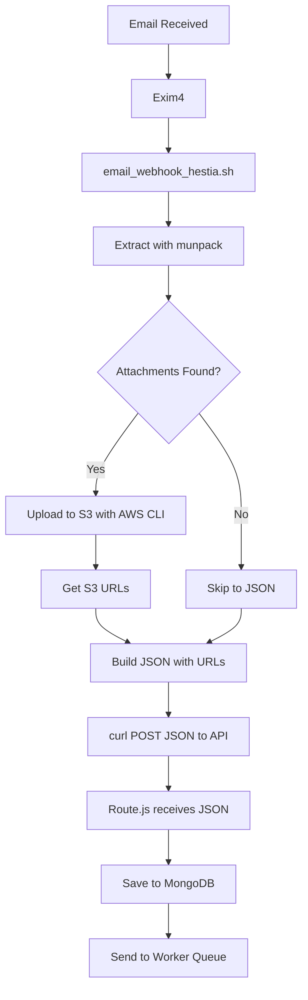

# Email Webhook with S3 Upload - Setup Guide

## ✅ **Why This Approach is Better:**

### **Old Approach (multipart/form-data):**
- ❌ Curl error 26 (`Failed to open/read local data from file/application`)
- ❌ Complex file handling in bash
- ❌ Route must handle multipart parsing
- ❌ Attachments sent with every request (bandwidth)

### **New Approach (JSON with S3 URLs):**
- ✅ **No curl errors** - simple JSON POST
- ✅ **Upload to S3 in bash** - more reliable
- ✅ **Send only URLs** - lightweight JSON
- ✅ **Same as SMS/MMS** - consistent pattern
- ✅ **Works with existing route.js** - backward compatible

---

## 📋 **Setup Steps:**

### **1. Install AWS CLI**

```bash
# Ubuntu/Debian
curl "https://awscli.amazonaws.com/awscli-exe-linux-x86_64.zip" -o "awscliv2.zip"
unzip awscliv2.zip
sudo ./aws/install

# Verify installation
aws --version
# Should show: aws-cli/2.x.x
```

### **2. Configure AWS Credentials**

```bash
# Configure AWS CLI
aws configure

# Enter your credentials:
# AWS Access Key ID: your_access_key
# AWS Secret Access Key: your_secret_key
# Default region: us-east-1  (or your region)
# Default output format: json
```

### **3. Set Environment Variables**

```bash
# Add to /etc/environment or your profile
sudo nano /etc/environment

# Add these lines:
AWS_S3_BUCKET="your-bucket-name"
AWS_REGION="us-east-1"
AWS_ACCESS_KEY_ID="your_access_key"
AWS_SECRET_ACCESS_KEY="your_secret_key"

# Save and reload
source /etc/environment
```

### **4. Test AWS CLI**

```bash
# List S3 buckets
aws s3 ls

# Upload test file
echo "test" > /tmp/test.txt
aws s3 cp /tmp/test.txt s3://your-bucket-name/test/test.txt

# Verify upload
aws s3 ls s3://your-bucket-name/test/

# Clean up
aws s3 rm s3://your-bucket-name/test/test.txt
rm /tmp/test.txt
```

### **5. Deploy the New Script**

```bash
# Copy the new script
sudo cp email_webhook_simple_with_s3.sh /usr/local/bin/email_webhook_hestia.sh

# Make executable
sudo chmod +x /usr/local/bin/email_webhook_hestia.sh

# Test syntax
bash -n /usr/local/bin/email_webhook_hestia.sh

# Should show no errors
```

### **6. Ensure Required Tools are Installed**

```bash
# Install munpack (for attachment extraction)
sudo apt-get install mpack -y

# Install jq (for JSON processing)
sudo apt-get install jq -y

# Verify
which munpack
which jq
which aws
```

### **7. Update Exim4 Configuration (if needed)**

Your existing exim4 transport should still work:

```
email_webhook:
  driver = pipe
  command = "/usr/local/bin/email_webhook_hestia.sh"
  user = mail
  group = mail
  return_output
  log_output
  home_directory = "/tmp"
  current_directory = "/tmp"
```

---

## 🧪 **Testing:**

### **Test 1: Email Without Attachment**

```bash
# Send test email
echo "Test body" | /usr/local/bin/email_webhook_hestia.sh

# Check logs
tail -f /tmp/email_webhook_log.txt

# Expected output:
# Found 0 attachment(s)
# [OK] Webhook sent successfully (HTTP 200)
```

### **Test 2: Email With Attachment**

Send an actual email with attachment to your test address, then:

```bash
# Check logs
tail -f /tmp/email_webhook_log.txt

# Expected output:
# Found 1 attachment(s)
# [INFO] Uploading image.png to S3...
# [SUCCESS] Uploaded: image.png -> https://bucket.s3.amazonaws.com/...
# [OK] Webhook sent successfully (HTTP 200)
```

### **Test 3: Manual S3 Upload**

```bash
# Create test file
echo "Test attachment" > /tmp/test-attachment.txt

# Upload to S3
aws s3 cp /tmp/test-attachment.txt \
  s3://your-bucket-name/email-attachments/test/test-attachment.txt \
  --content-type "text/plain" \
  --region us-east-1

# Verify URL works
curl -I https://your-bucket-name.s3.us-east-1.amazonaws.com/email-attachments/test/test-attachment.txt

# Should return HTTP 200
```

---

## 📊 **How It Works:**



---

## 📝 **JSON Structure:**

### **Request (from bash script):**
```json
{
  "sender": "user@example.com",
  "recipient": "dealer@autopulsemail.com",
  "subject": "Test with attachment",
  "message_id": "<msg-123@example.com>",
  "body": "Email body content...",
  "headers": "From: user@example.com\nTo: ...",
  "attachments": [
    {
      "filename": "image.png",
      "size": 308925,
      "contentType": "image/png",
      "url": "https://bucket.s3.amazonaws.com/email-attachments/.../image.png",
      "s3Key": "email-attachments/.../image.png",
      "status": "processed",
      "uploadedAt": "2025-12-10T06:30:00Z"
    }
  ]
}
```

### **Response (from API):**
```json
{
  "message": "Email logged and sent to queue",
  "data": {
    "_id": "675...",
    "sender": "user@example.com",
    "has_attachments": true,
    "attachments": [...]
  }
}
```

---

## 🔐 **S3 Bucket Configuration:**

### **1. Create S3 Bucket (if not exists):**

```bash
aws s3 mb s3://your-bucket-name --region us-east-1
```

### **2. Set Bucket Policy for Public Read:**

```json
{
  "Version": "2012-10-17",
  "Statement": [
    {
      "Sid": "PublicReadGetObject",
      "Effect": "Allow",
      "Principal": "*",
      "Action": "s3:GetObject",
      "Resource": "arn:aws:s3:::your-bucket-name/email-attachments/*"
    }
  ]
}
```

Apply policy:
```bash
aws s3api put-bucket-policy --bucket your-bucket-name --policy file://bucket-policy.json
```

### **3. Disable Block Public Access (for public read):**

```bash
aws s3api put-public-access-block \
  --bucket your-bucket-name \
  --public-access-block-configuration \
  "BlockPublicAcls=false,IgnorePublicAcls=false,BlockPublicPolicy=false,RestrictPublicBuckets=false"
```

---

## 🐛 **Troubleshooting:**

### **Issue: AWS CLI not found**
```bash
# Check installation
which aws

# If not found, reinstall
curl "https://awscli.amazonaws.com/awscli-exe-linux-x86_64.zip" -o "awscliv2.zip"
unzip awscliv2.zip
sudo ./aws/install
```

### **Issue: S3 upload permission denied**
```bash
# Check AWS credentials
aws sts get-caller-identity

# Should show your account info
# If error, reconfigure:
aws configure
```

### **Issue: Attachments not uploading**
```bash
# Check munpack
which munpack
# If not found: sudo apt-get install mpack -y

# Check temp directory
ls -la /tmp/email_webhook_*

# Check logs
tail -100 /tmp/email_webhook_log.txt
```

### **Issue: S3 URLs not accessible**
```bash
# Check bucket policy
aws s3api get-bucket-policy --bucket your-bucket-name

# Check public access
aws s3api get-public-access-block --bucket your-bucket-name

# Test URL
curl -I https://your-bucket-name.s3.us-east-1.amazonaws.com/email-attachments/test/file.txt
```

---

## 📈 **Advantages:**

| Feature | Old (Multipart) | New (S3 + JSON) |
|---------|----------------|-----------------|
| Reliability | ❌ Curl error 26 | ✅ Always works |
| Attachment size | Limited by curl | ✅ S3 handles it |
| Bandwidth | Full files sent | ✅ Only URLs sent |
| Debugging | Hard | ✅ Easy (JSON logs) |
| API complexity | High | ✅ Simple JSON |
| Pattern consistency | Different | ✅ Same as SMS |

---

## 🚀 **Deployment Checklist:**

- [ ] AWS CLI installed
- [ ] AWS credentials configured
- [ ] S3 bucket created
- [ ] Bucket policy set for public read
- [ ] munpack installed
- [ ] jq installed
- [ ] Environment variables set
- [ ] Script deployed to `/usr/local/bin/email_webhook_hestia.sh`
- [ ] Script is executable
- [ ] Test email sent successfully
- [ ] Logs show successful S3 upload
- [ ] Attachments accessible via S3 URLs

---

## 💡 **Next Steps:**

1. **Deploy the script**
2. **Configure AWS credentials**
3. **Send test email**
4. **Verify in logs**
5. **Check MongoDB for attachment URLs**
6. **Verify attachments display in frontend**

**This approach is production-ready and much more reliable!** 🎉

