# State machine diagrams: New Lead Follow-Up & Appointment Workflow

Source: [`../data/3/AutoPulse_New_Lead_Follow_Up_Workflow_OMNICHANNEL_FINAL.pdf`](../data/3/AutoPulse_New_Lead_Follow_Up_Workflow_OMNICHANNEL_FINAL.pdf) (Version 1, September 2026). `§N` below means section N of that PDF; "p.9" and "p.10" are its two global-rule pages (call escalation and omnichannel).

**Build status (30 Sept 2026):** none of this is built yet. It is planned as MASTER_PLAN_3 Part C (C2–C5). Today the AI service has only the 24 h channel switch and the handoff staff check (`scheduler/followups.py`).

**How to read these:**
- A **status** is where the opportunity is (§1). A **workflow** is the schedule of touches that status runs. Several statuses share one workflow; for example, New Lead, No Contact Made and Contact Made – No Next Action all run Short-Term Follow-Up.
- Every arrow is taken from the PDF. Where the PDF doesn't say what happens and a diagram still had to draw something, the step is marked **(interpretation)** and listed under [Spec gaps](#20-spec-gaps-found-while-drawing), so the client can confirm it.
- Every "send" in every diagram goes through [the pre-send recheck](#3-pre-send-recheck-every-queued-action) and [the omnichannel touch](#4-one-follow-up-touch-omnichannel--1-hour-call-escalation). They aren't redrawn each time.

## Contents

1. [Master lifecycle](#1-master-lifecycle)
2. [Event priority and races](#2-event-priority-and-races)
3. [Pre-send recheck (every queued action)](#3-pre-send-recheck-every-queued-action)
4. [One follow-up touch: omnichannel + 1-hour call escalation](#4-one-follow-up-touch-omnichannel--1-hour-call-escalation)
5. [Human call task lifecycle](#5-human-call-task-lifecycle)
6. [Short-Term Follow-Up, Days 1–7](#6-short-term-follow-up-days-17)
7. [Touch 1 composition](#7-touch-1-composition)
8. [Days 1–7 human call tasks (two per workday)](#8-days-17-human-call-tasks-two-per-workday)
9. [Extended cadence, Days 8–90, and Day 91](#9-extended-cadence-days-890-and-day-91)
10. [Response router](#10-response-router)
11. [Contact Made – Specific Follow-Up](#11-contact-made--specific-follow-up)
12. [Appointment Set workflow](#12-appointment-set-workflow)
13. [Appointment confirmation router](#13-appointment-confirmation-router)
14. [Appointment No-Show workflow](#14-appointment-no-show-workflow)
15. [Sales Visit](#15-sales-visit)
16. [Channel permissions and opt-out](#16-channel-permissions-and-opt-out)
17. [Opportunity clock and Short-Term re-entry](#17-opportunity-clock-and-short-term-re-entry)
18. [Duplicate lead](#18-duplicate-lead)
19. [Vehicle photo selection](#19-vehicle-photo-selection)
20. [Spec gaps found while drawing](#20-spec-gaps-found-while-drawing)
21. [Acceptance tests → diagrams](#21-acceptance-tests--diagrams)

---

## 1. Master lifecycle

§1, §2, §5, §9, §10, §12. Every status and every transition between them. The transitions inside "Active opportunity" are explained in the later diagrams; this one shows only where each status can go.

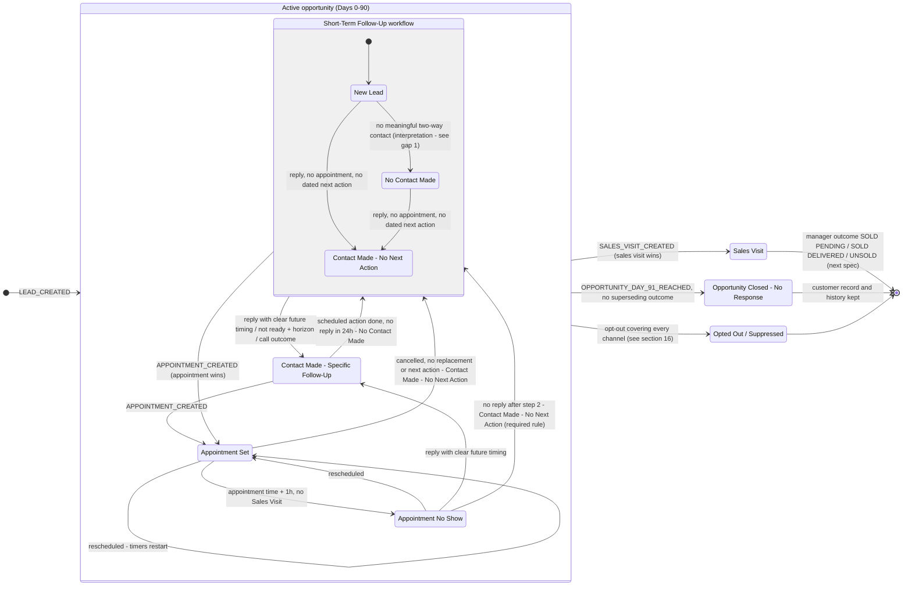
```mermaid
stateDiagram-v2
    direction LR
    [*] --> ACTIVE : LEAD_CREATED

    state "Active opportunity (Days 0-90)" as ACTIVE {
        state "Short-Term Follow-Up workflow" as ST {
            state "New Lead" as NEW
            state "No Contact Made" as NCM
            state "Contact Made - No Next Action" as CMNNA
            [*] --> NEW
            NEW --> NCM : no meaningful two-way contact (interpretation - see gap 1)
            NEW --> CMNNA : reply, no appointment, no dated next action
            NCM --> CMNNA : reply, no appointment, no dated next action
        }
        state "Contact Made - Specific Follow-Up" as CMSF
        state "Appointment Set" as APPT
        state "Appointment No Show" as NS

        ST --> CMSF : reply with clear future timing / not ready + horizon / call outcome
        ST --> APPT : APPOINTMENT_CREATED (appointment wins)
        CMSF --> APPT : APPOINTMENT_CREATED
        CMSF --> ST : scheduled action done, no reply in 24h - No Contact Made
        APPT --> APPT : rescheduled - timers restart
        APPT --> NS : appointment time + 1h, no Sales Visit
        APPT --> ST : cancelled, no replacement or next action - Contact Made - No Next Action
        NS --> APPT : rescheduled
        NS --> CMSF : reply with clear future timing
        NS --> ST : no reply after step 2 - Contact Made - No Next Action (required rule)
    }

    state "Sales Visit" as SV
    state "Opted Out / Suppressed" as OPT
    state "Opportunity Closed - No Response" as CLOSED

    ACTIVE --> OPT : opt-out covering every channel (see section 16)
    ACTIVE --> SV : SALES_VISIT_CREATED (sales visit wins)
    ACTIVE --> CLOSED : OPPORTUNITY_DAY_91_REACHED, no superseding outcome
    SV --> [*] : manager outcome SOLD PENDING / SOLD DELIVERED / UNSOLD (next spec)
    CLOSED --> [*] : customer record and history kept
    OPT --> [*]
```

| Status | Workflow it runs | Ends when |
|---|---|---|
| New Lead | Short-Term Follow-Up (§3) | any reply, appointment, visit, opt-out, Day 91 |
| No Contact Made | Short-Term Follow-Up | same |
| Contact Made – No Next Action | Short-Term Follow-Up | same |
| Contact Made – Specific Follow-Up | Specific Follow-Up (§6) | no reply 24 h after the action → No Contact Made |
| Appointment Set | Appointment Follow-Up (§7, §8) | +1 h with no visit → No Show; visit → Sales Visit |
| Appointment No Show | No-Show Follow-Up (§9) | no reply after step 2 → Contact Made – No Next Action |
| Sales Visit | none (all lead automation stops) | manager outcome (separate spec) |
| Opted Out / Suppressed | none on the suppressed channels | — |
| Opportunity Closed – No Response | none | — (a long-horizon customer task may reopen a *new* opportunity, §6) |

**Rule (§2, "one controlling workflow"):** at any moment exactly one of these workflows runs for an opportunity. Every arrow above first cancels the old status's queued messages and call tasks, then starts the new workflow ("status change cancels stale work").

---

## 2. Event priority and races

§11, §2. When events race (a reply lands while a booking is being made, or a check-in and an opt-out arrive together), the higher one wins. Read top to bottom: the first "yes" decides.

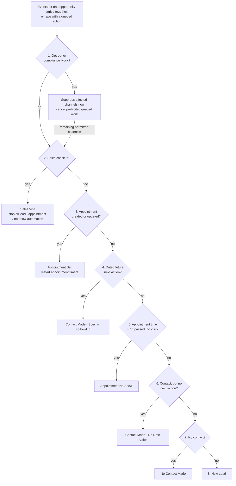
```mermaid
flowchart TD
    E["Events for one opportunity arrive together,<br/>or race with a queued action"] --> P1{"1. Opt-out or<br/>compliance block?"}
    P1 -->|yes| A1["Suppress affected channels now<br/>cancel prohibited queued work"]
    P1 -->|no| P2{"2. Sales check-in?"}
    P2 -->|yes| A2["Sales Visit<br/>stop all lead / appointment / no-show automation"]
    P2 -->|no| P3{"3. Appointment<br/>created or updated?"}
    P3 -->|yes| A3["Appointment Set<br/>restart appointment timers"]
    P3 -->|no| P4{"4. Dated future<br/>next action?"}
    P4 -->|yes| A4["Contact Made - Specific Follow-Up"]
    P4 -->|no| P5{"5. Appointment time<br/>+ 1h passed, no visit?"}
    P5 -->|yes| A5["Appointment No Show"]
    P5 -->|no| P6{"6. Contact, but no<br/>next action?"}
    P6 -->|yes| A6["Contact Made - No Next Action"]
    P6 -->|no| P7{"7. No contact?"}
    P7 -->|yes| A7["No Contact Made"]
    P7 -->|no| A8["8. New Lead"]
    A1 -.->|"remaining permitted channels"| P2
```

- Opt-out is applied first but doesn't always end the opportunity. When only one channel is opted out, the other checks still run for the channels that remain (dotted arrow, §16 of this doc).
- **(interpretation)** Priority also stops a lower event from overwriting a higher status. For example, an ordinary reply while Appointment Set is active is answered, but the status stays Appointment Set (gap 9).

---

## 3. Pre-send recheck (every queued action)

§2 "pre-send recheck", §11 "never execute a task simply because it was previously placed in a queue", p.9 guardrail. This runs immediately before **any** queued SMS, email or call task.

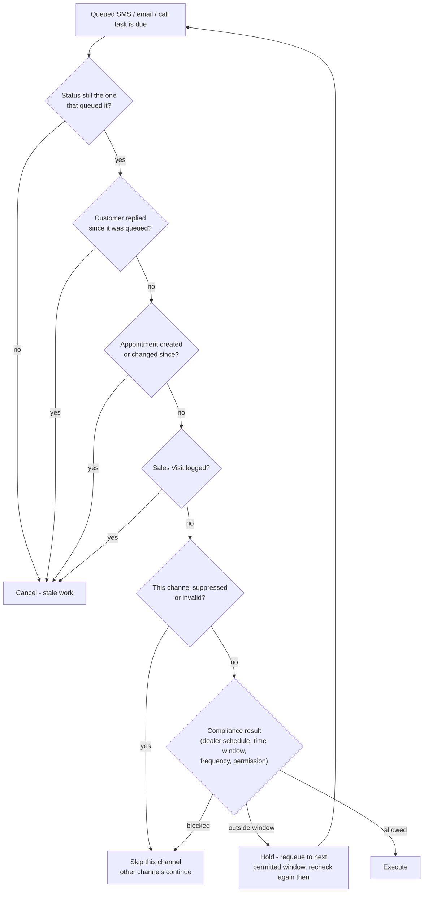
```mermaid
flowchart TD
    Q["Queued SMS / email / call task is due"] --> S1{"Status still the one<br/>that queued it?"}
    S1 -->|no| X["Cancel - stale work"]
    S1 -->|yes| S2{"Customer replied<br/>since it was queued?"}
    S2 -->|yes| X
    S2 -->|no| S3{"Appointment created<br/>or changed since?"}
    S3 -->|yes| X
    S3 -->|no| S4{"Sales Visit logged?"}
    S4 -->|yes| X
    S4 -->|no| S5{"This channel suppressed<br/>or invalid?"}
    S5 -->|yes| X2["Skip this channel<br/>other channels continue"]
    S5 -->|no| S6{"Compliance result<br/>(dealer schedule, time window,<br/>frequency, permission)"}
    S6 -->|blocked| X2
    S6 -->|outside window| H["Hold - requeue to next<br/>permitted window, recheck again then"]
    S6 -->|allowed| GO["Execute"]
    H --> Q
```

The compliance result comes from the TCPA spec (`AutoPulse_TCPA_AI_Compliance_Guardrails_Developer_Spec.pdf`: ALLOW / HOLD / REVIEW / BLOCK). This workflow only needs to know it can be "send now", "later" or "never".

---

## 4. One follow-up touch: omnichannel + 1-hour call escalation

p.9 and p.10 (both "non-negotiable"). Every follow-up touch in every workflow is **call + text + email**, less any channel that is unavailable, invalid, suppressed or blocked. p.10 overrides any earlier wording in the PDF that offers a choice of channel.

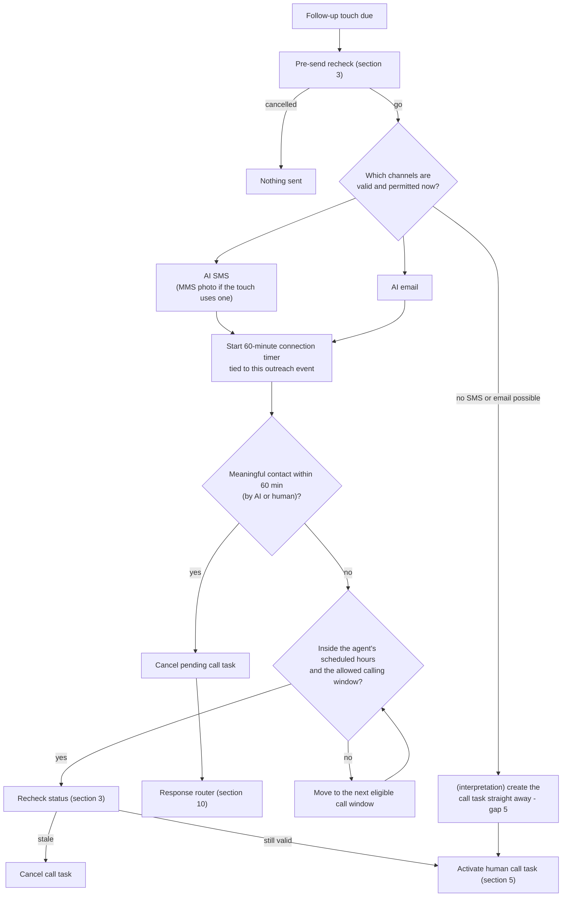
```mermaid
flowchart TD
    D["Follow-up touch due"] --> R["Pre-send recheck (section 3)"]
    R -->|cancelled| END0["Nothing sent"]
    R -->|go| F{"Which channels are<br/>valid and permitted now?"}
    F --> SMS["AI SMS<br/>(MMS photo if the touch uses one)"]
    F --> EM["AI email"]
    SMS --> T["Start 60-minute connection timer<br/>tied to this outreach event"]
    EM --> T
    F -->|"no SMS or email possible"| T2["(interpretation) create the<br/>call task straight away - gap 5"]
    T --> W{"Meaningful contact within 60 min<br/>(by AI or human)?"}
    W -->|yes| C["Cancel pending call task"]
    C --> RR["Response router (section 10)"]
    W -->|no| AG{"Inside the agent's scheduled hours<br/>and the allowed calling window?"}
    AG -->|no| NX["Move to the next eligible call window"]
    NX --> AG
    AG -->|yes| RC["Recheck status (section 3)"]
    RC -->|stale| C2["Cancel call task"]
    RC -->|still valid| CT["Activate human call task (section 5)"]
    T2 --> CT
```

Where it applies (p.9, p.10): Days 1–7 touches, weekly Days 8–30, monthly Days 31–90, Specific Follow-Up sends, appointment follow-up and confirmation touches, and No-Show touches.

---

## 5. Human call task lifecycle

§3 "Human call tasks", p.9 steps 5–13.

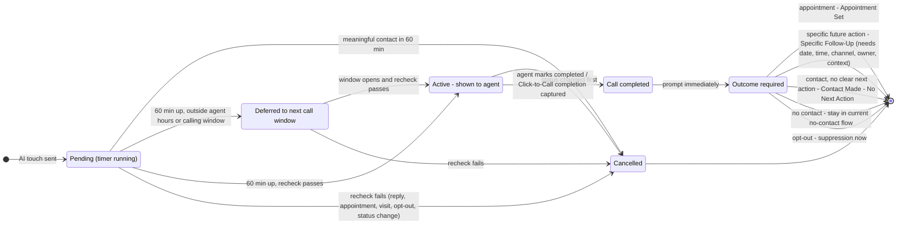
```mermaid
stateDiagram-v2
    direction LR
    state "Pending (timer running)" as PEND
    state "Deferred to next call window" as DEF
    state "Active - shown to agent" as ACT
    state "Call completed" as DONE
    state "Outcome required" as OUT
    state "Cancelled" as CAN

    [*] --> PEND : AI touch sent
    PEND --> CAN : meaningful contact in 60 min
    PEND --> DEF : 60 min up, outside agent hours or calling window
    DEF --> ACT : window opens and recheck passes
    PEND --> ACT : 60 min up, recheck passes
    PEND --> CAN : recheck fails (reply, appointment, visit, opt-out, status change)
    DEF --> CAN : recheck fails
    ACT --> CAN : status changed first
    ACT --> DONE : agent marks completed / Click-to-Call completion captured
    DONE --> OUT : prompt immediately
    OUT --> [*] : appointment - Appointment Set
    OUT --> [*] : specific future action - Specific Follow-Up (needs date, time, channel, owner, context)
    OUT --> [*] : contact, no clear next action - Contact Made - No Next Action
    OUT --> [*] : no contact - stay in current no-contact flow
    OUT --> [*] : opt-out - suppression now
    CAN --> [*]
```

The task must show: the customer, the vehicle/opportunity, the last AI touch and the current status (p.9 step 6).

---

## 6. Short-Term Follow-Up, Days 1–7

§3. Entered from New Lead, No Contact Made, Contact Made – No Next Action, and the end of the No-Show sequence. Each touch below is a full omnichannel touch (section 4).

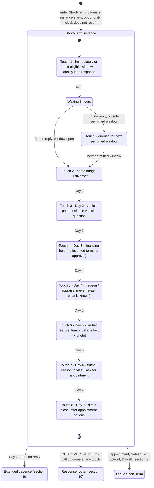
```mermaid
stateDiagram-v2
    state "Short-Term instance" as STI {
        state "Touch 1 - immediately or next eligible window - quality lead response" as T1
        state "Waiting 3 hours" as W3
        state "Touch 2 queued for next permitted window" as T2Q
        state "Touch 2 - name nudge 'FirstName?'" as T2
        state "Touch 3 - Day 2 - vehicle photo + simple vehicle question" as D2
        state "Touch 4 - Day 3 - financing help (no invented terms or approval)" as D3
        state "Touch 5 - Day 4 - trade-in / appraisal (never re-ask what is known)" as D4
        state "Touch 6 - Day 5 - verified feature, trim or vehicle fact (+ photo)" as D5
        state "Touch 7 - Day 6 - truthful reason to visit + ask for appointment" as D6
        state "Touch 8 - Day 7 - direct close, offer appointment options" as D7

        [*] --> T1
        T1 --> W3 : sent
        W3 --> T2 : 3h, no reply, window open
        W3 --> T2Q : 3h, no reply, outside permitted window
        T2Q --> T2 : next permitted window
        T2 --> D2 : Day 2
        D2 --> D3 : Day 3
        D3 --> D4 : Day 4
        D4 --> D5 : Day 5
        D5 --> D6 : Day 6
        D6 --> D7 : Day 7
        D7 --> [*]
    }

    [*] --> STI : enter Short-Term (cadence instance starts, opportunity clock does not reset)
    STI --> EXT : Day 7 done, no reply
    STI --> ROUTER : CUSTOMER_REPLIED / call outcome at any touch
    STI --> EXIT : appointment, Sales Visit, opt-out, Day 91 (section 2)

    state "Extended cadence (section 9)" as EXT
    state "Response router (section 10)" as ROUTER
    state "Leave Short-Term" as EXIT
```

- **Touch 2 is non-negotiable (§3):** the text is exactly `{FirstName}?`. It must not be replaced with other sales copy.
- Days 1–7 also create two human call tasks per scheduled workday (section 8), on top of each touch's 1-hour task. How the two combine is gap 7.
- A reply at any point prevents stale queued touches from firing (acceptance test).

---

## 7. Touch 1 composition

§3 "Touch 1 required structure", §13.

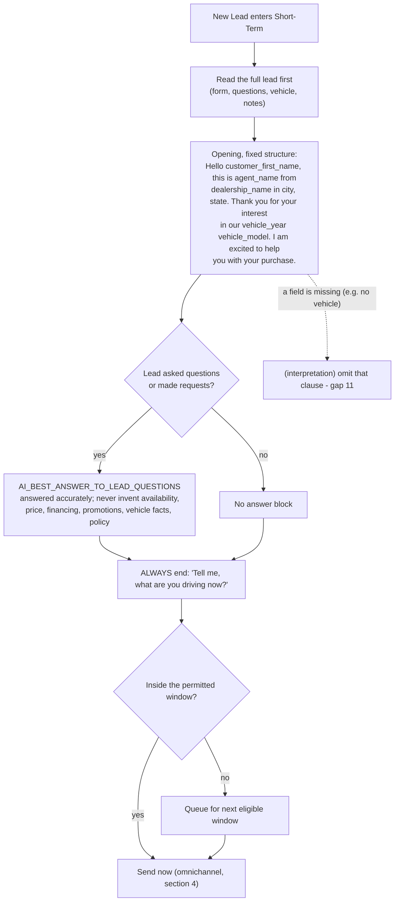
```mermaid
flowchart TD
    A["New Lead enters Short-Term"] --> B["Read the full lead first<br/>(form, questions, vehicle, notes)"]
    B --> C["Opening, fixed structure:<br/>Hello customer_first_name, this is agent_name from<br/>dealership_name in city, state. Thank you for your interest<br/>in our vehicle_year vehicle_model. I am excited to help<br/>you with your purchase."]
    C --> D{"Lead asked questions<br/>or made requests?"}
    D -->|yes| E["AI_BEST_ANSWER_TO_LEAD_QUESTIONS<br/>answered accurately; never invent availability,<br/>price, financing, promotions, vehicle facts, policy"]
    D -->|no| F["No answer block"]
    E --> G["ALWAYS end: 'Tell me, what are you driving now?'"]
    F --> G
    G --> H{"Inside the permitted window?"}
    H -->|yes| I["Send now (omnichannel, section 4)"]
    H -->|no| J["Queue for next eligible window"]
    J --> I
    C -.->|"a field is missing (e.g. no vehicle)"| K["(interpretation) omit that clause - gap 11"]
```

---

## 8. Days 1–7 human call tasks (two per workday)

§3 "Human call tasks – Days 1–7".

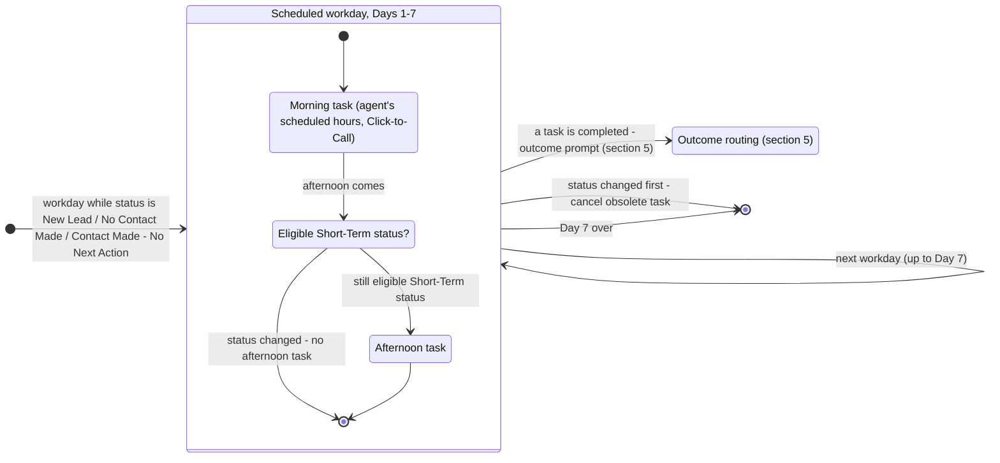
```mermaid
stateDiagram-v2
    direction LR
    state "Scheduled workday, Days 1-7" as DAY {
        state "Morning task (agent's scheduled hours, Click-to-Call)" as AM
        state "Afternoon task" as PM
        state "Eligible Short-Term status?" as chk
        state chk <<choice>>
        [*] --> AM
        AM --> chk : afternoon comes
        chk --> PM : still eligible Short-Term status
        chk --> [*] : status changed - no afternoon task
        PM --> [*]
    }
    [*] --> DAY : workday while status is New Lead / No Contact Made / Contact Made - No Next Action
    DAY --> DAY : next workday (up to Day 7)
    DAY --> OUTCOME : a task is completed - outcome prompt (section 5)
    DAY --> [*] : status changed first - cancel obsolete task
    DAY --> [*] : Day 7 over
    state "Outcome routing (section 5)" as OUTCOME
```

Non-workdays get no call tasks. The PDF's acceptance test: "two human call tasks occur only on scheduled workdays while status remains eligible".

---

## 9. Extended cadence, Days 8–90, and Day 91

§4. Timed by **opportunity age**, not by when this workflow started (interpretation, gap 6).

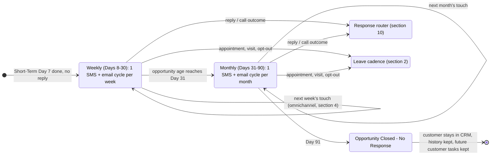
```mermaid
stateDiagram-v2
    direction LR
    state "Weekly (Days 8-30): 1 SMS + email cycle per week" as WK
    state "Monthly (Days 31-90): 1 SMS + email cycle per month" as MO
    state "Opportunity Closed - No Response" as CL

    [*] --> WK : Short-Term Day 7 done, no reply
    WK --> WK : next week's touch (omnichannel, section 4)
    WK --> MO : opportunity age reaches Day 31
    MO --> MO : next month's touch
    MO --> CL : Day 91
    WK --> ROUTER : reply / call outcome
    MO --> ROUTER : reply / call outcome
    WK --> EXIT : appointment, visit, opt-out
    MO --> EXIT : appointment, visit, opt-out
    CL --> [*] : customer stays in CRM, history kept, future customer tasks kept

    state "Response router (section 10)" as ROUTER
    state "Leave cadence (section 2)" as EXIT
```

**Angle selection before every touch (§4 "AI selection rule"):**

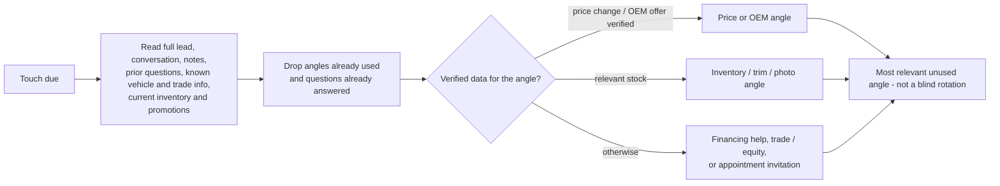
```mermaid
flowchart LR
    A["Touch due"] --> B["Read full lead, conversation, notes,<br/>prior questions, known vehicle and trade info,<br/>current inventory and promotions"]
    B --> C["Drop angles already used<br/>and questions already answered"]
    C --> D{"Verified data for the angle?"}
    D -->|"price change / OEM offer verified"| E["Price or OEM angle"]
    D -->|"relevant stock"| F["Inventory / trim / photo angle"]
    D -->|"otherwise"| G["Financing help, trade / equity,<br/>or appointment invitation"]
    E --> H["Most relevant unused angle - not a blind rotation"]
    F --> H
    G --> H
```

---

## 10. Response router

§5, plus the outcomes in §3 and p.9. Every customer reply and every call outcome goes through this.

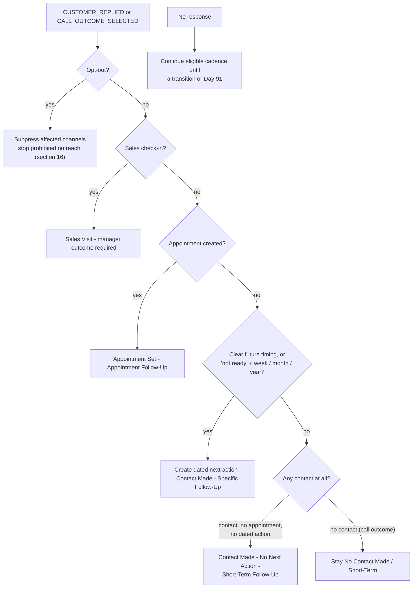
```mermaid
flowchart TD
    R["CUSTOMER_REPLIED or CALL_OUTCOME_SELECTED"] --> O{"Opt-out?"}
    O -->|yes| OS["Suppress affected channels<br/>stop prohibited outreach (section 16)"]
    O -->|no| V{"Sales check-in?"}
    V -->|yes| SV["Sales Visit - manager outcome required"]
    V -->|no| A{"Appointment created?"}
    A -->|yes| AS["Appointment Set - Appointment Follow-Up"]
    A -->|no| T{"Clear future timing, or<br/>'not ready' + week / month / year?"}
    T -->|yes| SF["Create dated next action -<br/>Contact Made - Specific Follow-Up"]
    T -->|no| N{"Any contact at all?"}
    N -->|"contact, no appointment,<br/>no dated action"| NN["Contact Made - No Next Action -<br/>Short-Term Follow-Up"]
    N -->|"no contact (call outcome)"| NC["Stay No Contact Made / Short-Term"]
    NR["No response"] --> CONT["Continue eligible cadence until<br/>a transition or Day 91"]
```

The checks are in priority order (section 2). A reply that carries both a booking and a "call me Friday" is an appointment.

---

## 11. Contact Made – Specific Follow-Up

§6.

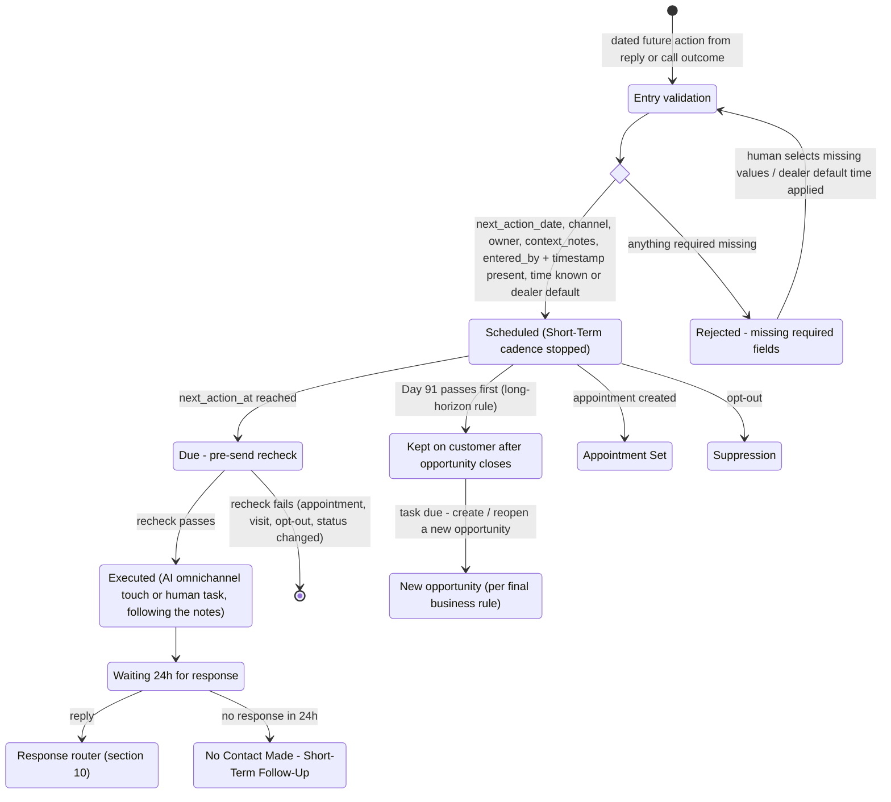
```mermaid
stateDiagram-v2
    state "Entry validation" as VAL
    state "Rejected - missing required fields" as REJ
    state "Scheduled (Short-Term cadence stopped)" as SCH
    state "Due - pre-send recheck" as DUE
    state "Executed (AI omnichannel touch or human task, following the notes)" as EXE
    state "Waiting 24h for response" as W24
    state "Kept on customer after opportunity closes" as LH
    state v <<choice>>

    [*] --> VAL : dated future action from reply or call outcome
    VAL --> v
    v --> SCH : next_action_date, channel, owner, context_notes, entered_by + timestamp present, time known or dealer default
    v --> REJ : anything required missing
    REJ --> VAL : human selects missing values / dealer default time applied
    SCH --> DUE : next_action_at reached
    SCH --> LH : Day 91 passes first (long-horizon rule)
    LH --> NEWOPP : task due - create / reopen a new opportunity
    DUE --> EXE : recheck passes
    DUE --> [*] : recheck fails (appointment, visit, opt-out, status changed)
    EXE --> W24
    W24 --> ROUTER : reply
    W24 --> NCM : no response in 24h
    SCH --> APPT : appointment created
    SCH --> OPT : opt-out

    state "No Contact Made - Short-Term Follow-Up" as NCM
    state "Response router (section 10)" as ROUTER
    state "Appointment Set" as APPT
    state "Suppression" as OPT
    state "New opportunity (per final business rule)" as NEWOPP
```

| Field | Rule (§6) |
|---|---|
| `next_action_date` | required |
| `next_action_time` | required if known; otherwise a dealer-configurable default or selection rule |
| `next_action_channel` | call, SMS, email or an approved combination. p.10 overrides this: when the AI executes the action, every permitted channel is used |
| `next_action_owner` | AI or human |
| `context_notes` | what the customer asked for, and what should happen next |
| `entered_by` + timestamp | required audit fields |

---

## 12. Appointment Set workflow

§7. Entered whenever an appointment is created, by the AI or by a person ("appointment wins").

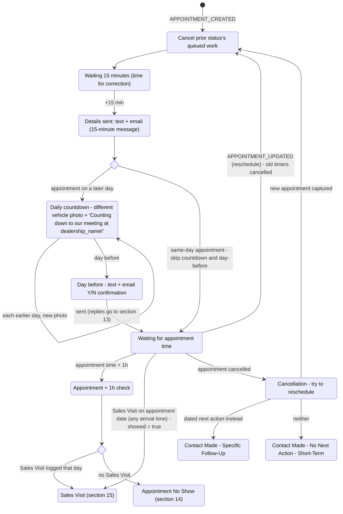
```mermaid
stateDiagram-v2
    state "Cancel prior status's queued work" as CX
    state "Waiting 15 minutes (time for correction)" as W15
    state "Details sent: text + email (15-minute message)" as DET
    state "Daily countdown - different vehicle photo + 'Counting down to our meeting at dealership_name!'" as CD
    state "Day before - text + email Y/N confirmation" as DB
    state "Waiting for appointment time" as WAIT
    state "Appointment + 1h check" as CHK
    state sd <<choice>>
    state ck <<choice>>

    [*] --> CX : APPOINTMENT_CREATED
    CX --> W15
    W15 --> DET : +15 min
    DET --> sd
    sd --> CD : appointment on a later day
    sd --> WAIT : same-day appointment - skip countdown and day-before
    CD --> CD : each earlier day, new photo
    CD --> DB : day before
    DB --> WAIT : sent (replies go to section 13)
    WAIT --> CHK : appointment time + 1h
    WAIT --> SV : Sales Visit on appointment date (any arrival time) - showed = true
    CHK --> ck
    ck --> SV : Sales Visit logged that day
    ck --> NS : no Sales Visit
    WAIT --> CX : APPOINTMENT_UPDATED (reschedule) - old timers cancelled
    WAIT --> CANC : appointment cancelled

    state "Sales Visit (section 15)" as SV
    state "Appointment No Show (section 14)" as NS
    state "Cancellation - try to reschedule" as CANC
    CANC --> CX : new appointment captured
    CANC --> SF : dated next action instead
    CANC --> CMNNA : neither
    state "Contact Made - Specific Follow-Up" as SF
    state "Contact Made - No Next Action - Short-Term" as CMNNA
```

**15-minute message (§7):** "{customer_first_name}, we are all set to meet on {appointment_date} at {appointment_time} at {dealership_name}, {dealership_address}. Please make sure to call or text us if anything changes at {ai_agent_phone}. Looking forward to assisting you!" For a same-day appointment it's sent only "when still useful".

**Day-before message (§7):** "Hello, {customer_first_name}, this is {agent_name} at {dealership_name} confirming our meeting for {date} at {time}. Does this time still work? Please reply Y for Yes or N for No."

**Multiple appointments (§15):** by default one active primary sales appointment per opportunity. A second one replaces the first unless it's explicitly allowed (interpretation of "default to one").

---

## 13. Appointment confirmation router

§8. Runs on any reply to the day-before message, and on a person confirming by phone.

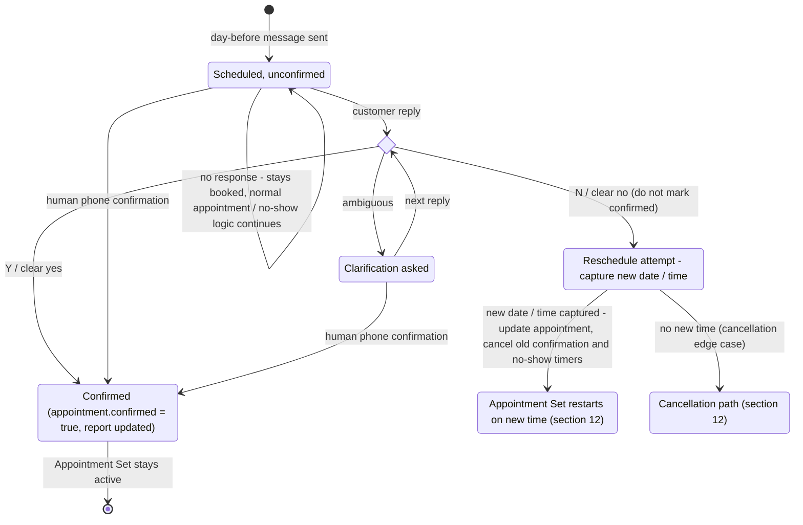
```mermaid
stateDiagram-v2
    state "Scheduled, unconfirmed" as UNC
    state "Confirmed (appointment.confirmed = true, report updated)" as CONF
    state "Clarification asked" as CLAR
    state "Reschedule attempt - capture new date / time" as RES
    state r <<choice>>

    [*] --> UNC : day-before message sent
    UNC --> r : customer reply
    r --> CONF : Y / clear yes
    r --> RES : N / clear no (do not mark confirmed)
    r --> CLAR : ambiguous
    CLAR --> r : next reply
    UNC --> UNC : no response - stays booked, normal appointment / no-show logic continues
    UNC --> CONF : human phone confirmation
    CLAR --> CONF : human phone confirmation
    RES --> NEWAPPT : new date / time captured - update appointment, cancel old confirmation and no-show timers
    RES --> CANCEL : no new time (cancellation edge case)
    CONF --> [*] : Appointment Set stays active

    state "Appointment Set restarts on new time (section 12)" as NEWAPPT
    state "Cancellation path (section 12)" as CANCEL
```

**Test from §16:** a rescheduled or old appointment can never produce a false No Show, because its +1 h timer is cancelled when the appointment changes.

---

## 14. Appointment No-Show workflow

§9. "Required business rule": no show and not rescheduled → **Contact Made – No Next Action** (not No Contact Made), then Short-Term.

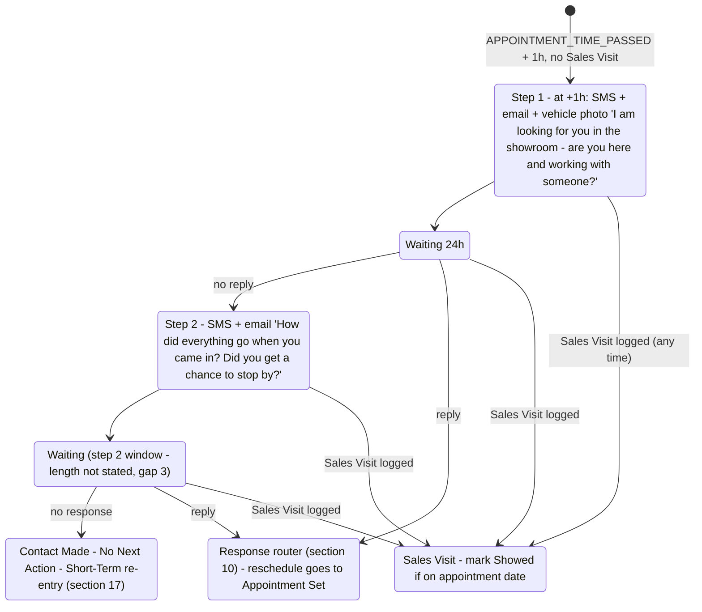
```mermaid
stateDiagram-v2
    state "Step 1 - at +1h: SMS + email + vehicle photo 'I am looking for you in the showroom - are you here and working with someone?'" as S1
    state "Waiting 24h" as W1
    state "Step 2 - SMS + email 'How did everything go when you came in? Did you get a chance to stop by?'" as S2
    state "Waiting (step 2 window - length not stated, gap 3)" as W2

    [*] --> S1 : APPOINTMENT_TIME_PASSED + 1h, no Sales Visit
    S1 --> W1
    W1 --> S2 : no reply
    S2 --> W2
    W2 --> CMNNA : no response
    W1 --> ROUTER : reply
    W2 --> ROUTER : reply
    S1 --> SV : Sales Visit logged (any time)
    W1 --> SV : Sales Visit logged
    S2 --> SV : Sales Visit logged
    W2 --> SV : Sales Visit logged

    state "Contact Made - No Next Action - Short-Term re-entry (section 17)" as CMNNA
    state "Response router (section 10) - reschedule goes to Appointment Set" as ROUTER
    state "Sales Visit - mark Showed if on appointment date" as SV
```

Both steps are omnichannel touches, so each one also starts a 1-hour call task (section 4).

---

## 15. Sales Visit

§10. The PDF's scope ends at the manager outcome; what comes after is in the next spec (`docs/data/4/`).

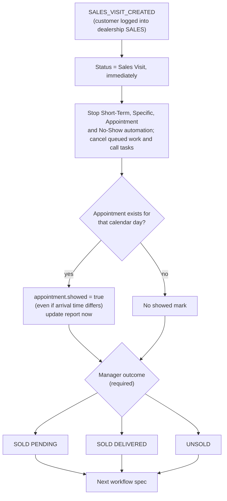
```mermaid
flowchart TD
    A["SALES_VISIT_CREATED<br/>(customer logged into dealership SALES)"] --> B["Status = Sales Visit, immediately"]
    B --> C["Stop Short-Term, Specific, Appointment<br/>and No-Show automation; cancel queued work and call tasks"]
    C --> D{"Appointment exists for<br/>that calendar day?"}
    D -->|yes| E["appointment.showed = true<br/>(even if arrival time differs)<br/>update report now"]
    D -->|no| F["No showed mark"]
    E --> G{"Manager outcome<br/>(required)"}
    F --> G
    G --> H["SOLD PENDING"]
    G --> I["SOLD DELIVERED"]
    G --> J["UNSOLD"]
    H --> K["Next workflow spec"]
    I --> K
    J --> K
```

---

## 16. Channel permissions and opt-out

§2 "opt-out wins", §15 (channel-specific opt-out, wrong number, hard bounce), p.10 "channel availability". Each channel has its own state, and they run in parallel.

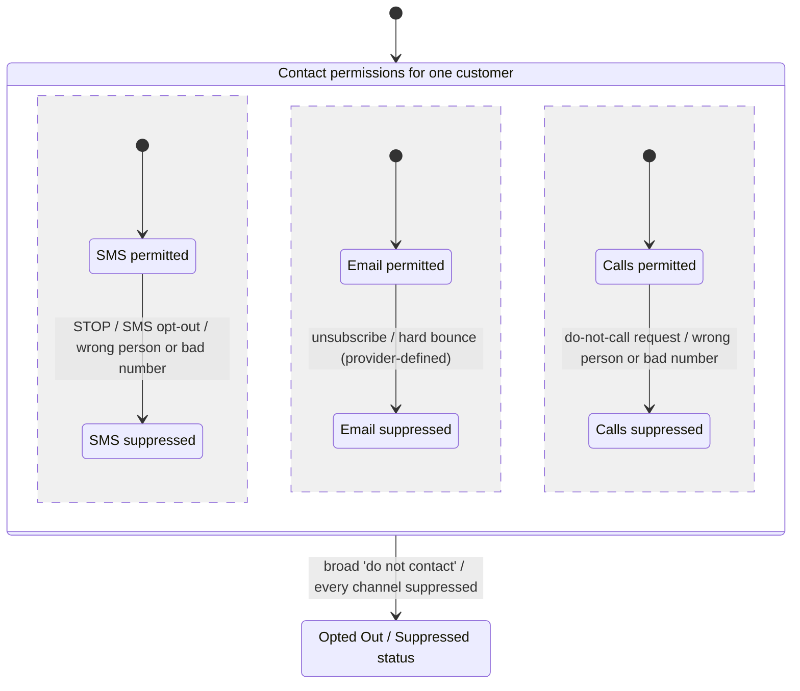
```mermaid
stateDiagram-v2
    state "Contact permissions for one customer" as PERM {
        state "SMS permitted" as SMSOK
        state "SMS suppressed" as SMSOFF
        [*] --> SMSOK
        SMSOK --> SMSOFF : STOP / SMS opt-out / wrong person or bad number
        --
        state "Email permitted" as EMOK
        state "Email suppressed" as EMOFF
        [*] --> EMOK
        EMOK --> EMOFF : unsubscribe / hard bounce (provider-defined)
        --
        state "Calls permitted" as CLOK
        state "Calls suppressed" as CLOFF
        [*] --> CLOK
        CLOK --> CLOFF : do-not-call request / wrong person or bad number
    }
    [*] --> PERM
    PERM --> OPT : broad 'do not contact' / every channel suppressed
    state "Opted Out / Suppressed status" as OPT
```

- A suppression takes effect **immediately**: queued work on that channel is cancelled, not just skipped at send time (acceptance test "opt-out prevents prohibited queued communications").
- **Wrong person / bad number:** a data-quality suppression. Never continue outreach to a number known to be wrong.
- **Hard bounce:** suppresses that email address only; other permitted channels continue.
- Outside the allowed window a channel is **held**, not suppressed (section 3).
- **(interpretation)** The status becomes Opted Out / Suppressed only when nothing is left to contact. A single-channel opt-out removes that channel and the workflow carries on with the rest (gap 8).

---

## 17. Opportunity clock and Short-Term re-entry

§12, §2 "master opportunity age never resets", §15 "Short-Term re-entry".

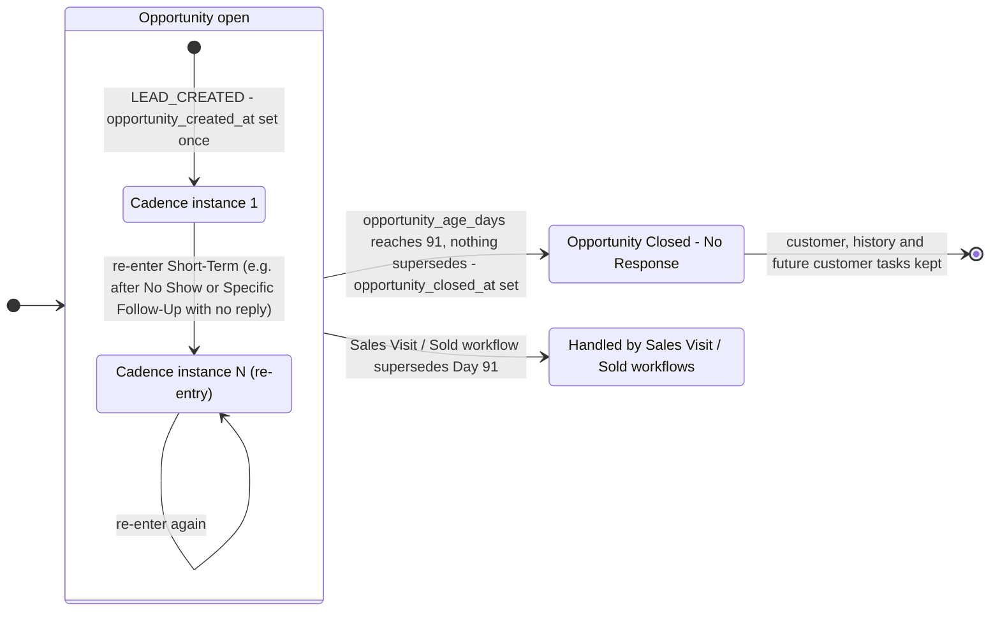
```mermaid
stateDiagram-v2
    direction LR
    state "Opportunity open" as OPEN {
        state "Cadence instance 1" as I1
        state "Cadence instance N (re-entry)" as IN
        [*] --> I1 : LEAD_CREATED - opportunity_created_at set once
        I1 --> IN : re-enter Short-Term (e.g. after No Show or Specific Follow-Up with no reply)
        IN --> IN : re-enter again
    }
    [*] --> OPEN
    OPEN --> CLOSED : opportunity_age_days reaches 91, nothing supersedes - opportunity_closed_at set
    OPEN --> SUP : Sales Visit / Sold workflow supersedes Day 91
    state "Opportunity Closed - No Response" as CLOSED
    state "Handled by Sales Visit / Sold workflows" as SUP
    CLOSED --> [*] : customer, history and future customer tasks kept
```

**What re-entry changes and what it doesn't:**

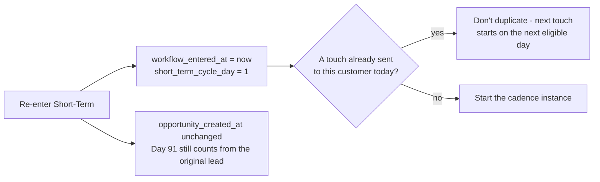
```mermaid
flowchart LR
    A["Re-enter Short-Term"] --> B["workflow_entered_at = now<br/>short_term_cycle_day = 1"]
    A --> C["opportunity_created_at unchanged<br/>Day 91 still counts from the original lead"]
    B --> D{"A touch already sent<br/>to this customer today?"}
    D -->|yes| E["Don't duplicate - next touch<br/>starts on the next eligible day"]
    D -->|no| F["Start the cadence instance"]
```

| Field (§12) | Meaning |
|---|---|
| `opportunity_created_at` | immutable original timestamp |
| `opportunity_age_days` | now − `opportunity_created_at` |
| `workflow_entered_at` | when the current workflow started |
| `short_term_cycle_day` | day within the current Short-Term instance |
| `last_meaningful_contact_at` | timestamp or null |
| `last_outbound_at` | timestamp or null |
| `next_action_at` | timestamp or null |
| `opportunity_closed_at` | null until closed |

---

## 18. Duplicate lead

§15 "Duplicate lead", §16 "no customer has conflicting active workflow instances".

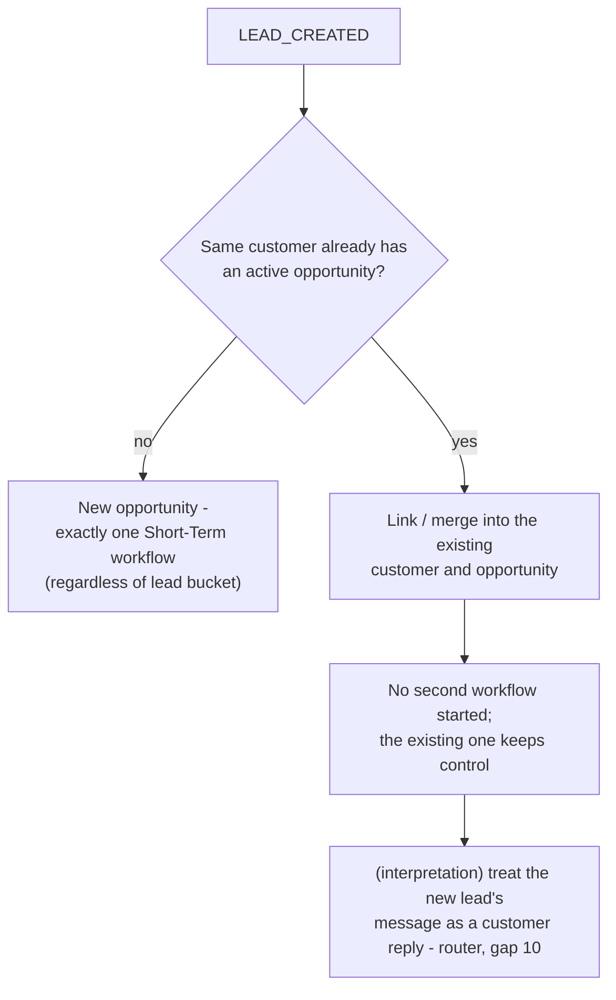
```mermaid
flowchart TD
    A["LEAD_CREATED"] --> B{"Same customer already has<br/>an active opportunity?"}
    B -->|no| C["New opportunity -<br/>exactly one Short-Term workflow<br/>(regardless of lead bucket)"]
    B -->|yes| D["Link / merge into the existing<br/>customer and opportunity"]
    D --> E["No second workflow started;<br/>the existing one keeps control"]
    E --> F["(interpretation) treat the new lead's<br/>message as a customer reply - router, gap 10"]
```

---

## 19. Vehicle photo selection

§13, §15 "Photo unavailable". Used by the Day 2 and Day 5 touches, the daily appointment countdown and No-Show step 1.

```mermaid
flowchart TD
    A["Touch wants a vehicle photo"] --> B{"Photo from an authorized inventory /<br/>media source for the intended vehicle?"}
    B -->|yes| C["Send it (countdown: a different photo each day)"]
    B -->|no| D{"Approved alternative vehicle<br/>or approved alternate media?"}
    D -->|yes| E["Send the approved alternative"]
    D -->|no| F["Non-photo message<br/>never a fabricated or unrelated photo"]
```

---

## 20. Spec gaps found while drawing

The PDF doesn't answer these. Each needs a client decision before it's built; until then the diagrams mark our guess as **(interpretation)**.

1. **When does New Lead become No Contact Made?** §1 gives both statuses the same workflow but never says what moves a lead from one to the other (after Touch 1? after Touch 2? after Day 1?).
2. **What counts as "meaningful contact"?** It drives every 1-hour call task and the status changes. Does an auto-reply count? An "ok"? A STOP? A bounce?
3. **How long is No-Show step 2's "window"?** §9 says "no response after Step 2 window" without a duration. Step 1 uses 24 h.
4. **Touch 2 on email.** §3 says the text is exactly `{FirstName}?`, but p.10 says every follow-up is call + text + email. Does "{FirstName}?" go out as an email too, and with what subject?
5. **A touch where SMS and email are both unavailable.** Should the call task be created straight away, or only after 60 minutes?
6. **The cadence clock after re-entry.** If a no-show on Day 40 restarts Short-Term, after its 7 days does the lead go back to weekly (Days 8–30 of the *instance*) or monthly (Day 47 of the *opportunity*)? Section 9 assumes opportunity age.
7. **Days 1–7 call tasks vs the 1-hour call task.** §3 asks for two call tasks per workday; p.9 adds one after every AI touch. Are these separate tasks, or does the 1-hour task fill the morning/afternoon slot?
8. **A single-channel opt-out and the status.** Does "Opted Out / Suppressed" mean every channel is off, or is it set on any opt-out while other channels continue?
9. **An ordinary reply during Appointment Set or No Show.** The router (§5) sends "reply, no appointment" to Contact Made – No Next Action. Priority (§11) suggests the appointment keeps control. Which one applies?
10. **A duplicate lead's content.** Is a second form fill merged silently, or treated as a new customer message that the AI answers?
11. **Touch 1 with missing fields.** What if there's no vehicle, agent name, or city/state on the lead? The required structure can't be filled.
12. **Re-entry and Touch 1.** On re-entry (after a no-show, say), does the cadence start again at Touch 1's "Hello … this is … Thank you for your interest"? That reads oddly to a customer mid-conversation.
13. **Day boundaries.** Is "Day 2" the next calendar day in the customer's time zone, or 24 h after Touch 1? And "each day before appointment": in whose time zone?
14. **Day 91 with a future appointment or Specific Follow-Up pending.** §4 says Day 91 closes the opportunity "without superseding business outcome". Is a booked appointment on Day 92 a superseding outcome?
15. **§9 terminology note.** The PDF itself flags that sending a never-reached no-show to *Contact Made* – No Next Action is semantically odd, then keeps it as a required rule. The diagrams follow the required rule.

---

## 21. Acceptance tests → diagrams

§16's tests and the diagram that shows each one.

| Acceptance test (§16) | Diagram |
|---|---|
| New lead creates exactly one Short-Term workflow regardless of bucket | 1, 18 |
| Touch 1 answers lead questions and ends with "what are you driving now?" | 7 |
| Touch 2 is the first-name nudge at 3 h or next permitted window | 6 |
| Two human call tasks only on scheduled workdays while status is eligible | 8 |
| Customer reply prevents stale queued AI messages from firing | 3, 6 |
| Appointment creation stops Short-Term / Specific and starts Appointment Follow-Up | 1, 2, 12 |
| Confirmation updates appointment and report | 13 |
| Sales Visit on appointment date marks Showed regardless of arrival time | 12, 15 |
| Rescheduled / old appointment cannot create a false No Show | 12, 13 |
| No Show begins only at appointment + 1 h with no Sales Visit | 12, 14 |
| Specific Follow-Up with no response after 24 h routes to No Contact Made | 11 |
| Opt-out prevents prohibited queued communications | 3, 16 |
| Short-Term re-entry does not reset `opportunity_created_at` | 17 |
| Day 91 closes opportunity, keeps customer / history / future task | 9, 11, 17 |
| No customer has conflicting active workflow instances | 1, 18 |
