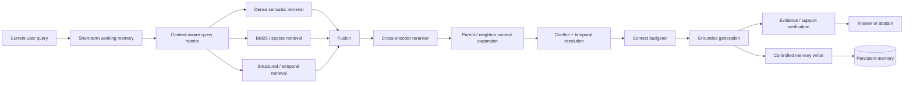
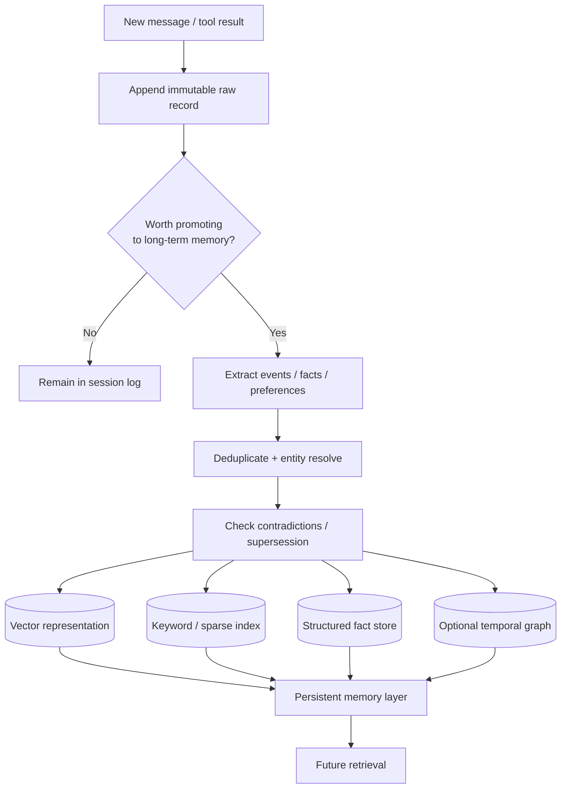
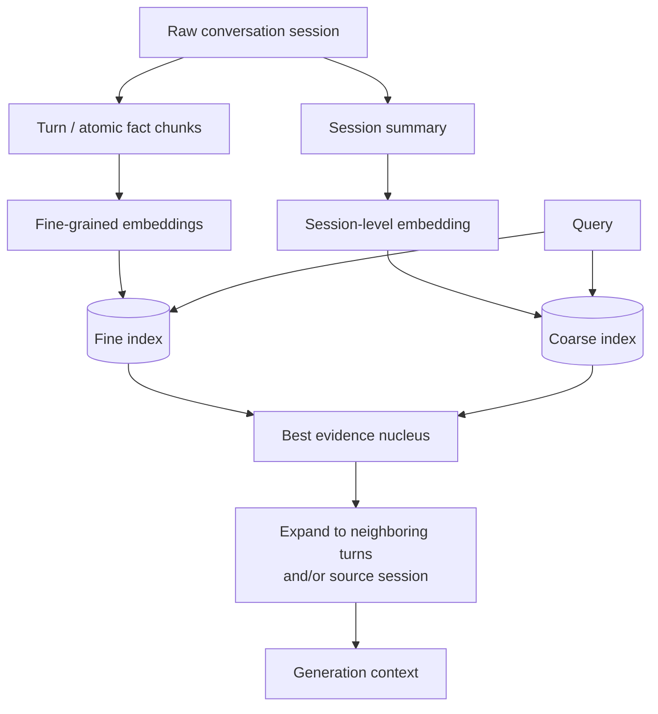
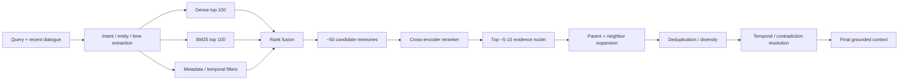
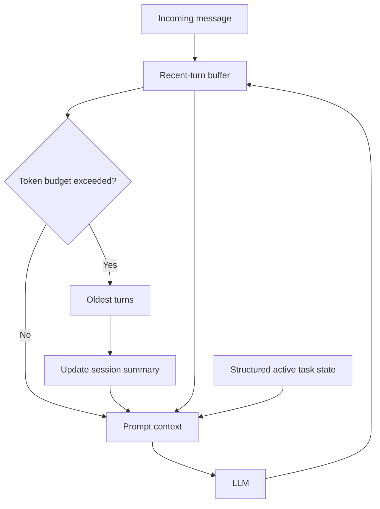
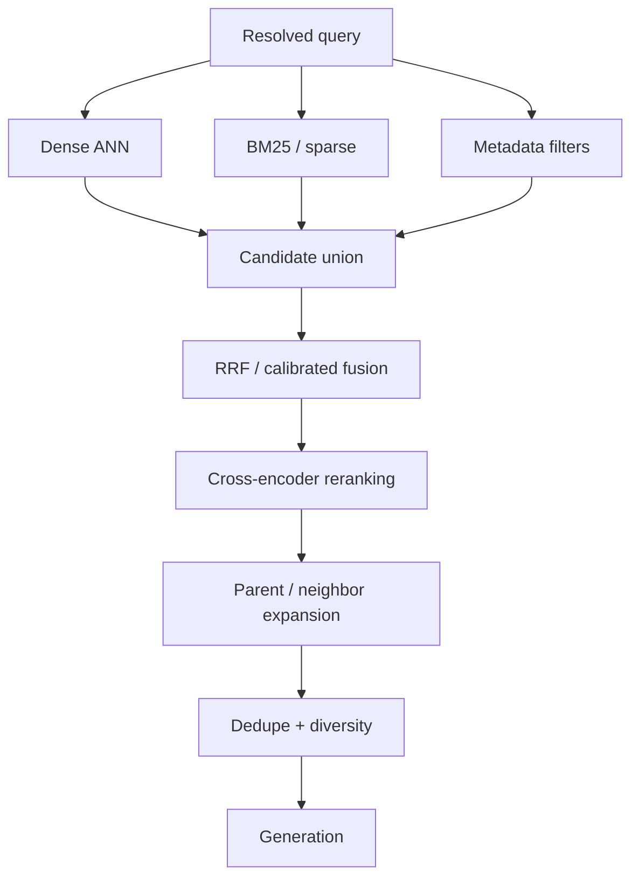
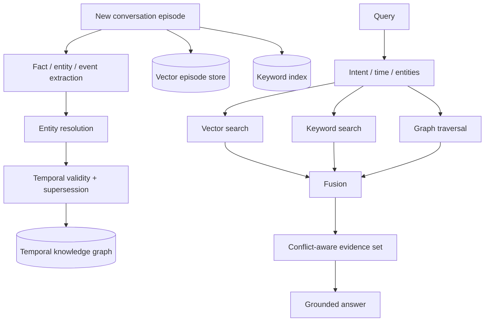
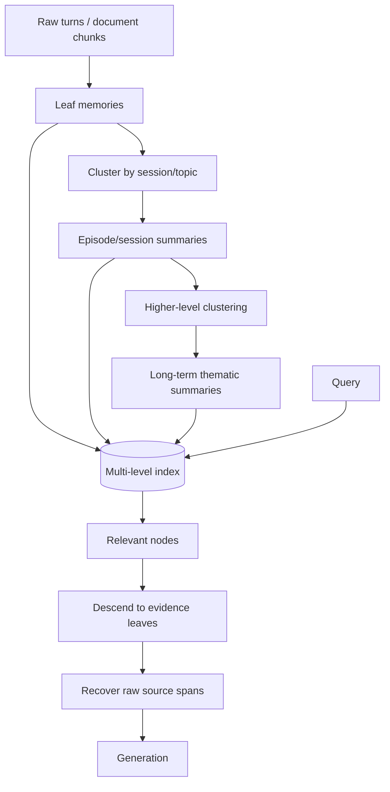
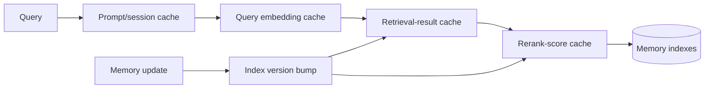
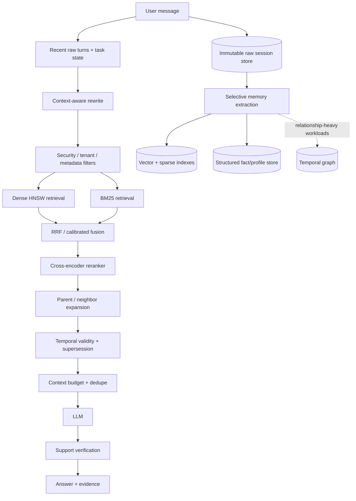

# Memory Architecture for RAG: Reliable Short-Term and Long-Term Retrieval

## Executive summary

A strong memory-enabled Retrieval-Augmented Generation system should not treat “memory” as one large vector database. The most reliable design is a **layered memory architecture** in which recent conversational state, persistent episodic history, durable semantic facts, structured temporal relationships, and source documents are stored and retrieved differently. MemGPT formalized the value of memory tiers for extending limited model context, while newer long-term-memory benchmarks such as LongMemEval and LoCoMo show why this separation matters: merely extending the context window or applying naïve RAG does not reliably recover information across long, multi-session conversations. LoCoMo contains conversations averaging roughly 300 turns and 9K tokens across as many as 35 sessions; LongMemEval includes 500 curated questions spanning single-session recall, multi-session reasoning, temporal reasoning, knowledge updates, and abstention. Both find substantial difficulty with long-range conversational memory even when long-context or retrieval methods are used. citeturn19search0turn19search1turn19search9

The central design principle is:

> **Retrieve at the granularity that maximizes evidence precision; generate from the granularity that preserves enough surrounding context to interpret that evidence.**

In practice, this means indexing relatively atomic facts, turns, or semantically coherent chunks, but after retrieval expanding them to their parent section, session, or neighboring turns before generation. LongMemEval's released retrieval framework explicitly evaluates turn- versus session-level memory and includes session decomposition, key expansion, and time-aware retrieval; RAPTOR independently demonstrates the usefulness of retrieving information at multiple levels of abstraction rather than relying exclusively on short contiguous chunks. citeturn19search9turn19search2

The strongest general-purpose architecture is therefore **hybrid and multi-stage**:



Dense embeddings are excellent for paraphrases and conceptual similarity, but sparse methods remain valuable for exact identifiers, names, codes, rare terms, and lexical constraints. DPR established the effectiveness of learned dual-encoder dense retrieval, while BM25 remains a strong lexical baseline. Modern production systems therefore commonly expose hybrid lexical/vector search and reranking rather than forcing a choice between the two: Weaviate combines vector search with BM25F, and Pinecone documents semantic, lexical/hybrid retrieval and reranking as complementary stages. citeturn15search0turn13search2turn4search2turn4search19

For the vector index, **HNSW is the best default for moderate-to-large, latency-sensitive memory collections when RAM is available**; **IVF or IVF-PQ becomes attractive when very large collections, tighter memory budgets, or compression matter**. HNSW trades graph memory for high-recall low-latency search, with `M`, `efConstruction`, and search-time `ef` controlling memory/build/query-quality trade-offs. IVF partitions vectors into `nlist` clusters and probes only `nprobe` clusters at query time; raising `nprobe` trades latency for recall. FAISS provides low-level index implementations and experimentation control, whereas Milvus provides database-oriented persistence and operational management around vector indexes. citeturn15search1turn15search2turn15search9turn5search1

Long conversational memory should also be **time-aware rather than simply recency-biased**. A useful memory record distinguishes when information was said, when the represented event happened, when the fact became valid, when it ceased to be valid, and when the record entered the store. LongMemEval explicitly tests knowledge updates and temporal reasoning and provides time-aware query pruning; temporal-graph approaches such as Zep/Graphiti model changing relationships and integrate semantic, keyword, and graph-based retrieval. citeturn19search9turn9search8turn9search2

The recommended production hierarchy is:

| Layer | Primary purpose | Typical retention | Representation | Retrieval |
|---|---|---:|---|---|
| **Working memory** | Coreference, current task state, immediate dialogue continuity | Minutes/session | Raw turns + active structured state | Direct inclusion |
| **Session memory** | Preserve local conversational episode | Hours/days | Raw session + rolling/session summary | Session ID + semantic search |
| **Episodic LTM** | Recall what happened in prior interactions | Long-lived | Raw episode + event/fact chunks + embeddings | Hybrid dense/sparse + temporal |
| **Semantic/profile LTM** | Stable preferences, identities, durable facts | Long-lived | Structured fields/triples + evidence links | Exact/filter + semantic |
| **Knowledge/document LTM** | External authoritative evidence | Source lifetime | Hierarchical chunks + source metadata | Hybrid RAG + reranking |
| **Cold source store** | Ground truth and reprocessing | Longest retention | Original conversations/documents | ID/address lookup |

This layered pattern follows the broad direction of hierarchical memory systems such as MemGPT and newer memory architectures while avoiding a critical failure mode: **replacing raw ground truth with generated summaries**. Generated summaries are useful retrieval keys and token-saving abstractions, but raw messages/documents should remain the authoritative record because summarization can omit qualifications, temporal relationships, or contradictions. MemGPT demonstrates tiered context management; RAPTOR demonstrates multi-resolution summaries; recent memory work similarly emphasizes contextualized retrieval around original episodes rather than treating distilled facts as the only persistent representation. citeturn19search1turn19search2turn10academia28

The five architectural patterns analyzed below can be summarized as follows.

| Approach | Retrieval correctness | Conversational continuity | Scale | Latency | Storage cost | Best fit |
|---|---:|---:|---:|---:|---:|---|
| Windowed short-term memory | Excellent for recent state | Excellent locally | Low | Very low | Low | Current session/task |
| Dense episodic vector memory | Good semantic recall | Moderate-good | High | Low | Moderate | Simple LTM, semantic queries |
| Hybrid retrieval + reranker | **Excellent general-purpose** | Good | High | Moderate | Moderate-high | Default production RAG |
| Temporal symbolic + vector memory | **Excellent for updates/time/multi-hop** | Excellent | Moderate-high | Moderate-high | High | Personal agents, changing facts |
| Hierarchical multi-resolution memory | Excellent for long documents/sessions | **Excellent** | High | Moderate | Moderate-high | Long conversations/docs |

The highest-confidence recommendation for a general system with no infrastructure constraint is therefore **windowed working memory + persistent raw episodes + hybrid dense/BM25 retrieval + metadata/time filters + reranking + parent/neighbor expansion + provenance-aware generation**, optionally adding a temporal graph when queries frequently require relationship or update reasoning. This recommendation is a synthesis of the benchmark evidence and production retrieval capabilities rather than a claim that one architecture dominates every workload. LongMemEval and LoCoMo, in particular, make clear that the correct choice depends heavily on question type—single-session extraction, cross-session synthesis, temporal reasoning, and knowledge updates stress different parts of the pipeline. citeturn19search0turn19search9

## Memory model and reference architecture

**Short-term memory (STM)** is the information the application expects to need immediately: recent user/assistant turns, unresolved references, the active goal, tool results, workflow state, and perhaps a compressed running summary. It is normally session-scoped, mutable, fast to access, and either injected directly into the model context or held in an application state object. This corresponds conceptually to the fast/limited memory tier in hierarchical designs such as MemGPT. citeturn19search1

**Long-term memory (LTM)** persists beyond the current context window or session. It may contain complete interaction episodes, extracted facts, user preferences, past decisions, summaries/reflections, external documents, and relationships among entities and events. LongMemEval's distinction between evidence across sessions, temporal reasoning, knowledge updates, and abstention illustrates why LTM is more than archival storage: the application must be able to retrieve the *right historical evidence under the right temporal interpretation*. citeturn19search9

A particularly useful subdivision is:

| Memory class | Example | What should be stored | Preferred retrieval |
|---|---|---|---|
| Working | “By ‘it’ I mean the PostgreSQL migration we just discussed.” | Recent raw dialogue + active entities | Direct context |
| Episodic | “On March 3 the user chose PostgreSQL over DynamoDB.” | Event + timestamp + raw supporting turn | Hybrid semantic/lexical |
| Semantic | “User prefers Python.” | Canonical fact plus provenance | Structured filter + semantic |
| Procedural/task | “Deployment requires security review before release.” | Rule/workflow state | Symbolic/exact lookup |
| Reflective | “Their recurring concern is operational cost.” | Derived summary linked to episodes | Semantic, lower authority |
| Documentary | Contract, manual, codebase, policy | Source chunks + hierarchy | Hybrid RAG |

The authority ordering should usually be:

**original evidence > explicitly confirmed structured fact > extracted fact > generated summary/reflection**.

This distinction is essential because a conversational agent may itself make an incorrect statement. Persisting every assistant utterance as factual memory can transform one hallucination into permanent retrieved “evidence.” LongMemEval even separates user-side and assistant-side information in its evaluation format, underscoring that message source is semantically relevant. citeturn19search9

A robust record schema might resemble:

```text
MemoryRecord {
    memory_id
    tenant_id
    user_id
    conversation_id
    session_id
    turn_id

    type: raw_turn | episode | fact | preference | summary | document_chunk
    speaker: user | assistant | tool | system | external_source

    text
    embedding
    sparse_terms

    entities[]
    topics[]
    parent_id
    neighbor_ids[]
    source_uri_or_id
    source_span

    event_time
    observed_at
    valid_from
    valid_to
    ingested_at

    confidence
    authority
    importance
    supersedes[]
    contradicted_by[]

    acl_tags[]
    embedding_model_version
    chunking_version
    content_hash
}
```

The multiple timestamps are intentional. `ingested_at` tells the storage system when it learned something; `event_time` represents when an event occurred; `valid_from` and `valid_to` model the period during which a changing fact was true. Temporal memory systems benefit from maintaining these distinctions rather than assuming “most recently inserted = currently correct.” LongMemEval's temporal reasoning and knowledge-update categories and temporal-graph systems such as Graphiti/Zep directly motivate this separation. citeturn19search9turn9search8

**Sessionization** should be explicit. A session can be defined by an application conversation/thread identifier and optionally segmented further when there is a long inactivity gap or major topic change. Each memory item should preserve its original `session_id` even if semantically indexed at the fact/turn level. During retrieval, current-session memories can receive a controlled boost while cross-session memories remain searchable. This prevents an old semantically similar conversation from displacing evidence from the current task, while still allowing cross-session recall—the capability LongMemEval and LoCoMo specifically test. citeturn19search0turn19search9

The memory lifecycle should separate **writing** from **reading**:



The write gate should favor information that is durable, user-confirmed, task-relevant, or likely to be useful later. Transient pleasantries and repeated low-value text generally belong only in the raw conversation store. More elaborate systems such as Generative Agents and Mem0 similarly distinguish memory extraction/consolidation from later retrieval rather than treating the entire interaction log as an undifferentiated prompt. citeturn2search2turn10search0

The principal storage choices are:

| Representation | Strength | Weakness | Recommended role |
|---|---|---|---|
| **Dense embeddings** | Paraphrases, semantic similarity, multilingual/conceptual recall | Can miss exact strings; similarity is not truth; poor explicit temporal/relational logic | Candidate retrieval |
| **Sparse/BM25** | Exact terms, names, IDs, unusual words; interpretable | Vocabulary mismatch and paraphrase weakness | Complement dense search |
| **Relational/document fields** | Exact filters, transactions, ACL, time, source metadata | Requires known schema | System-of-record metadata |
| **Knowledge/temporal graph** | Relationships, multi-hop traversal, updates, event chronology | Expensive extraction/entity resolution | Relationship-heavy LTM |
| **Hybrid** | Highest robustness across query types | More storage, writes, tuning, operational complexity | **Preferred production architecture** |

Dense retrieval became a major alternative to sparse retrieval through dual-encoder systems such as DPR, which reported sizable top-20 passage-retrieval gains over its BM25 baseline on its evaluated open-domain QA datasets. That result should not be interpreted as BM25 becoming obsolete: hybrid systems exploit different failure modes, and current Weaviate and Pinecone stacks explicitly support combining semantic and lexical retrieval. citeturn15search0turn4search2turn4search3

OpenAI's hosted retrieval model follows the same broad abstraction: files placed in vector stores are processed for retrieval, with chunking/indexing handled by the service, while retrieval supports associated attributes for filtering; the file-search interface also exposes result-count control, creating an explicit quality-versus-latency/token-use trade-off. citeturn4search5turn4search13turn4search1

## Storage, indexing, and chunk construction

### Vector-index choices

Approximate nearest-neighbor search is usually the performance-critical LTM primitive. The important decision is less “which vector database?” than **which ANN algorithm, compression scheme, filtering behavior, and operational layer match the data size and SLA**.

| Index | Recall/latency character | Memory | Build/update | Important tuning | Good fit |
|---|---|---|---|---|---|
| Exact flat | Exact nearest neighbors; slowest as N grows | High | Simple | `k`, batching | Ground-truth benchmark, small corpora |
| HNSW | High recall at low latency | **High** | Relatively expensive graph build | `M`, `efConstruction`, `efSearch` | Interactive RAG |
| IVF-Flat | Recall/latency controlled by partitions probed | Moderate-high | Requires clustering/training | `nlist`, `nprobe` | Large datasets |
| IVF-PQ | Approximate + compressed | **Low** | More tuning/training | `nlist`, `nprobe`, PQ subquantizers/bits | Very large/cost-sensitive |
| HNSW + quantization | HNSW speed with lower vector memory | Medium | More complexity | HNSW + quantizer | Large interactive workloads |
| Flat GPU | Very high throughput exact/near-exact search | GPU memory intensive | Simple | batch sizes | Offline/evaluation/special workloads |

Milvus documents HNSW's `M` as the number of graph neighbors and `efConstruction` as the candidate pool considered while constructing graph connections; its IVF-Flat documentation defines `nlist` as the number of k-means partitions and `nprobe` as the number searched at query time. Milvus also notes that increasing `nprobe` increases search work and can sharply increase query time. citeturn15search1turn15search2turn15search9

A practical HNSW tuning process is not to copy a magic configuration but to build a **recall-latency frontier**. Start with several plausible `M` values, build indexes with progressively larger `efConstruction`, and sweep query-time `efSearch` until additional recall improvements no longer justify p95 latency. Increasing graph connectivity and candidate exploration generally improves recall but raises memory, indexing cost, or query latency. citeturn15search2turn14search13

For IVF, similarly sweep `nlist` and `nprobe`. `nlist` controls partition granularity; `nprobe` determines how many partitions are actually searched. Increasing `nprobe` generally moves behavior toward a more exhaustive search at greater cost. citeturn15search1turn15search9

FAISS is best understood as an **ANN/search library** rather than a complete conversational-memory database. It exposes flat, IVF, PQ, HNSW and related combinations and is excellent for experiments, embedded services, offline indexing, and custom architectures. FAISS's documentation notes, for example, that its HNSW implementation supports flat and quantized storage variants and that removal is problematic for that specific HNSW implementation because deletion can damage graph structure. citeturn5search1turn5search21

Milvus is more appropriate when a vector index needs to be part of a persistent database service with collections, metadata, index lifecycle and operational scaling. A common pattern is to use FAISS when maximum algorithmic control or an in-process index is desired and Milvus, Weaviate, Pinecone or another vector database when persistence, multi-user operation and managed querying are more important. This is an architectural recommendation rather than a claim that one has universally higher performance. citeturn15search1turn15search2turn17search3

Google's ScaNN is another significant ANN option: Google's original ScaNN work targeted efficient vector similarity search and the later SOAR work focuses on improving search efficiency through controlled redundancy. It is particularly relevant when optimizing a custom search service rather than adopting a complete memory database. citeturn6search1turn6search5

### Chunking is a retrieval decision, not preprocessing housekeeping

Poor chunking often causes retrieval failures that look like embedding failures. A vector index can perfectly retrieve the nearest indexed object and still return useless evidence if the correct fact was split from its qualifier, speaker, date, section heading, or preceding conversational reference.

**Fixed/sliding-window chunks** are the simplest baseline. They create predictable sizes and are easy to batch, but boundaries are artificial and overlaps create storage and retrieval duplication. Pinecone's chunking guidance emphasizes that chunks must fit embedding-model limits while retaining enough information to make retrieved segments meaningful. citeturn3search0

**Semantic chunks** split on topical or discourse boundaries rather than fixed token counts. They can improve coherence, especially in prose, but require additional computation and can create unevenly sized chunks. The correct comparison is empirical: test semantic splitting against a fixed-window baseline using evidence Recall@k and downstream answer accuracy, rather than assuming semantic segmentation is always better.

**Hierarchical chunks** preserve parent-child structure. RAPTOR recursively embeds, clusters, and summarizes text into a tree so retrieval can operate at multiple abstraction levels; its paper reports strong results on complex QA and a 20 percentage-point absolute improvement on QuALITY in one GPT-4 configuration compared with the prior result used by the authors. citeturn19search2

For conversational RAG, the most robust variant is a **dual-granularity index**:



LongMemEval directly supports and evaluates both turn-level and session-level granularity and provides fact/key expansion experiments, demonstrating that memory-index granularity is an explicit retrieval design variable rather than merely a formatting choice. citeturn19search9

A good tuning sweep for ordinary prose is to compare approximately `256`, `512`, and `1024` token target chunks with `0%`, `10%`, and `20%` overlap, then optimize against your own evidence-recall and end-to-end metrics. These values are recommended experimental starting points, not universal optima. Conversation memory should additionally test turn-level, episode-level, and session-level indexing because its natural semantic units are often much smaller than document sections.

One especially useful pattern is **small-to-big retrieval**:

1. Search 100–500-token atomic units.
2. Rerank those units.
3. Keep the best evidence nuclei.
4. Replace each nucleus with its containing paragraph, parent chunk, session excerpt, or ±N adjacent dialogue turns.
5. Deduplicate overlapping expansions.
6. Fit expanded evidence into the final token budget.

This separates **search precision** from **reading context** and directly addresses the main weakness of both tiny chunks and giant chunks.

Context ordering also matters. “Lost in the Middle” found that long-context models often use relevant information less effectively when it appears in the middle of lengthy contexts than when it appears near the beginning or end, which is an important reason not to treat a larger context window as a substitute for retrieval and ordering. citeturn11academia37

### Metadata is part of retrieval quality

At minimum, conversation/document chunks should be associated with:

`tenant_id`, `user_id`, `conversation_id`, `session_id`, `turn_id`, `timestamp`, `speaker`, `memory_type`, `source`, `parent_id`, `topic`, `entity IDs`, `language`, `ACL`, `valid_from`, `valid_to`, and version identifiers.

These fields are not merely bookkeeping. They let the retriever first narrow the semantic search space to the correct user, authorization scope, time range, document version, or session. Pinecone and Weaviate both support metadata/filter constraints around vector or hybrid searches; OpenAI vector-store search similarly exposes attributes usable for filtering. citeturn4search15turn17search27turn4search13

The context budget should then be treated as a constrained optimization problem:

\[
\max_{C \subseteq R}\;\sum_{d\in C} \mathrm{Utility}(d,q)
\]

subject to

\[
\sum_{d\in C}\mathrm{tokens}(d) \le B
\]

where utility should consider relevance, novelty, source authority, temporal validity, and coverage of distinct subquestions rather than similarity alone.

## Retrieval, scoring, temporal memory, and context preservation

### Candidate generation and reranking

A modern retrieval stack should separate **high-recall candidate generation** from **high-precision reranking**.

DPR is a canonical dense first-stage retriever: separate encoders produce dense question and passage representations, allowing passages to be pre-embedded and searched efficiently with ANN indexes. Its 2020 study reported 9–19 percentage-point absolute gains over the authors' Lucene-BM25 baseline in top-20 retrieval accuracy across the evaluated open-domain QA datasets. citeturn15search0turn15search4

BM25 remains valuable because neural embeddings are not inherently optimized for exact strings such as `"ERR_CONNECTION_1287"`, SKU numbers, names, dates, or uncommon technical terminology. Hybrid search therefore sends a query through both sparse and dense retrieval. Weaviate's hybrid implementation explicitly combines vector retrieval and BM25F, while Pinecone supports semantic, lexical and hybrid patterns. citeturn4search2turn4search11

Cross-encoder rerankers then evaluate `(query, candidate)` jointly. This generally provides richer relevance estimation than independent query/document embeddings but incurs inference for each candidate pair, which is why cross-encoders are normally applied to a restricted candidate set rather than the whole corpus. citeturn13search21

ColBERT-style late interaction occupies an intermediate point: it preserves token-level representations and performs fine-grained token interaction without running a full cross-encoder for every corpus item. ColBERTv2 adds residual compression and reports substantial storage reduction relative to its late-interaction baseline. citeturn13search3

A strong multi-stage pipeline is:



Reciprocal-rank fusion is often convenient because lexical and dense similarity values live on incompatible scales:

\[
\mathrm{RRF}(d)=\sum_r\frac{1}{k+\operatorname{rank}_r(d)}
\]

Rather than assume one `k`, tune it with the rest of the retrieval pipeline. A sensible experimental sweep is `k ∈ {20, 60, 100}` while monitoring Recall@k and nDCG.

Where learned reranking is available, a conceptual final score might be:

\[
S(d,q)=
w_c C(d,q)
+w_h H(d,q)
+w_t T(d)
+w_s I_\text{session}
+w_a A(d)
-w_x X(d)
\]

where:

- \(C\) = calibrated cross-encoder relevance;
- \(H\) = hybrid retrieval/fusion score;
- \(T\) = task-sensitive temporal score;
- \(I_\text{session}\) = current-session affinity;
- \(A\) = authority/confidence;
- \(X\) = staleness/contradiction penalty.

Do not simply add raw cosine similarity, BM25 and cross-encoder scores without normalization or calibration: they do not generally share a meaningful numeric scale.

### Recency is not the same as temporal correctness

A common memory design assigns every record exponential recency decay:

\[
R(\Delta t)=e^{-\lambda\Delta t}
\]

or equivalently, using a half-life \(h\),

\[
R(\Delta t)=2^{-\Delta t/h}.
\]

That can be useful for queries such as “what were we discussing recently?” but is dangerous as a global ranking rule. A user's birthday does not become less true because it was stated a year ago; a stock price, current employer, or project status may become stale quickly. LongMemEval's separate knowledge-update and temporal-reasoning tasks illustrate why treating all memory as monotonically decaying is insufficient. citeturn19search9

A better policy is **type-sensitive decay**:

| Memory type | Recency policy |
|---|---|
| Current task state | Very strong decay |
| Casual episode | Moderate decay |
| User preference | Mild decay + supersession |
| Stable biographical fact | Little/no passive decay |
| Time-sensitive status | Strong validity checks |
| Explicitly dated historical event | Never replace purely because newer |
| Document revision | Prefer current version for “current” questions, retain history |

Temporal queries should also be rewritten with time constraints. LongMemEval's released framework includes time-aware query expansion that extracts timestamped events and prunes the retrieval space according to the inferred time range. citeturn19search9

A query such as:

> “What database did I decide to use before we changed the architecture in April?”

should become conceptually:

```text
semantic_query = "database technology decision"
user_id = current_user
event_time < architecture_change_date
memory_type in {decision, episode}
retrieve historical state, not current canonical state
```

By contrast:

> “Which database are we using now?”

should prioritize facts whose validity interval includes the present and suppress records marked as superseded.

This is where temporal knowledge graphs become attractive. Zep's Graphiti architecture incrementally adds episodes to a temporal context graph and combines semantic, keyword, and graph-based retrieval; its design specifically targets facts and relationships whose validity changes over time. citeturn9search8turn9search2

### Correct conversational retrieval starts before embedding

Questions in dialogue are frequently underspecified:

> “Did we ever fix that?”

Searching the literal sentence is usually useless. The retriever should first resolve “that” using working memory:

```text
Recent context:
User: "The HNSW index periodically returned stale profile data."
...
Current: "Did we ever fix that?"

Resolved query:
"Was the stale profile-data problem in the HNSW memory index fixed?"
```

This makes short-term and long-term memory interdependent: **STM interprets the query used to search LTM**.

The query rewrite should preserve the original query and produce structured facets rather than replacing it entirely:

```text
QueryFrame {
    original_query
    standalone_query
    entities
    current_session
    target_time_range
    requested_memory_types
    lexical_keywords
    possible_subquestions
}
```

Dense retrieval can run against `standalone_query`, BM25 against both original terms and extracted lexical anchors, and filters against structured facets.

### Context expansion should happen after ranking

Suppose retrieval finds:

> “Actually, let's use Milvus.”

Taken alone, the sentence lacks context. Instead of embedding a huge conversation block merely to retain context, retain graph pointers:

```text
turn_105.parent_session = session_14
turn_105.prev = turn_104
turn_105.next = turn_106
turn_105.topic = vector_database_decision
```

The system retrieves turn 105 because it is a sharp semantic match, then expands it:

```text
turn_103 ... previous comparison
turn_104 ... reason for rejecting option A
turn_105 ... final decision
turn_106 ... caveat / deployment requirement
```

This pattern typically gives better retrieval precision than indexing the whole session as a single vector while retaining more conversational meaning than feeding an isolated sentence.

## Architecture patterns and implementation playbooks

The following five patterns cover most practical memory systems. Each includes the requested architecture, implementation procedure, tools, tuning, evaluation, advantages/disadvantages, and pseudocode.

### Pattern: windowed working memory with session summarization

This is the correct baseline for **short-term conversational memory**. Recent messages are kept verbatim, older in-session content is summarized, and selected task state is maintained separately.



**Implementation.** Append every raw turn to an immutable conversation log. Keep the latest `N` turns or `T` tokens in a fast store. When that budget is crossed, summarize older material into a session synopsis but retain the originals outside the prompt. Keep critical active fields—such as selected project, unresolved action items, tool IDs, names and constraints—in a structured state object rather than hoping the summary preserves them.

**Recommended tooling.** Redis or an in-process cache is sufficient for active-window state; PostgreSQL/document storage can hold the raw log. Any model can summarize older turns. Frameworks such as LangChain or LlamaIndex can orchestrate this, but the core architecture is simple enough that custom state management is often preferable. MemGPT is the relevant research analogue because it explicitly manages fast and slow memory tiers. citeturn19search1

**Tuning.** Sweep recent-window budgets as a fraction of the model's available context rather than maximizing them. Evaluate rolling-summary frequency and whether critical entities/actions are lost. Do not repeatedly summarize summaries indefinitely; periodically regenerate a summary from authoritative raw turns to limit accumulated distortion.

**Metrics.** Evaluate coreference resolution accuracy, current-task constraint recall, exact recall of facts from the last `N` turns, context tokens/request, prompt-construction latency, and contradiction rate. LongMemEval's single-session categories are useful downstream checks; LoCoMo can stress longer continuity. citeturn19search0turn19search9

**Pros:** extremely low retrieval latency, excellent local coherence, straightforward implementation, and minimal infrastructure.

**Cons:** cannot independently solve cross-session recall, summaries are lossy, prompt cost grows if the verbatim window is over-expanded, and very long contexts remain subject to attention-position effects documented by Lost in the Middle. citeturn11academia37

**Pseudocode:**

```text
function build_short_term_context(user_id, session_id, token_budget):
    recent = session_log.tail(session_id, max_turns=K)
    state  = task_state.get(session_id)
    summary = session_summary.get(session_id)

    context = [state, summary, recent]

    while token_count(context) > token_budget:
        oldest = remove_oldest_noncritical_turns(recent)
        summary = summarize_with_evidence_links(summary, oldest)
        session_summary.put(session_id, summary)
        context = [state, summary, recent]

    return context
```

This approach should almost always be present, but rarely should it be the *only* memory layer.

### Pattern: dense episodic vector memory

This is the simplest persistent RAG memory: convert prior episodes/chunks into embeddings and retrieve nearest neighbors.


**Implementation.** Persist original conversations, segment them into coherent units, attach source/session/time metadata, embed each unit, and upsert it into a vector index. At query time resolve dialogue references using STM, embed the rewritten query, apply tenant/user filters, retrieve `k` candidates, optionally expand neighbors, then inject them into the generation context.

OpenAI's retrieval/vector-store APIs provide a hosted version of this abstraction in which vector stores underpin semantic search and indexed files are prepared for retrieval; Pinecone explicitly documents OpenAI embeddings paired with vector search for semantic search and long-term-memory/RAG scenarios. citeturn4search5turn17search18

**Recommended tooling.** For embeddings, OpenAI embeddings, sentence-transformers or another MTEB-tested model can be used. For indexes, FAISS suits custom/local deployments; Milvus, Pinecone or Weaviate suit database/service deployments. MTEB is useful when comparing candidate embedding models because retrieval quality varies materially by model, task and domain rather than having one universally best embedding. citeturn11academia36

**Tuning.** Jointly tune chunk size, embedding model, similarity metric, ANN settings and `top_k`. Start from exact flat search on a representative offline subset; it establishes the retrieval-quality ceiling for the chosen embeddings. Then tune HNSW/IVF until ANN Recall@k relative to the exact baseline is acceptably high. This distinction tells you whether misses come from the embedding/chunking layer or ANN approximation.

For HNSW, sweep `M`, `efConstruction` and `efSearch`; for IVF, sweep `nlist` and `nprobe`. citeturn15search1turn15search2

**Metrics.** Evidence Recall@1/5/10, MRR, nDCG@k, ANN recall versus exact search, answer faithfulness, p50/p95 query latency, index size, embedding cost and write latency. BEIR can evaluate retriever generalization, while LongMemEval and LoCoMo are more directly relevant to conversational memory. citeturn12search0turn19search0turn19search9

**Pros:** simple architecture, efficient semantic matching, mature ANN ecosystem, excellent scaling compared with brute-force prompt history.

**Cons:** semantic similarity does not guarantee factual relevance, exact strings can be missed, independent chunks do not model relationships well, temporal conflicts require additional logic, and embedding every low-value turn wastes storage.

**Pseudocode:**

```text
function write_episode(session, turn):
    record = make_atomic_memory(turn)
    record.vector = embed(contextualize(turn, session))
    record.metadata = {
        user_id, session_id, speaker,
        observed_at, event_time,
        parent_session_id
    }
    vector_db.upsert(record)

function retrieve_episode(query, recent_context):
    standalone = rewrite_query(query, recent_context)

    hits = vector_db.search(
        vector = embed(standalone),
        filter = {"user_id": current_user},
        top_k = 20
    )

    hits = similarity_threshold(hits)
    return expand_neighbors(hits[0:8])
```

This pattern is a strong minimum viable LTM but is not the recommended endpoint for high-accuracy systems.

### Pattern: hybrid lexical+dense retrieval with reranking

This is the recommended **general-purpose production baseline**.



**Implementation.** Maintain dense vectors and a sparse/inverted index over the same canonical memory IDs. Generate enough candidates from both retrievers to favor recall, union or rank-fuse them, then apply a more expensive reranker to the much smaller candidate set. Expand context only after reranking. Both Weaviate and Pinecone expose pieces of this architecture through hybrid search, metadata filtering and reranking features. citeturn4search2turn4search6turn4search7turn4search19

**Recommended tooling.** Weaviate offers integrated BM25/vector hybrid search and reranking modules; Pinecone provides dense/sparse/hybrid retrieval and reranking; Elasticsearch/OpenSearch can be paired with a vector backend; FAISS plus Lucene can provide full low-level control. Cross-encoder models from sentence-transformers or dedicated reranking services can provide the second stage. citeturn4search2turn17search15turn4search19

**Tuning.** First optimize candidate Recall@k with a relatively generous pool—for example, test dense 50–200 plus BM25 50–200. Then sweep reranker depth independently. Production systems commonly benefit more from reranking dozens of candidates well than from stuffing hundreds of first-stage hits into an LLM. Measure incremental recall from each lane: `dense_only`, `BM25_only`, `union`, `fusion`, `reranked`.

Tune sparse/dense weights on labeled queries rather than by intuition. Where score scales differ substantially, prefer rank fusion or calibrated scores.

**Metrics.** In addition to Recall@k/MRR/nDCG, track *marginal rescue rate*: the percentage of questions whose gold evidence is missed by dense search but recovered by BM25, and vice versa. Track reranker uplift in nDCG/MRR, top-k evidence precision, rerank p95 latency and cost/query.

**Pros:** robust to both conceptual paraphrases and exact lexical evidence, reranking sharply separates candidate generation from precision, supports metadata naturally, and is less brittle across heterogeneous corpora.

**Cons:** multiple indexes increase storage/write amplification; reranking adds inference latency/cost; weighting/fusion needs evaluation; operational debugging is more complex.

**Pseudocode:**

```text
function hybrid_retrieve(query_frame):
    dense = vector_index.search(
        embed(query_frame.standalone_query),
        filter=query_frame.filters,
        top_k=100
    )

    sparse = bm25_index.search(
        terms=[
            query_frame.original_query,
            query_frame.lexical_keywords
        ],
        filter=query_frame.filters,
        top_k=100
    )

    candidates = reciprocal_rank_fusion(
        dense, sparse, rrf_k=60
    )

    top = candidates[0:50]

    scored = cross_encoder.score(
        query_frame.standalone_query,
        [c.text for c in top]
    )

    reranked = sort_desc(scored)
    nuclei = reranked[0:10]

    expanded = expand_parent_or_neighbors(nuclei)
    return dedupe_and_budget(expanded)
```

For most RAG systems where correct chunk retrieval matters more than minimal implementation complexity, this is the architecture to beat.

### Pattern: temporal symbolic-graph plus vector memory

This pattern is appropriate when users ask about changing relationships, histories, multi-hop associations and factual updates.



**Implementation.** Preserve every raw episode. Extract candidate entities, relationships, events and temporal intervals. Resolve duplicate entities to canonical IDs. Store both structured assertions and links back to the original text. A fact update should generally *close* the old fact's validity interval or create a `supersedes` edge rather than physically erasing history. At retrieval time, use vector/keyword search to identify relevant entities/episodes and graph traversal to recover relationships and chronology.

Graph-based RAG has increasingly been explored for exactly these limitations of independent-vector chunks. HippoRAG combines a knowledge graph with Personalized PageRank-inspired retrieval and reports improvements on multi-hop QA while reducing the iterative retrieval burden of some competing methods. citeturn7academia33turn7academia35

Zep/Graphiti is a directly memory-oriented example: episodes are incrementally integrated into a temporal context graph and retrieval combines graph structure with semantic and keyword search. citeturn9search8turn9search2

**Recommended tooling.** Graph databases such as Neo4j or a relational graph representation can store entities/edges; Zep/Graphiti is specifically oriented toward temporal agent memory. Pair the graph with Milvus, Weaviate, Pinecone, pgvector or FAISS for episodic vector search. Avoid requiring graph traversal for every simple question; it should be one retrieval lane.

**Tuning.** Optimize fact-extraction precision before recall because bad graph edges can propagate widely. Tune entity-resolution thresholds, maximum traversal depth, edge types allowed per query and temporal filtering. For many conversational queries, one or two hops are safer than unconstrained graph traversal.

Separate *observed fact confidence* from *retrieval relevance*. A highly relevant but low-confidence extracted relationship should not be treated as equivalent to a user-confirmed assertion.

**Metrics.** Temporal QA accuracy, knowledge-update accuracy, multi-hop evidence recall, entity-resolution precision/recall, contradiction rate, invalid/superseded-fact retrieval rate, path precision and end-to-end LongMemEval temporal/multi-session performance. LongMemEval specifically provides temporal-reasoning and knowledge-update classes. citeturn19search9

**Pros:** models updates explicitly; excellent for “what changed?”, “who was associated with what?”, or multi-session relationship questions; supports explainable evidence paths; structured facts are easy to filter.

**Cons:** expensive ingestion, LLM extraction can introduce erroneous entities/edges, entity resolution is difficult, graph schemas evolve, and simple single-hop queries may be unnecessarily slower than vector search.

**Pseudocode:**

```text
function ingest_temporal_episode(raw_episode):
    source_id = source_store.append(raw_episode)

    claims = extract_structured_claims(raw_episode)

    for claim in claims:
        entity_ids = entity_resolver.resolve(claim.entities)

        prior = graph.find_active_conflicts(
            subject=entity_ids.subject,
            predicate=claim.predicate
        )

        if claim_is_supported(claim, raw_episode):
            for p in prior:
                if claim.supersedes(p):
                    graph.close_validity(
                        p,
                        valid_to=claim.event_time
                    )

            graph.add_fact(
                subject=entity_ids.subject,
                predicate=claim.predicate,
                object=entity_ids.object,
                valid_from=claim.event_time,
                source_id=source_id,
                confidence=claim.confidence
            )

    vector_store.add(embed(raw_episode), source_id)

function temporal_retrieve(query):
    frame = parse_entities_and_time(query)

    episodes = vector_search(frame)
    paths = graph_search(
        entities=frame.entities,
        valid_at=frame.target_time,
        max_hops=2
    )

    evidence = fuse(paths, episodes)
    return verify_sources(evidence)
```

### Pattern: hierarchical multi-resolution memory

This architecture addresses a recurring tension: atomic chunks give precise retrieval, but broad summaries are useful for questions asking about themes, cross-session synthesis or whole-document meaning.



RAPTOR is the canonical document-RAG example: it recursively clusters and summarizes chunks, yielding a tree whose nodes represent different abstraction levels. citeturn19search2

MemGPT provides a complementary systems perspective in which information moves across memory tiers according to contextual need rather than every stored item residing in the active context simultaneously. citeturn19search1

For conversational memory, hierarchical organization can be:

```text
raw turn
  → local episode
     → session summary
        → project/topic summary
           → user-history thematic memory
```

**Implementation.** Retain immutable leaves. Generate summaries for contiguous or semantically related leaves. Store parent-child pointers and embed both leaf and summary nodes. Query all levels, but treat summaries primarily as *routing/overview objects*. When a summary appears relevant, descend to source leaves and provide those leaves—or both leaves and summary—to the final generator.

**Recommended tooling.** RAPTOR-style custom trees, LlamaIndex hierarchical/parent-child constructs, vector stores supporting metadata and parent IDs, and ordinary object/document storage for the raw hierarchy. FAISS or any vector database can index nodes because the hierarchy itself can live outside the ANN implementation.

**Tuning.** Tune the number of levels, clustering threshold, summary token budget and whether retrieval searches all levels simultaneously or first finds parent nodes. Evaluate whether summaries increase recall at the cost of unsupported abstraction. For dialogue, build session summaries after natural session boundaries rather than after arbitrary token intervals whenever possible.

**Metrics.** Evidence Recall@k at leaf and parent levels, parent-routing accuracy, summary faithfulness, multi-session synthesis accuracy, final-answer correctness, tokens retrieved per correct answer and hierarchy-maintenance cost. RAPTOR's results provide evidence that multi-resolution retrieval can substantially help complex document QA, but your conversational workload should be independently benchmarked. citeturn19search2

**Pros:** handles questions at multiple abstraction levels; preserves broad context without searching giant chunks; reduces prompt size; useful for long sessions/documents.

**Cons:** summary generation adds cost and latency; summaries can lose details or propagate errors; hierarchy maintenance is harder with frequently changing memories; duplicate information at multiple levels increases index storage.

**Pseudocode:**

```text
function build_memory_tree(raw_chunks):
    leaves = [
        Node(text=c, level=0, source=c.id)
        for c in raw_chunks
    ]

    levels = [leaves]
    current = leaves

    while should_compress(current):
        clusters = semantic_cluster(current)

        parents = []
        for cluster in clusters:
            summary = summarize_with_citations(cluster)

            parent = Node(
                text=summary,
                level=current[0].level + 1,
                children=[n.id for n in cluster]
            )

            parents.append(parent)

        levels.append(parents)
        current = parents

    index_embeddings(flatten(levels))
    return levels

function hierarchical_retrieve(query):
    nodes = multi_level_index.search(embed(query), top_k=20)

    candidate_leaves = set()

    for node in nodes:
        if node.is_leaf:
            candidate_leaves.add(node)
        else:
            candidate_leaves.update(
                descend_and_retrieve(node, query)
            )

    evidence = rerank(query, candidate_leaves)
    return recover_raw_context(evidence[0:8])
```

### Choosing among the patterns

The patterns are complementary, not mutually exclusive.

| Requirement | Recommended composition |
|---|---|
| Simple chatbot, single session | Windowed STM |
| Cross-session semantic recall | STM + dense episodic LTM |
| Production assistant with heterogeneous data | **STM + hybrid retrieval + reranker** |
| Exact identifiers/code/configuration | Hybrid with strong BM25 lane |
| Frequently changing user/project facts | Hybrid + temporal validity |
| “What did I say last year?” | Episodic + temporal filters |
| Relationship/multi-hop reasoning | Temporal graph + hybrid retrieval |
| Very long documents/conversations | Hierarchical + leaf evidence recovery |
| Lowest infrastructure complexity | Dense vector store |
| Highest general retrieval reliability | **Hybrid + rerank + context expansion** |

## Reliability, hallucination control, caching, and consistency

Correct retrieval is necessary but not sufficient for reliable RAG. There are at least four distinct failure modes:

\[
\text{Failure} =
\text{retrieval miss}
\;\lor\;
\text{bad ranking}
\;\lor\;
\text{bad context interpretation}
\;\lor\;
\text{unsupported generation}
\]

A generation benchmark alone hides which component is failing. Retrieval and generation must therefore be evaluated separately.

### Provenance must survive every transformation

Every derived fact, summary or graph edge should retain pointers to the raw evidence from which it came:

```text
derived memory
    ↓
source memory IDs
    ↓
raw conversation/document
    ↓
exact span / turn IDs
```

The generator should receive source identifiers with retrieved evidence, and a post-generation verifier should be able to answer: *Which memory records support each factual statement?*

Self-RAG is an important research example of making retrieval and grounding decisions explicit: it introduces reflection mechanisms that evaluate retrieved material and generated output rather than assuming every retrieval result is relevant or every generated statement supported. citeturn2search1

### Memory writes should be safer than memory reads

An assistant-generated response should not automatically become an authoritative user fact:

```text
Assistant: "Your preferred region is probably us-east-1."
```

Persisting this as `user.preferred_region=us-east-1` can cause future hallucinations to reinforce themselves.

A safer writer uses a policy such as:

| Source | Default authority |
|---|---|
| Explicit user statement | High |
| Verified tool/database result | High |
| Trusted document source | High |
| Extracted fact with exact evidence | Medium-high |
| Assistant inference | Low |
| Assistant speculation | Do not promote |

The writer should also be idempotent through content hashes/canonical keys and support update/supersession instead of repeatedly appending near-identical “facts.”

### Conflict resolution should precede prompt construction

Assume memory contains:

```text
2025-06: deployment_region = us-east-1
2026-04: deployment_region = eu-west-1
```

For “Where do we deploy now?”, supplying both records without explanation can make the LLM choose arbitrarily. The memory layer should first identify the predicate conflict, determine validity/order, and provide:

```text
Current:
  deployment_region = eu-west-1
  effective 2026-04

Historical:
  us-east-1, superseded 2026-04
```

For “Where were we deploying last year?”, it should instead query the historical interval. This is precisely the category of distinction that temporal reasoning and knowledge-update benchmarks are designed to expose. citeturn19search9

### Abstention is an explicit retrieval feature

LongMemEval includes abstention questions where requested historical evidence does not exist. That means retrieval thresholds should not merely choose the “least bad” top result. citeturn19search9

A production pipeline should support:

```text
if candidate_relevance < calibrated_threshold:
    retrieve_more_or_rewrite()

if still_no_supported_evidence:
    answer_with_uncertainty_or_abstain()
```

Thresholds must be calibrated on negative/no-evidence queries, not just positive QA pairs.

### Caching should respect memory versions

A useful cache hierarchy is:



Cache candidates include:

- query embeddings;
- document/memory embeddings;
- normalized query rewrites;
- first-stage retrieval results;
- cross-encoder scores for repeated query-document pairs;
- hierarchical summaries;
- entity resolution;
- session summaries.

But retrieval-result caches must incorporate `tenant_id`, ACL/filter state, and an index or memory version. Otherwise a cache can return memories that have been deleted, superseded, or are inaccessible to the current user.

### Memory layers should have explicit latency budgets

A useful production decomposition is:

```text
L0  Recent turns / task state        ~ direct lookup
L1  Session summary/cache           ~ memory/Redis
L2  Sparse+dense indexes            ~ search service
L3  Cross-encoder / graph traversal ~ conditional expensive stage
L4  Cold raw source                 ~ expansion/verification
```

Only run expensive L3 components when confidence or query classification justifies them. A simple “what is my saved timezone?” query should not require graph traversal plus an LLM reranker.

### Context packing should optimize coverage, not similarity duplication

Top vector hits are frequently near-duplicates because overlapping chunks share most text. Before passing evidence to the model:

1. collapse chunks with the same parent and high text overlap;
2. preserve the highest-ranked nucleus;
3. expand once to the parent context;
4. prefer distinct evidence supporting different query aspects;
5. order evidence by relevance and logical/temporal sequence.

OpenAI's file-search documentation explicitly recognizes a result-count trade-off: fewer results can reduce token usage and latency but may reduce answer quality. citeturn4search1

Context budgeting should therefore be tuned against **answer accuracy per retrieved token**, not only accuracy.

## Evaluation, benchmarks, and tuning methodology

The most important evaluation rule is:

> **Measure retrieval before generation.**

If a RAG answer is wrong, first determine whether the necessary evidence was retrieved. An LLM cannot reliably recover evidence that the retriever omitted.

### Retrieval metrics

| Metric | Meaning | Best use |
|---|---|---|
| Recall@k | Fraction of required evidence found in top-k | Primary “did we retrieve it?” metric |
| Hit@k | Whether at least one required item was retrieved | Single-evidence questions |
| Precision@k | Fraction of top-k that is relevant | Context cleanliness |
| MRR | Rank of first relevant item | Fast single-answer retrieval |
| nDCG@k | Ranking quality with graded relevance | Multiple relevance levels |
| MAP | Average precision across queries | Multi-evidence retrieval |
| ANN Recall@k | Approximate vs exact nearest-neighbor results | Index tuning |
| Evidence coverage | Fraction of required supporting facts recovered | Multi-hop memory |
| Negative-query FP rate | Irrelevant retrieval when no evidence exists | Abstention |

LongMemEval's dataset explicitly exposes evidence session IDs and turn-level `has_answer` labels and its retrieval code evaluates memory recall at session/turn granularity, making it especially suitable for diagnosing conversational-memory retrieval separately from final QA. citeturn19search9

### Generation and grounding metrics

RAGAS proposes evaluation dimensions centered on retrieved-context relevance and faithful answer generation without requiring traditional reference answers for every measure. citeturn12search5

A practical suite should include:

| Dimension | Measures |
|---|---|
| Correctness | exact match, F1, task-specific correctness, judged correctness |
| Faithfulness | supported-claim rate, contradiction rate |
| Citation quality | citation precision, recall, source-span accuracy |
| Relevance | answer relevance to user query |
| Temporal accuracy | correct historical/current state |
| Abstention | precision/recall/F1 on no-evidence cases |
| Consistency | same fact across paraphrased queries/sessions |

Do not rely exclusively on an LLM judge. Combine automatic retrieval labels, deterministic checks where available, task-specific expected answers, and sampled human review.

### Benchmark suite

**LongMemEval** is the most directly applicable benchmark for persistent conversational RAG. Its 500 questions cover single-session user/assistant information, preferences, multi-session synthesis, temporal reasoning, knowledge updates and abstention. The released `LongMemEval_S` history is roughly 115K tokens across approximately 40 sessions, while `LongMemEval_M` scales to roughly 500 sessions per instance, making it useful for stress-testing retrieval rather than only model context length. citeturn19search9

**LoCoMo** is complementary: conversations average about 300 turns and 9K tokens and can span up to 35 sessions; tasks include question answering, event summarization and multimodal dialogue. Its authors found long-context and RAG approaches improve over simpler baselines but still leave a substantial human-performance gap on long-range temporal and causal understanding. citeturn19search0

**BEIR** should be used to test general retrieval robustness outside your narrow conversational dataset. It was designed for heterogeneous information-retrieval benchmarking and is useful for detecting a retriever overfit to one domain. citeturn12search0turn12search4

**MTEB** is useful when selecting embedding models because it compares embeddings across diverse tasks rather than only one retrieval benchmark. Its broader lesson is that embedding-model choice should be empirical and workload-specific. citeturn11academia36

**Exact vector search** should serve as an internal ANN benchmark: compare HNSW/IVF results with `IndexFlat` or another exact implementation on a representative sample. This decomposes ANN-index error from embedding-model error.

### Recommended offline evaluation grid

Do not tune one parameter at a time in isolation. Chunk size, top-k, ANN recall and reranking depth interact.

A useful experiment matrix is:

| Parameter | Candidate sweep |
|---|---|
| Chunk target | 256 / 512 / 1024 tokens |
| Overlap | 0 / 10 / 20% |
| Granularity | turn / episode / session / hierarchy |
| Retriever | BM25 / dense / hybrid |
| Dense candidates | 20 / 50 / 100 / 200 |
| Sparse candidates | 20 / 50 / 100 / 200 |
| Rerank depth | 10 / 25 / 50 / 100 |
| Final evidence nuclei | 3 / 5 / 10 / 15 |
| Neighbor expansion | ±0 / ±1 / ±2 / session parent |
| HNSW `efSearch` | low / medium / high recall sweep |
| IVF `nprobe` | increasing fractions of `nlist` |
| Recency weight | 0 / mild / strong, by memory type |
| Time filtering | off / inferred / explicit |
| Query rewrite | off / context-aware |
| Hierarchical retrieval | leaf-only / all levels |

The specific numbers are experimental starting points, not claims of universal optimality.

Evaluation should then produce a Pareto frontier rather than one score:

\[
(\text{answer accuracy},
\text{retrieval recall},
\text{p95 latency},
\text{tokens},
\text{cost})
\]

For example, a reranker configuration increasing answer accuracy by 0.2 percentage points while doubling p95 latency may be inappropriate for an interactive assistant but attractive for high-value compliance QA.

### Production observability

Weaviate exposes metrics such as request latency, import speed and memory/resource behavior through its monitoring facilities, illustrating the broader requirement that vector retrieval must be treated as a production service rather than only an ML component. citeturn17search19

Per query, log at least:

```text
query_id
memory/index version
query rewrite
filters
retrievers invoked
candidate IDs and raw ranks
fusion scores
reranker scores
selected context IDs
token counts
source validity timestamps
answer citations
retrieval latency
reranking latency
generation latency
cache hits
user feedback
```

Without this trace, it is very difficult to determine whether a bad answer came from sessionization, chunking, embedding, ANN recall, filtering, reranking, temporal conflict resolution, context packing or generation.

## Scalability, latency, cost trade-offs, and final recommendations

Every memory architecture exchanges retrieval quality against compute, storage and prompt cost.

### Index and storage economics

HNSW achieves attractive interactive search performance by maintaining a graph over vectors, but that graph consumes memory. Increasing connectivity can improve navigability while further increasing memory/build cost. Milvus exposes the key HNSW controls directly through `M` and `efConstruction`. citeturn15search2

IVF reduces search work by searching selected clusters. Increasing `nprobe` visits more clusters and typically improves recall at greater latency. IVF-PQ goes further by compressing vectors; compression lowers storage and memory requirements but discards representation detail, creating another recall/efficiency trade-off. Weaviate likewise documents vector quantization as a way to reduce memory/resource use while acknowledging information loss from compression. citeturn15search1turn15search9turn17search23

A rough qualitative comparison is:

| Architecture choice | Recall | RAM/storage | Query compute | Write/build compute |
|---|---:|---:|---:|---:|
| Exact flat vectors | Highest for fixed embedding space | High | Very high at scale | Low |
| HNSW | Very high when tuned | **High** | Low | Medium-high |
| IVF-Flat | High when sufficiently probed | Medium-high | Low-medium | Medium |
| IVF-PQ | Moderate-high | **Low** | Low-medium | High |
| Dense + sparse hybrid | Higher robustness | High | Medium | Medium |
| Hybrid + cross-encoder | **Very high ranking quality** | High | Medium-high | Medium |
| Graph + hybrid | High on relational/temporal tasks | **Very high total system cost** | Medium-high | **High** |
| Hierarchical summaries | High on broad-context tasks | Medium-high | Medium | High ingestion |

### Generation-token economics

A large context window should be treated as a **capacity ceiling**, not a retrieval policy. LoCoMo shows that even long-context/RAG methods remain challenged on extended conversation, while Lost in the Middle shows that merely placing relevant material somewhere within a long context does not guarantee effective use. citeturn19search0turn11academia37

This means a 128K-token model does not imply the application should feed 128K tokens. A focused 5–15K evidence context may be more accurate, less expensive and faster when retrieval is strong.

Hosted search interfaces expose the same trade-off operationally: OpenAI notes that limiting file-search results can reduce latency and token consumption but can also reduce answer quality. citeturn4search1

### Reranking economics

Cross-encoders should normally be applied after cheaper retrieval because their query-document joint inference cost grows approximately with the number and length of candidate pairs. This retrieve-then-rerank architecture preserves a large initial recall set while concentrating expensive inference on tens rather than millions of passages. citeturn13search21

The most useful cost measurement is not “reranker cost” in isolation but:

\[
\text{Cost per Correct Answer}
=
\frac{\text{retrieval + rerank + generation cost}}
{\text{successful grounded responses}}
\]

An apparently expensive reranker can reduce total cost if its better context allows fewer retrieved chunks and a shorter generation prompt.

### Graph-memory economics

Temporal/graph memories move work from query time toward ingestion. Each new episode may require extraction, entity resolution, temporal linking and conflict handling. That can be worthwhile for assistants where questions repeatedly involve “before,” “after,” “current,” “who,” “related to,” and cross-session relationships. It is unnecessary overhead for a static documentation bot whose dominant questions are ordinary passage lookup. HippoRAG and temporal graph systems demonstrate the potential of structured relations, but they also introduce machinery beyond ordinary vector retrieval. citeturn7academia33turn9search8

### Recommended default stack

For an unconstrained new RAG system in 2026, the strongest general starting point is:



For **short-term memory**, keep recent turns verbatim, preserve active task state structurally, and summarize older session material only as needed. citeturn19search1

For **long-term episodic memory**, retain raw sessions as ground truth and index turn/episode-level chunks semantically. Never make an embedding or generated summary the sole copy of a memory.

For **correct chunk retrieval**, index small coherent units, attach parent/session links, use dense + sparse retrieval, rerank candidates and expand only the highest-quality nuclei into surrounding context. LongMemEval's session/turn granularity experiments and RAPTOR's multi-resolution retrieval both support treating retrieval and reading granularity as distinct design decisions. citeturn19search9turn19search2

For **index selection**, start with HNSW for interactive workloads unless its RAM overhead is problematic. Benchmark exact flat search to establish the quality ceiling. Move toward IVF/PQ or vector compression when corpus scale and memory cost justify accepting another approximation layer. citeturn15search1turn15search2turn17search23

For **relevance**, combine semantic vectors with BM25 rather than relying on embeddings alone; then use a cross-encoder or comparable reranker on the fused candidate set. DPR demonstrates the power of dense dual-encoder retrieval, while current production search stacks from Pinecone and Weaviate support hybrid and reranked retrieval precisely because sparse and dense signals are complementary. citeturn15search0turn4search2turn4search19

For **temporal memory**, distinguish observation time, event time and validity interval; use recency as a feature rather than a universal truth criterion. Explicitly supersede changing facts, preserve historical versions, and use temporal filters for time-constrained questions. LongMemEval's knowledge-update/temporal categories are particularly useful for validating this behavior. citeturn19search9

For **hallucination control**, maintain provenance from every derived memory back to the raw source, prevent speculative assistant responses from becoming authoritative memory, verify the support of generated claims, and support abstention when relevant evidence is absent. Self-RAG provides evidence for explicit retrieval/support reflection, while LongMemEval treats abstention as a first-class memory capability. citeturn2search1turn19search9

For **cost control**, cache embeddings and stable retrieval/rerank computations, but version caches against memory updates. Reduce prompt tokens by deduplicating overlapping chunks and expanding context only after ranking. Optimize the entire accuracy/latency/token Pareto frontier rather than any one component.

For **evaluation**, use exact-search comparisons for ANN tuning, BEIR/MTEB for generic retrieval and embedding selection, and LongMemEval plus LoCoMo for the conversational-memory problems that generic RAG benchmarks largely miss. citeturn12search0turn11academia36turn19search0turn19search9

The resulting priority order is:

**First, fix chunk boundaries and retrieval recall. Then add hybrid retrieval. Then rerank. Then preserve parent/session context. Then add temporal consistency. Only after those are measured should a system add sophisticated graph memory or increasingly elaborate summarization.**

That ordering matters because no memory abstraction can compensate for systematically retrieving the wrong evidence. LongMemEval's design makes this especially visible by separating indexing, retrieval and reading stages, and its current benchmark assets expose both session- and turn-level evidence labels for diagnosing where memory systems fail. citeturn19search9

The overall architectural conclusion is therefore not “use a better vector database” or “use a larger context window.” It is to build memory as a **retrieval hierarchy with preserved ground truth**:

\[
\boxed{
\text{Reliable RAG Memory}
=
\text{STM context}
+
\text{persistent raw evidence}
+
\text{multi-representation LTM}
+
\text{hybrid retrieval}
+
\text{reranking}
+
\text{context expansion}
+
\text{temporal/provenance controls}
}
\]

Recent conversational-memory benchmarks show that sustained multi-session recall, temporal reasoning and knowledge updating remain meaningfully harder than ordinary passage retrieval, while systems such as MemGPT, RAPTOR, Self-RAG, HippoRAG and temporal graph memory each address a different part of that problem. The most robust engineering approach is therefore compositional: retain their useful principles—tiered memory, multi-resolution representation, selective retrieval, structured relationships and explicit evidence verification—rather than expecting any single storage format or ANN algorithm to constitute “memory” by itself. citeturn19search0turn19search1turn19search2turn2search1turn7academia33