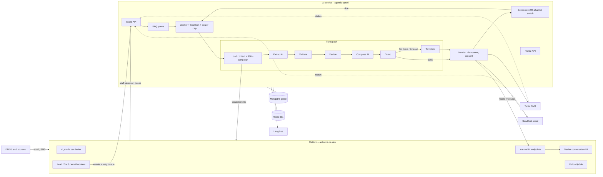
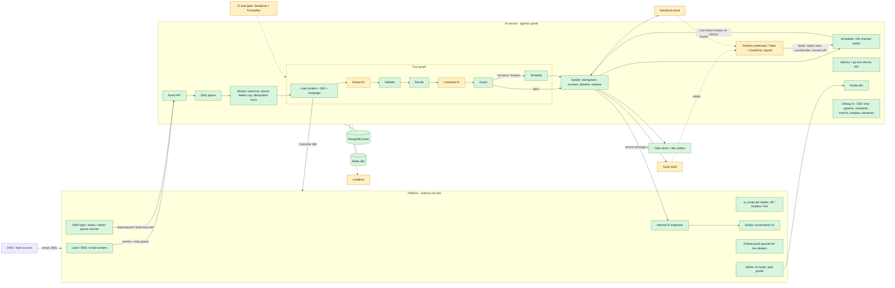

# AutoPulse AI layer: implementation progress, Stages 1–13

Last updated: 2026-09-25. The plan is in `docs/plans/MASTER_PLAN_1.md` and the design in `docs/architecture/architecture.md`. To run everything locally, see `docs/runbooks/initial_setup.md`; to roll a dealer out, see `docs/runbooks/rollout.md`.

Paths are short: `AI:` means `agentic-upsell/src/upsell_agent/` and `PL:` means `aidmvcs-be-dev/`. Nothing is committed yet.

## Verification (after Stage 13)

| Check | Command | Result |
|---|---|---|
| AI unit tests + DeepEval evals (extraction and replies) | `make ai-test`, `make ai-evals` | 354 passed, 2 skipped (the Redis checkpointer tests need Redis Stack) |
| Promptfoo prompt-injection suite | `make ai-evals` | 9 / 9 |
| Live scenarios in Docker, Stages 1–13 | `make ai-scenarios` | 24 / 24 |
| Platform ↔ AI end-to-end, through the real platform workers, webhooks and admin routes | `make ai-e2e` | 35 / 35: lead, reply, email, statuses, 24 h switch, staff takeover, hand-back, no n8n or `FollowUpJob`, shadow, rollback |
| Platform tests (unit + real-MongoDB workers) | `make platform-test` | 61 / 61 |
| Burst: 300 campaign replies in 10 minutes vs another dealer | `make ai-burst` | 8 / 8 checks (also passes at 10x the rate) |
| Customer 360: AI port vs the platform's real endpoint | `make compare-360` | 13 / 13 customers match |
| Go-live checks on the dev data | `make ai-rollout-check` | They work. Dealer A flagged "not ready" from the pre-fix burst runs (correct); B and C healthy. |
| Debug UI typecheck and build; Ruff | | OK; clean |

**Not verified here:** needs real accounts or a production deployment.
- a real Twilio / SendGrid round trip;
- real OpenAI models in the evals;
- Langfuse traces;
- a real dealer in shadow and then live for a week.

---

## Stage 0 — Decisions
- SendGrid for AI email, with a reply-to that routes back through the platform's Mailgun inbound.
- SMS goes out from the dealer's own Twilio number.
- The platform sends an event ID with every event.
- `ENVIRONMENT=DEV` in `agentic-upsell/.env` turns on the Debug UI and the dev endpoints.

## Stage 1 — Foundations
- `AI:config.py` — added settings: environment/is_dev, model names, timeouts, per-dealer cap, and driver choices.
- `AI:clock.py` — a clock the dev tools can move forward, so time-based tests don't have to wait.
- `AI:channels/base.py`, `AI:channels/__init__.py` — the interface every SMS/email driver follows.
- `AI:channels/fake.py` — a fake driver that stores messages in a dev outbox instead of sending them.
- `AI:integrations/platform_client.py` — the client for calling the platform (stub for tests, live over HTTP).
- `AI:integrations/mongodb.py` — added collection names and indexes for all AI collections.
- `AI:worker/queue.py`, `AI:worker/jobs.py`, `AI:worker/main.py`, `AI:worker/__init__.py` — the SAQ background worker and its jobs (SAQ instead of arq because arq clashes with redis 6+).
- `AI:agent/qualification.py` — lead types reduced to sales / trade-in / service / general.
- `AI:agent/state.py` — turn state rebuilt for the new pipeline (old upsell fields removed).
- `AI:memory/long_term.py` — stopped saving the removed upsell fields.
- `AI:api/routes.py` — marked the old upsell routes as not registered (out of scope).
- `AI:memory/short_term.py`, `AI:tools/*.py`, `AI:guardrails/policy.py` — comments only: they now point to the new doc sections.
- `agentic-upsell/pyproject.toml`, `uv.lock` — added saq, sse-starlette and pyyaml, plus mongomock-motor and fakeredis for tests.
- `agentic-upsell/Dockerfile`, `.dockerignore` — the image now includes the scenarios, and the worker runs from the same image.
- `agentic-upsell/.env.example` — documents every new setting.
- `compose.yml` — added ai-api and ai-worker services, a `dev` profile with the source bind-mounted and auto-reload, and the model and first-reply settings.
- `Makefile` — added ai-up, ai-build, ai-restart, ai-seed, ai-scenarios and the other dev targets.
- `AI:devtools/seed.py`, `AI:devtools/__init__.py` — seed data: dealers, customers, leads and a campaign.
- `tests/unit/conftest.py`, `test_foundations.py` — test fixtures (in-memory Mongo and Redis) and foundation tests.
- `tests/unit/test_api_health.py`, `test_dealer_scoped_mongo.py`, `test_qualification_*.py`, `test_short_term_ttl.py` — updated for the new app factory, the new state and the new doc references.

## Stage 2 — Events in
- `AI:events/models.py` — the shapes of the lead-created, inbound-message, paused and resumed events.
- `AI:events/intake.py` — checks for duplicates by event ID and queues one job per event.
- `AI:events/handlers.py` — what each job does: runs a turn, pauses the lead or resumes it.
- `AI:api/events.py` — the `POST /v1/events/*` endpoints; they return 202 straight away.
- `AI:api/auth.py` — shared-secret check, which now reads settings from the running app.
- `AI:main.py` — app factory that registers the event, lead and dev routers (dev only when DEV).
- `tests/unit/test_events_api.py`, `test_event_handlers.py` — duplicate, pause/resume and auth tests.

## Stage 3 — Pipeline skeleton, trace and Debug UI
- `AI:agent/graph.py` — the LangGraph turn graph (placeholder steps at this stage).
- `AI:agent/pipeline.py` — the list of steps and edges the Debug UI draws.
- `AI:agent/turn.py` — runs one turn: graph, then send, then schedule, then the turn log.
- `AI:observability/trace.py` — records each step's input, reasoning and output, and streams it live.
- `AI:api/dev.py` — DEV-only endpoints: simulate, trace stream, conversation, slots, clock and scenarios.
- `AI:devtools/simulate.py` — creates fake leads and inbound messages the way the platform would.
- `AI:devtools/scenarios.py` + `agentic-upsell/scenarios/s1_*`, `s2_*`, `s3_*` — scripted end-to-end scenarios.
- `agentic-upsell/debug-ui/*` — React app showing the animated pipeline, a step inspector, the simulator, the timeline, and the slots, scheduler and scenarios tabs.
- `tests/unit/test_dev_routes.py` — confirms the dev routes are hidden unless DEV.

## Stage 4 — Instant first reply and real sending
- `AI:agent/templates.py` — first-reply templates for each lead type (SMS kept to 320 characters).
- `AI:agent/nodes/template_reply.py` — the template step, also used as the fallback.
- `AI:channels/base.py` — added a send error that says whether a retry makes sense.
- `AI:channels/fake.py` — can simulate temporary and permanent failures.
- `AI:channels/consent.py` — STOP/START words, opt-out checks, recipient lookup and phone numbers converted to E.164.
- `AI:channels/sender.py` — sends once per turn and channel (idempotency key), with retries, consent and shadow mode, and records every send on the platform.
- `AI:worker/locks.py` — a Redis lock per lead and a limit of turns running at once per dealer.
- `AI:worker/jobs.py` — jobs that are busy get re-queued instead of failing.
- `AI:events/intake.py`, `AI:events/handlers.py` — pass the time the event arrived; handle STOP/START.
- `AI:agent/turn.py` — Send is real; Schedule only reports what it would do; lead state records the first-reply time.
- `AI:integrations/mongodb.py` — added the `ai_consent` collection and the platform collection names.
- `AI:config.py` — added lock, busy-retry, send-retry and first-reply settings.
- `AI:api/dev.py`, Debug UI — show the delivery status on each chat bubble.
- `scenarios/s4_*` — instant reply, email lead, duplicate event and STOP.
- `tests/unit/test_templates.py`, `test_sender.py`, `test_locks.py`, `test_jobs.py` — new tests.

## Stage 5 — Platform side (aidmvcs-be-dev)
- `PL:app/lib/ai/aiMode.js` — `ai_mode` for each dealer (off / shadow / live), cached for 60 seconds.
- `PL:app/lib/ai/aiEvents.js` — posts events to the AI with a 2 s timeout and a 5-attempt retry queue; it never throws.
- `PL:app/lib/ai/aiDispatch.js` — builds and sends the lead-created and inbound-message events.
- `PL:app/lib/ai/aiInbound.js` — in live mode, saves inbound SMS and email into the conversation and notifies the AI.
- `PL:app/lib/ai/aiMessageRecord.js` — checks AI messages and turns them into conversation (`Email`) records.
- `PL:app/models/User.js` — added the `ai_mode` field.
- `PL:app/models/Email.js` — added AI fields (generated, fallback, turn ID, idempotency key, delivery status) and a unique index.
- `PL:scripts/ensure-email-indexes.js` — also creates the new AI index.
- `PL:app/api/internal/ai/messages/route.js` — the AI records a sent message here (shared secret, idempotent).
- `PL:app/api/internal/ai/messages/status/route.js` — the AI updates delivery status here.
- `PL:app/api/admin/ai-mode/route.js` — admin endpoint to set a dealer's AI mode.
- `PL:app/worker/leadworker.js` — in live mode, skips n8n, saves the lead's message, notifies the AI and skips the old follow-ups.
- `PL:app/worker/processSms.js` — in live mode, sends inbound SMS to the AI; in shadow mode, only notifies it.
- `PL:app/worker/emailWorker.js` — same for email; ADF lead emails notify the AI.
- `PL:app/worker/worker.js` — runs the AI event retry worker.
- `PL:app/api/system/route.js` — adds the email record ID and lead ID to the job data.
- `PL:test-ai-layer.js`, `PL:test-ai-layer-integration.js` — 25 unit and 8 real-Mongo tests.
- `PL:scripts/ai-dev-full.js`, `PL:scripts/ai-e2e-check.js` — run the platform against the dev stack, and the 13-check end-to-end test.
- `PL:next-env.d.ts` — changed by Next.js itself when the dev server ran.
- `AI:integrations/platform_client.py` — the live client records messages and updates statuses on the platform.
- `Makefile` — added platform-install, platform-test, dev-full, ai-e2e and test-all.

## Stage 6 — Customer 360
- `PL:app/api/customers/[id]/360/route.js` — the 360 response now includes trade-ins.
- `AI:integrations/customer360.py` — a Python copy of the platform's 360 assembly, for the stub client.
- `AI:integrations/platform_client.py` — the stub builds a real 360 from Mongo; the live client unwraps the response and treats 400/404 as "no customer".
- `AI:integrations/mongodb.py` — added the vehicle, deal, repair order, appointment and trade-in collections (vehicles use `dealerId`).
- `AI:devtools/simulate.py` — writes history in the same shape the DMS does, plus platform dealers and phone formats.
- `AI:devtools/seed.py` — rewritten to seed owned, serviced, traded and merged-customer histories.
- `AI:devtools/compare_360.py` — compares the stub 360 with the platform's live 360, customer by customer.
- `scenarios/s6_customer360_parity.yaml`, `tests/unit/test_customer360.py` — parity scenario and tests.

## Stage 7 — Slot engine
- `AI:slots/schema.py` — every slot: its label, type, group, how long it stays valid, and how to ask for it.
- `AI:slots/validators.py` — cleans and checks values (numbers, years, mileage, choices, yes/no).
- `AI:slots/requirements.py` — which slots each lead type needs (all/any, and trade-in slots only when there is a trade); lead source mapped to lead type.
- `AI:slots/store.py` — saves facts with history (a new value replaces the old one), confirm/reject, and refuses values the bot guessed.
- `AI:slots/profile.py` — builds the profile: each slot is filled, needs confirming, stale or missing.
- `AI:slots/prefill.py` — fills slots from Customer 360 (vehicles, service, trade-ins).
- `AI:slots/policy.py` — the Decide rules: stop, hand off, confirm, ask, or qualified.
- `AI:api/leads.py` — `GET /v1/leads/{id}/profile` for the platform UI.
- `AI:agent/nodes/load_context.py` — loads the lead, customer, 360, profile and recent messages.
- `AI:agent/nodes/decide.py` — runs the Decide rules and traces why each rule fired or not.
- `AI:api/dev.py`, `AI:main.py` — the Slots tab shows the real profile; the leads router is registered.
- `scenarios/s7_*`, `tests/unit/test_slots.py` — pre-fill, sales qualification and confirming a hedged value; 57 tests.

## Stage 8 — AI steps
- `AI:agent/llm.py` — Pydantic AI agents for extract and compose, with structured outputs, usage limits and cost per call.
- `AI:agent/offline_model.py` — a deterministic stand-in model, so dev and tests need no API key (dev hints #retry, #fallback, #reject and #slow).
- `AI:agent/context.py` — per-turn context with an AI-call budget of 4.
- `AI:agent/nodes/extract.py` — the AI pulls slot values, questions and sentiment from the customer's message.
- `AI:agent/nodes/validate.py` — 4 checks: allowed slot, the quote is really in the text, the value is valid, the confidence is enough.
- `AI:agent/nodes/compose.py` — the AI writes the SMS and email versions of the reply.
- `AI:guardrails/draft_guard.py` — blocks invented numbers, approvals, stock claims and bad formats.
- `AI:agent/nodes/guard.py` — runs the guard and allows one rewrite before falling back to the template.
- `AI:agent/nodes/template_reply.py` — fallback template with the reason it was used.
- `AI:agent/graph.py` — the real graph: load → extract → validate → decide → compose → guard → (rewrite | fallback). Placeholder steps and `stubs.py` removed.
- `AI:agent/state.py` — added profile, recent messages, fallback reason and the hand-off flag.
- `AI:agent/turn.py` — 8 s limit for a first reply and 20 s otherwise, with the template if time runs out; lead status set to qualified or handoff; tokens and cost logged.
- `AI:observability/tracing.py` — optional Langfuse v4 trace per turn (off without keys).
- `AI:worker/main.py` — gives the turn its platform client, settings and tracing.
- `AI:events/handlers.py`, `AI:worker/jobs.py` — inbound messages are recorded before the lock, so one turn answers all unanswered messages.
- `AI:config.py` — first reply is written by the AI by default; offline models are the default.
- Debug UI (`types.ts`, `SlotsPanel.tsx`, `App.tsx`, `PipelineGraph.tsx`) — real slots panel and paced live animation.
- `scenarios/s8_*` — AI first reply, and a slow model that falls back to the template in time.
- `tests/unit/test_turn_pipeline.py`, `test_guard_and_models.py`, `evals/test_extraction.py`, `evals/datasets/extraction_cases.jsonl` — pipeline tests and the DeepEval slot F1 evals.

## Stage 9 — Campaign replies
- `AI:agent/campaigns.py` — finds the campaign a reply belongs to: the dealer's latest campaign send within 14 days that is newer than the last AI message.
- `AI:agent/nodes/load_context.py`, `AI:agent/nodes/compose.py` — load the campaign and write the reply in its context.
- `AI:agent/offline_model.py` — the offline reply mentions the campaign.
- `AI:devtools/scenarios.py`, `scenarios/s9_campaign_reply.yaml` — new "send_campaign" step and a campaign-reply scenario.

## Stage 10 — 24h channel switch
**Status: done and verified.** 31 new unit tests. 4 new live scenarios pass. The every-minute cron fired a due follow-up on its own within 10 s.

- `AI:scheduler/followups.py` (new):
  - saves the follow-up after each send: the other channel's version, due in 24 h;
  - a newer message replaces the older pending follow-up;
  - a send that failed outright makes the follow-up due now;
  - firing: resets stuck claims (over 5 minutes), claims due follow-ups one at a time with an atomic update, and takes the lead lock;
  - before sending, checks again for a customer reply, lead status and the dealer's AI mode;
  - sends through the normal sender and never schedules a second switch.
- `AI:scheduler/__init__.py` (new) — package for the scheduler.
- `AI:integrations/dealer_mode.py` (new) — reads the dealer's AI mode from the platform `users` record, using the same rule as the platform's `aiMode.js`. A follow-up for a dealer switched to off or shadow is cancelled.
- `AI:channels/delivery.py` (new) — applies a provider delivery status:
  - updates `ai_messages` without ever moving a status backwards;
  - updates the platform's conversation record;
  - a failed, undelivered, bounced or dropped message makes its follow-up due now;
  - an unsubscribe or spam report turns email consent off.
- `AI:api/webhooks.py` (new) — `POST /v1/webhooks/twilio/status` and `POST /v1/webhooks/sendgrid/events`:
  - Twilio's HMAC signature and SendGrid's ECDSA signature are checked, and every call is rejected if the secret isn't set;
  - the follow-up job is queued when a message failed.
- `AI:agent/turn.py` — the Schedule step now really saves the follow-up and explains why when it doesn't.
- `AI:agent/pipeline.py` — new "Follow-up due" step with an edge to Send, so the Debug UI animates a follow-up firing.
- `AI:worker/jobs.py` — new `fire_due_followups` job that fires each follow-up under its lead's lock.
- `AI:worker/main.py` — SAQ cron runs `fire_due_followups` every minute on every worker.
- `AI:config.py` — added `TWILIO_AUTH_TOKEN`, `SENDGRID_WEBHOOK_PUBLIC_KEY` and `PUBLIC_BASE_URL`.
- `AI:main.py`:
  - registers the webhook routes and gives the API a platform client for status updates;
  - in DEV, syncs the dev clock on every request.
- `AI:api/leads.py` — the profile's `pending_followup` time is returned as UTC.
- `AI:api/dev.py`:
  - "advance clock" fires due follow-ups straight away;
  - "mark failed" goes through the real delivery-status code;
  - new `/dev/messages/{id}/status` endpoint;
  - dates are sent as UTC, and conversation items include delivery status.
- `AI:integrations/mongodb.py` — added the platform `users` and `emailaccounts` collection names.
- `AI:devtools/simulate.py` — uses those shared names.
- `AI:devtools/scenarios.py`:
  - new steps `advance_clock` (the clock is reset after the scenario), `expect_followup`, `delivery_status`, `expect_outbox` and `set_dealer_mode` (restored after the scenario);
  - VINs get a unique suffix per run, so the Stage 7 pre-fill scenario can run twice;
  - the platform dealer records are ensured before a run.
- `scenarios/s10_channel_switch.yaml` — no reply for 24 h sends the email version once, and never a second switch.
- `scenarios/s10_reply_cancels_switch.yaml` — a reply at 23 h cancels the switch; the AI's answer gets a new follow-up.
- `scenarios/s10_failed_sms_switches_now.yaml` — an undelivered SMS switches to email straight away.
- `scenarios/s10_dealer_off_cancels_switch.yaml` — switching the dealer off cancels its pending follow-up.
- Debug UI:
  - `SchedulerTab.tsx`: cards show from→to, the recipient, the text and the cancel reason, with a "mark undelivered/bounced" button for either channel;
  - `types.ts`: the full follow-up shape;
  - `PipelineGraph.tsx`: position of the new step;
  - `Timeline.tsx`: labels follow-up turns.
- `tests/unit/test_followups.py` (new, 31 tests) — scheduling rules, firing, reply at 23:59:59, reply after the claim, pause, shadow, off, auto-reply off, two workers racing, busy lead, stuck claim, crash mid-send, delivery callbacks, stale callbacks, unsubscribe, and both webhook signatures (the Twilio signature was checked against Twilio's own validator).
- `tests/unit/test_dev_routes.py` — the profile now shows the pending follow-up after a reply.

## Stage 11 — No double messaging and staff takeover
**Status: done and verified.**
- **Platform tests:** 61 pass (6 unit tests and 6 real-MongoDB worker tests are new).
- **End-to-end check:** 27 of 27 pass, 14 of them new for Stage 11. They run the plan's full "Done when" flow against the running platform and AI service: new lead, AI reply, 24 h with no answer, email switch, staff reply. After that the AI stays silent. The lead has exactly the AI's messages plus the staff reply, 0 n8n calls and 0 `FollowUpJob`s.

- `PL:app/lib/ai/aiStaff.js` (new):
  - builds `lead-paused` / `lead-resumed` events, with a unique event id per action and no ':';
  - `notifyAiOfStaffReply` and `notifyAiOfStaffStatus`: the AI is paused when staff move a lead to Appointment Booked, Visited, Sold, DND or Managerial Review;
  - admin `pauseAiForLead` / `resumeAiForLead`;
  - all are no-ops for `off` dealers and never throw.
- `PL:app/lib/ai/aiAdminLead.js` (new) — shared by the admin AI lead routes: admin auth, lead lookup, and event result → HTTP answer.
- `PL:app/api/admin/ai/leads/[id]/pause/route.js` (new) — admin "take over": sends `lead-paused`.
- `PL:app/api/admin/ai/leads/[id]/resume/route.js` (new) — admin "hand back to AI": sends `lead-resumed`.
- `PL:app/api/admin/ai/leads/[id]/profile/route.js` (new) — admin view of what the AI knows (proxies the AI's profile endpoint with the shared secret).
- `PL:app/lib/followupService.js` — new `aiOwnsFollowUps()`. `scheduleNext` creates no rule-based `FollowUpJob` for a live dealer and clears the lead's pending ones. This covers every scheduling path: lead worker, SMS, email, status changes, booking and staff replies.
- `PL:app/api/conversations/followup/route.js` — a `FollowUpJob` fired by n8n for a live dealer is marked completed and sends nothing.
- `PL:app/api/admin/ai-mode/route.js` — switching a dealer to `live` clears its pending `FollowUpJob`s and reports how many.
- `PL:app/api/conversations/reply/route.js` — a staff member's manual reply sends `lead-paused`: the AI stops and cancels its pending channel switch.
- `PL:app/api/conversations/lead/status/route.js` — moving a lead to a staff-owned status sends `lead-paused`.
- `PL:scripts/ai-dev-full.js` — every `N8N_*` URL points at a local n8n tripwire (port 3999) that answers 503 and records each call at `GET /hits`, so a local run can never reach a real n8n.
- `PL:scripts/ai-e2e-check.js` — new section 5 (checks 5a–5n): 24 h switch, staff reply pauses the AI, silence while paused, exact message count, no `FollowUpJob`, no n8n call (tripwire), admin resume, the AI answers again, admin profile, dealer token refused (403), an n8n-fired `FollowUpJob` sends nothing, and going live clears jobs.
- `PL:test-ai-no-double-messaging.js` (new):
  - runs the real `processLead` / `processSMS` workers against MongoDB, with n8n replaced by a tripwire server;
  - a live dealer's lead and SMS never reach n8n or get a `FollowUpJob`;
  - an `off` dealer does reach n8n (the control), and rule-based follow-ups still work for `off`;
  - a staff reply arrives as `lead-paused`.
- `PL:test-ai-layer.js` — 6 new unit tests: event payloads, which modes pause, staff-owned statuses, unique admin events, never throwing, and `aiOwnsFollowUps`.
- `Makefile` — `platform-test` also runs `test-ai-no-double-messaging.js`.
- AI side: no change needed. `lead-paused` already cancelled the pending follow-ups and silenced the lead (Stage 2), and Stage 10's re-check before firing covers a pause that lands mid-claim.

## Stage 12 — Real providers and hardening
**Status: built and verified, except the real SMS/email round trip.** That needs real Twilio and SendGrid accounts; the command to run it is ready (below).

**Burst test results (plan's test: 300 campaign replies for one dealer over 10 minutes, model calls slowed to 1.2 s like a real model):**
- All 300 answered, sent and written by the AI in campaign context: 0 failed turns, 0 template fallbacks.
- Burst replies: p50 2.5 s, p95 3.4 s.
- Dealer B's first replies during the burst: p95 2.5 s against 3.4 s before it, max 2.5 s, so not slowed and well under 8 s.
- Dealer A never had more than its 10-turn cap running.

**Harsher run:** 10x the rate (300 replies in 60 s) also passes. Dealer A sat exactly at its cap of 10, and dealer B's p95 stayed about 3.4 s.

**Eval gate:** 26 DeepEval cases pass (13 extraction, 13 reply) and 9 of 9 Promptfoo injection tests pass, on the offline model. With an `OPENAI_API_KEY` the same gate runs against real models.

**What the burst test found and fixed (all regression-tested):**
1. **Guard bug.** Digits inside model names ("RAV4", "CX-5", "F-150") counted as invented numbers. Every reply to a campaign named after such a model failed the guard twice, went out as the template, and handed the lead to a person: all of them in the first run. Also, the old number normalizer stripped trailing zeros, so "$30,000" made "$3" look known.
2. **Dealer cap counter.** The counter briefly overshot the cap when jobs were refused. The cap still held, but the check can't be trusted as written. It's now one atomic Redis script.
3. **Replies could be dropped under a flood.** A busy job gave up after about 3 minutes. It now backs off from 2 s to 10 s for up to about 48 minutes.
4. **The queue occasionally strands a job.** SAQ sometimes moves a job to "active" without starting it (2 of 300 in the first run; one reply waited 44 s). The sweep now runs every 10 s instead of 60. Turns are now safe to re-run: the turn id comes from what triggered the turn, so a re-run (or an ordinary retry after a late error) can never message twice. That was a real double-message risk before.
5. **A campaign's follow-ups all fall due together 24 h later.** They are now fired 10 at a time instead of one by one.

**Changes:**
- `AI:channels/twilio.py` (new) — live SMS via Twilio's REST API with `httpx`: from the dealer's own number, with a status callback. Timeouts, 429 and 5xx retry; other 4xx are permanent; error 21610 (customer texted STOP) is suppressed and consent turned off.
- `AI:channels/sendgrid.py` (new) — live email via SendGrid v3: from the dealer's mailbox (or `SENDGRID_FROM_EMAIL`), reply-to the dealer's mailbox, plain text + HTML, idempotency key as a custom arg, message id from `X-Message-Id`.
- `AI:channels/live.py` (new) — routes by channel. Outside production it suppresses anyone not on `SEND_ALLOWLIST` before any provider is called.
- `AI:channels/dealer_identity.py` (new) — the dealer's Twilio number, mailbox and name from the platform records, cached for 60 s.
- `AI:channels/__init__.py` — `CHANNEL_DRIVER=live` builds the live driver; missing credentials stop the worker at startup.
- `AI:channels/base.py` — a send error can now say "suppress" or "opted out".
- `AI:channels/sender.py` — records such refusals as suppressed, not failed, and turns consent off when the provider reports an opt-out.
- `AI:config.py`:
  - new provider settings: `TWILIO_ACCOUNT_SID`, `TWILIO_API_BASE`, `SENDGRID_API_KEY`, `SENDGRID_API_BASE`, `SENDGRID_FROM_EMAIL`, `SEND_ALLOWLIST`;
  - new load settings: `WORKER_CONCURRENCY` (20), `OFFLINE_MODEL_LATENCY_MS`, `BUSY_RETRY_MAX_DELAY_S`, `BUSY_RETRY_MAX` 300;
  - `is_production` and `allowlist` helpers.
- `AI:devtools/provider_check.py` (new, `make ai-provider-check`) — sends one real SMS and/or email through the live drivers, to check the round trip by replying.
- `AI:devtools/burst.py` (new, `make ai-burst`) — the burst test, with 8 pass/fail checks, stored in `dev_burst_runs`.
- `AI:devtools/simulate.py`:
  - dealer B is now live and a new dealer C is the shadow dealer;
  - the simulator applies each dealer's mode like the platform: shadow events are marked shadow, and `off` dealers send nothing.
- `AI:events/intake.py` — an event can be "skipped" (dealer off, simulator only).
- `AI:devtools/scenarios.py` — dealer alias C.
- `AI:worker/locks.py` — the dealer cap is one atomic Lua script, so refused attempts never touch the counter.
- `AI:worker/jobs.py` — busy retries back off (`busy_retry_delay`).
- `AI:worker/main.py` — worker concurrency comes from settings; the SAQ sweep runs every 10 s.
- `AI:events/handlers.py` — turn ids come from the trigger (`lead-created-<lead>`, `inbound-<message>`). A job that already sent skips early.
- `AI:agent/turn.py` — `run_turn` takes that turn id.
- `AI:scheduler/followups.py` — due follow-ups fire 10 at a time, and up to 500 per run.
- `AI:guardrails/draft_guard.py` — model names aren't numbers; "30k" equals "30,000"; correct normalization.
- `AI:agent/nodes/guard.py` — the campaign's own text counts as known.
- `AI:agent/llm.py` — both prompts now say customer text is data, never instructions; Compose may never confirm a booking.
- `AI:agent/offline_model.py` — optional artificial latency.
- `AI:observability/metrics.py` (new) — the numbers to watch per dealer and window: first reply p50/p95/max and % under 8 s, template-fallback rate, guard failures, rejected extractions, cost per day and tokens, lead statuses with qualified and hand-off rates, send outcomes, follow-up outcomes. Also a text report.
- `AI:api/metrics.py` (new) — `GET /v1/metrics?dealer_id=&days=`, shared-secret auth.
- `AI:api/dev.py` — `/dev/metrics` for the Debug UI.
- `AI:main.py` — registers the metrics routes.
- `AI:devtools/report.py` (new, `make ai-report`) — the report per dealer.
- Debug UI — new Metrics tab: 6 cards, lead-status, send and follow-up bars, and a cost-per-day chart, polled every 5 s. Also a `Metrics` type and API call.
- `evals/harness.py` (new) — runs one real turn (graph, guard, sender) on an in-memory database with the configured models.
- `evals/test_replies.py` + `evals/datasets/reply_cases.jsonl` (new, 13 cases) — DeepEval "Safe reply" and "Right behaviour" metrics: sales, trade-in, service, email, hand-off, a campaign with digits, price question, and 5 prompt-injection cases.
- `evals/promptfoo/promptfooconfig.yaml` + `provider.py` (new) — 9 prompt-injection attacks through the real pipeline: invented price or approval, fake system message, dictated stock claim, booking confirmation, fake discount, role-play, guarantee, hidden tags, another customer's data.
- `evals/__init__.py` — makes the harness importable.
- `.github/workflows/ai-eval-gate.yml` (new) — on PRs touching prompts, graph, slots, guardrails or evals: unit tests, DeepEval, then Promptfoo. Real models when the `OPENAI_API_KEY` secret exists.
- Tests (new):
  - `tests/unit/test_live_drivers.py` (14): exact Twilio/SendGrid requests, every failure class, allowlist, fail-fast factory;
  - `tests/unit/test_metrics.py` (3);
  - `tests/unit/test_eval_metrics.py` (5): the gate's metrics really fail bad replies.
- Tests (added to):
  - `test_locks.py`: refused attempts leave the counter alone; retry schedule;
  - `test_event_handlers.py`: re-runs send once;
  - `test_guard_and_models.py`: model names, 30k, the $3 case, campaign text;
  - `test_turn_pipeline.py`: a RAV4 campaign reply passes;
  - `test_followups.py`: a campaign's follow-ups drain concurrently, once each;
  - `test_foundations.py`: the live driver needs credentials.
- `scenarios/s9_campaign_reply.yaml` — the campaign name now includes "RAV4" and the scenario asserts no fallback.
- `compose.yml` — `OFFLINE_MODEL_LATENCY_MS` and `WORKER_CONCURRENCY` pass through.
- `Makefile` — `ai-burst`, `ai-worker-normal`, `ai-provider-check`, `ai-evals`, `ai-report`.
- `.env.example` — every new setting, explained.

**Not done here:**
- **Real SMS and email round trip.** Needs Twilio/SendGrid accounts: run `make ai-provider-check`, reply, and check the conversation screen.
- **Making the eval gate required.** It is a GitHub branch-protection setting a repo admin must switch on. The workflow hasn't run on GitHub yet because nothing is pushed.
- **Remaining queue delay.** The rare SAQ stranded job is recovered within about 10 s but not eliminated; the slowest of 300 replies took 17.9 s.

## Stage 13 — Shadow and rollout
**Status: everything that can be built and tested locally is done and verified.**
- **Tests:** 24 new unit tests.
- **Scenarios:** 2 new, both passing.
- **End-to-end:** 8 new checks (sections 6 and 7), all passing.
- **Not done here:** the plan's final step, "one real dealer shadow for a week, then live for a week", happens in production with a real dealer. `docs/runbooks/rollout.md` is the step-by-step for it, and `make ai-rollout-check` measures its "done when" (no double messages, no lost replies).

**Changes:**
- Shadow mode itself was already in place (Stages 4 and 10): the whole turn runs, the draft is stored as `shadow`, nothing is sent or recorded on the platform, and no follow-up is scheduled. It is now covered by tests, a scenario and the e2e check.
- `AI:observability/rollout.py` (new) — go-live checks per dealer, measured from the data:
  - **no double messages:** no automated n8n / `FollowUpJob` message on a live dealer's AI leads, and never two AI sends for one turn;
  - **no lost replies:** no customer message left unanswered for over 5 minutes, and no accepted event that never ran;
  - **numbers within limits:** first reply p95 under 8 s, template fallback under 5%, guard failures under 10%, send failures under 2%.
  - Also a text report.
- `AI:api/metrics.py` — `GET /v1/rollout-check?dealer_id=&days=` (shared secret).
- `AI:devtools/rollout_check.py` (new, `make ai-rollout-check`) — the go-live checks per dealer; exit code 1 when a dealer is not ready.
- `AI:devtools/shadow.py` (new) — the shadow comparison. For every AI draft: what the customer said, the draft (outcome, guard result, what it asked), and the first reply the platform actually sent (n8n or staff) before the customer's next message. Reviews (better / same / worse / unsafe) are saved per turn in `dev_shadow_reviews`.
- `AI:devtools/copy_dealer.py` (new, `make ai-copy-dealer`) — a DEV copy of one dealer's recent data:
  - copies the dealer record without its password, mailboxes without passwords, leads, customers, the conversation, DMS history, campaigns, and the AI's own records;
  - only reads the source, and the destination must be the local dev database;
  - phones and emails are masked consistently; the dealer's own number and mailbox are kept;
  - `REPLAY=1` runs the copied conversations through the local AI in shadow mode, one turn at a time.
- `AI:api/dev.py` — `/dev/rollout-check`, `/dev/shadow`, `/dev/shadow/review`.
- `AI:devtools/scenarios.py`:
  - new steps `expect_no_followup`, `platform_reply` (n8n / staff sent this) and `expect_shadow`;
  - `reply` reports when the dealer is off and nothing was sent.
- `AI:devtools/compare_360.py` — compares only seeded customers with DMS history (the 50 most recent per dealer). Burst customers had made it compare about 1,400 customers and stall the scenario run.
- `scenarios/s13_shadow_dealer.yaml` — dealer C (shadow): 2 drafts, nothing sent, no follow-up, both drafts paired with n8n's and staff's actual replies.
- `scenarios/s13_rollback_to_off.yaml` — dealer switched to off: the next reply never reaches the AI, and the pending follow-up is cancelled when due.
- Debug UI:
  - new Shadow tab: each draft next to what the customer really got, review buttons, verdict counts, and a 24h / 7 / 30-day window;
  - Metrics tab: a "Go-live checks" panel (✓/✗ per check, with examples of what failed);
  - `types.ts` / `api.ts`: `ShadowView`, `RolloutCheck`, `Verdict`.
- `PL:scripts/ai-e2e-check.js`:
  - **section 6, shadow dealer:** the lead goes to n8n as today; the AI draft is shadow, not in the conversation screen and not followed up; the Shadow comparison pairs it with n8n's reply;
  - **section 7, rollback:** the admin switches a live dealer off; within the 60 s cache the next lead goes to n8n and the AI never sees it; the dealer is switched back to live.
- `PL:scripts/ai-dev-full.js` — the n8n tripwire now answers like a minimal n8n (a marked stand-in reply) instead of 503, so off / shadow dealers' leads go through the platform's normal path locally.
- `PL:app/lib/mongodb.js` — existing platform bug fixed: a module waiting for another module's connection gave up after 10 s even when the connection came up (the platform worker crashed on startup twice here). It now waits up to 30 s and checks the state before failing.
- `Makefile` — `ai-rollout-check`, `ai-copy-dealer`.
- Tests (new):
  - `tests/unit/test_rollout.py` (7): healthy passes; n8n on a live lead, unanswered messages, events never handled, double sends and over-limit numbers each fail; API auth;
  - `tests/unit/test_shadow.py` (4): nothing leaves in shadow; draft vs n8n / staff pairing; no reply yet; reviews;
  - `tests/unit/test_copy_dealer.py` (3): only this dealer's recent data, no passwords, consistent masking, the source untouched, unmasked when asked.
- `docs/runbooks/rollout.md` (new) — the rollout step by step: shadow week, review, go live, watch, add dealers, rollback.
- `docs/runbooks/initial_setup.md` (new) — setting the project up and running it with the Makefile.

## Clean-up in this session
- `scenarios/s7_confirm_hedged_value.yaml` — fixed invalid YAML in the description.
- `tests/integration/test_short_term_redis_idle_expiry.py` — skips when Redis has no RediSearch module (the dev image is plain redis:7).
- `AI:slots/requirements.py`, `AI:slots/validators.py`, `tests/unit/test_slots.py` — lint fixes.
- `AI:docs/architecture/architecture.md` — build status updated (now to Stage 13); `ai_consent` and platform collections added.

---

## Required architecture (target)

## Current architecture (after Stage 13)

- **Green:** built and verified end to end locally.
- **Amber:** built and tested against stand-ins (the offline model, mocked provider APIs, signed test webhooks), but not yet run against the real external service.
- **Red:** nothing. Every part of the target architecture is built.

| Part | Stage | Status | Verified by |
|---|---|---|---|
| Events, queue, worker, lead lock, dealer cap | 1, 2, 4, 12 | Built | Tests, scenarios, burst test |
| Turn graph, trace, Debug UI | 3, 8 | Built | Scenarios, UI build |
| Sender (idempotent, retries, consent, STOP/START, shadow, allowlist) | 4, 12 | Built | Tests, scenarios, e2e |
| Platform integration (ai_mode, events, recording, conversation view) | 5 | Built | e2e 1–4 |
| Customer 360 | 6 | Built | compare-360 13/13 |
| Slot engine, profile API | 7 | Built | Tests, scenarios |
| Extract / Compose | 8 | Amber | Offline model everywhere; real models need `OPENAI_API_KEY` (evals then run on them) |
| Campaign replies | 9 | Built | Tests, s9, burst test (300 in context) |
| 24h channel switch, delivery webhooks | 10 | Built / webhooks amber | Tests, s10 scenarios, e2e 5a; webhooks with signed test requests (Twilio signature checked against Twilio's own validator) |
| No double messaging, staff takeover | 11 | Built | e2e 5 (14 checks), real-worker tests with the n8n tripwire |
| Live Twilio / SendGrid drivers | 12 | Amber | Mocked provider APIs; `make ai-provider-check` for the real round trip |
| Burst handling, metrics, eval gate | 12 | Built / CI amber | Burst 8/8, evals 26 + 9 locally; the CI workflow hasn't run on GitHub yet |
| Shadow mode, comparison, go-live checks, rollback, DEV copy | 13 | Built | Tests, s13 scenarios, e2e 6–7 |
| One real dealer shadow then live for a week | 13 | Not doable here | `docs/runbooks/rollout.md`; measured by `make ai-rollout-check` |
| Langfuse | 8 | Amber | Off until Langfuse keys are set |

## Known caveats
- **The offline model is rule-based, not AI.** Set `AI_MODEL_EXTRACT` / `AI_MODEL_COMPOSE` and a real `OPENAI_API_KEY` to use real models (the current key is a placeholder and returns 401). Then run `make ai-evals` against them before any dealer goes live.
- **Real providers are unproven.** The live drivers were tested against mocked Twilio / SendGrid APIs only. The first real use should be `make ai-provider-check` with `SEND_ALLOWLIST` set.
- **Rare queue delay.** SAQ occasionally strands a job (about 2 in 300 under burst). The 10 s sweep recovers it and turns are safe to re-run, but that reply waits up to about 15 s.
- **Images not rebuilt.** Docker Hub is unreachable from this machine, so the dev profile bind-mounts the source instead. Rebuild the images (`make ai-build`) where Docker Hub works, before any deployment.
- **Existing platform bug, not fixed:** the catch block in `PL:app/api/system/route.js` references `data`, which is not defined there (ReferenceError).
- **Nothing is committed.**
