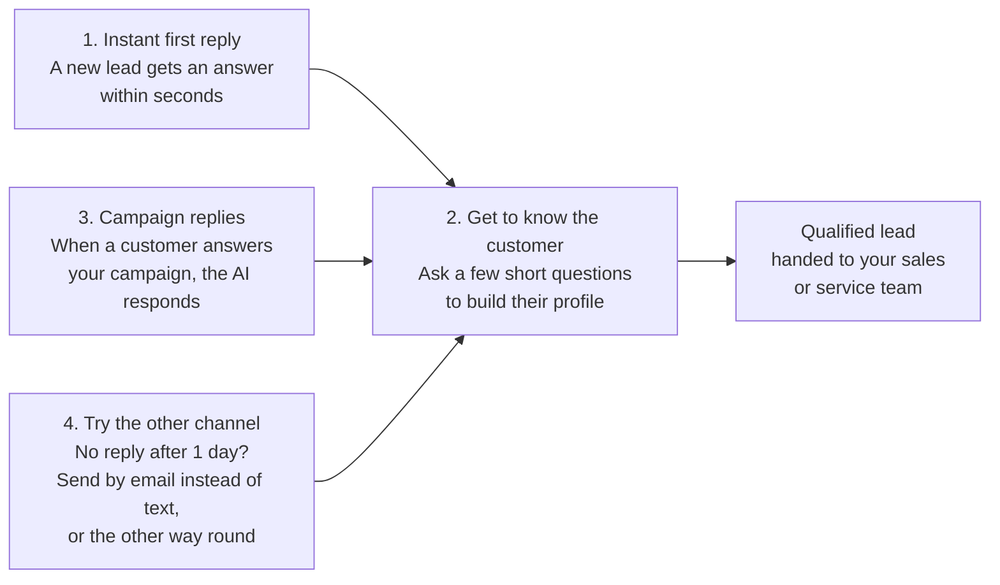
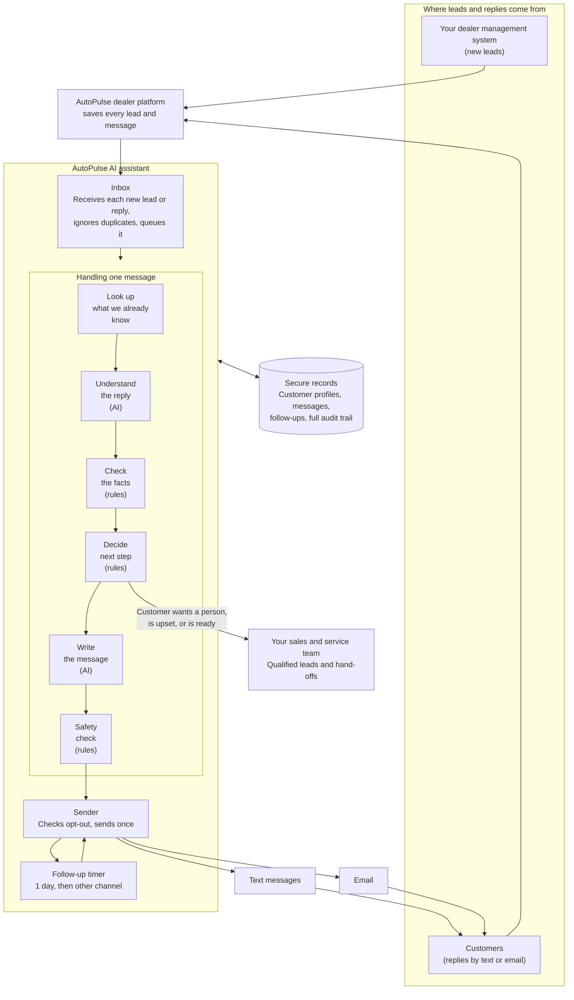
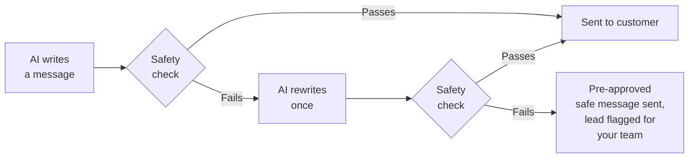
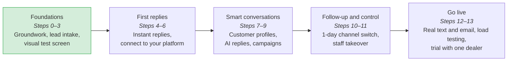
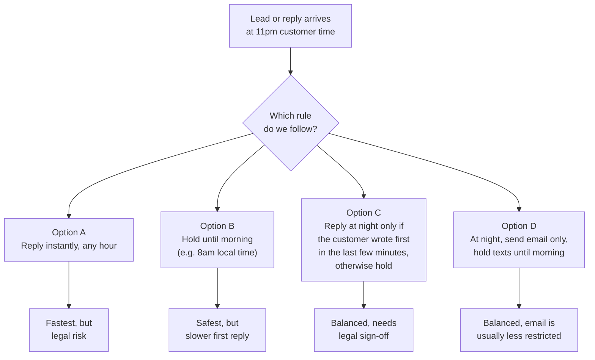

# AutoPulse AI Assistant: Progress Report

**Date:** 24 September 2026
**For:** AutoPulse leadership and dealer partners

---

## 1. Summary

We now know exactly what the AI assistant will do and in what order we will build it.

- **The focus is narrower.** The assistant has four clear jobs, all about responding to customers quickly and learning what they need. Upselling, inventory search and pricing come later.
- **Your team stays in control.** The AI writes the messages. Fixed business rules decide what to ask, when to send and when to hand the customer to a person.
- **We have a 13-step roadmap.** Every step ends with something you can see working. The last step is a trial with one dealer before we roll out to everyone.
- **We need a few decisions from you.** The most urgent one is whether the AI may reply to customers at night (see [Section 8](#8-open-questions)).

---

## 2. What the assistant does for a dealership

| Job | What it means for you |
|---|---|
| **1. Instant first reply** | Leads from your dealer system get an answer by text or email within seconds, day or night, even when your staff are busy. |
| **2. Get to know the customer** | The AI asks one or two friendly questions at a time: the vehicle they want, their budget, whether they have a trade-in, when they plan to buy. It never asks for something you already know. |
| **3. Reply to campaign responses** | You still create and send campaigns yourself. When customers write back, the AI answers straight away and knows which campaign they are replying to. |
| **4. Try the other channel** | If a customer hasn't replied after a day, the same message goes out once on the other channel. If they reply anywhere, the follow-up is cancelled. |

When the profile is complete, the lead is marked **qualified** and your team is notified. Your staff pick it up already knowing what the customer wants.

---

## 3. What the AI collects

Depending on the type of lead, the AI works through a short checklist.

| Lead type | What we find out before handing to your team |
|---|---|
| **Sales** | New or used, which model, budget or monthly payment, when they want to buy, whether they have a trade-in |
| **Trade-in** | Which vehicle, mileage, condition, how much is still owed on it |
| **Service** | Which vehicle, mileage, what service is needed, best time for them |
| **General enquiry** | First what kind of enquiry it is, then the matching checklist above |

If a sales customer says they have a trade-in, the trade-in questions are added automatically.

---

## 4. How it works (AI layer architecture)

This diagram shows how the AI assistant sits between your existing dealer platform and your customers.

**In plain English:**

1. A new lead or a customer reply reaches your AutoPulse platform as it does today, and the platform passes it to the AI assistant.
2. The assistant looks up what it already knows about the customer, so it never asks twice.
3. The **AI** reads the customer's words, for example "about 60k miles on my 2018 Civic".
4. **Fixed rules** check those details and decide what to do next: ask another question, answer the customer's question, hand to a person, or mark the lead as ready.
5. The **AI** writes a short, natural message.
6. A **safety check** makes sure the message is appropriate before it's sent.
7. The message goes out by text or email, and a one-day follow-up is set in case the customer goes quiet.

---

## 5. Keeping customers and your business safe

- **No invented numbers.** The AI never makes up prices, trade-in values, finance approvals or stock availability. Those always come from your team.
- **Only the customer's own words are saved.** The AI's guesses are never stored as facts about the customer. If it's unsure, it asks the customer to confirm.
- **A person takes over when needed.** If a customer asks for a person or sounds upset, the AI stops and hands them to your team. The AI stays paused on that lead until your staff hand it back. It also pauses as soon as a staff member replies to the customer themselves.
- **Opt-outs are respected.** STOP by text or unsubscribe by email is checked before every message, including follow-ups.
- **Each dealer's data stays private.** One dealer's customers can never be seen by another. We have an automated test that tries to break this rule and must fail.
- **No double messages.** Each message is sent once, even if something is retried behind the scenes. When a dealer switches the AI on, the old automated follow-ups for those leads are turned off.
- **Always a reply.** If the AI is slow or unavailable, a pre-written message for that lead type is sent, so a new lead is never left waiting.

---

## 6. What we achieved today

| Area | Outcome |
|---|---|
| **Clear purpose** | We wrote down the four jobs the assistant does and what it won't do yet. This keeps the first release focused and easier to test. |
| **Design** | We completed the full design: how messages flow, what is collected for each lead type, the safety rules and the one-day channel switch. |
| **Tool choices** | We chose a small set of proven tools for conversation flow, testing, monitoring and security testing. We left out tools we don't need yet, which keeps cost and complexity down. |
| **Build roadmap** | We combined the separate AI and platform plans into one 13-step roadmap in the correct order. |
| **Build started** | The groundwork is in place: receiving new leads and replies, ignoring duplicates, a practice setup with sample dealers and customers, and the first set of test conversations. |

---

## 7. Roadmap

*Green = in progress now.*

**How we will roll out:**

1. **Shadow week.** For one dealer, the AI writes replies but doesn't send them. We compare them with what goes out today.
2. **Go live with that dealer** and watch results for a week.
3. **Add dealers one at a time.**
4. **Instant off switch.** Any dealer can be switched back to the current system within a minute.

**What we will measure:** how fast the first reply goes out, how many leads become qualified, how often the safe fallback message is used, and AI cost per dealer per day.

---

## 8. Open questions

We need your input on these before launch.

### Q1. Should the AI reply to customers at night? *(urgent, legal)*

Our plan is for the AI to reply **immediately, at any hour**, because speed wins leads. However, **some countries and states restrict marketing texts at night.** For example, US rules limit texts before 8am and after 9pm in the customer's local time, and several states are stricter.

| Option | Speed | Legal risk | Our view |
|---|---|---|---|
| **A.** Reply instantly, any hour | Best | **High** in some regions | Not recommended without legal advice |
| **B.** Hold all messages until morning | Slower overnight | Lowest | Safe default |
| **C.** Reply at night only to a customer who has just written to us | Good | Depends on region | Worth checking with your lawyer |
| **D.** At night, email only; texts wait until morning | Good | Lower | A strong middle ground |

The one-day follow-ups would follow the same quiet hours.

**What we need from you:**
- Which countries and states your dealers operate in.
- Your legal team's view on which option is allowed.
- Whether each dealer should be able to set their own quiet hours.

Until we hear back, we will build **quiet hours as a setting** and default to **Option B**, which is the safest. Changing it later will be a setting, not a rebuild.

### Q2. What happens if the customer still doesn't reply after the channel switch?

After one day we try the other channel once. If there's still no reply, should we **stop**, or keep following up on a schedule (for example after 3 days, then 7 days)?

### Q3. Do unanswered campaign messages get the channel switch too?

If a customer never replies to a campaign you sent, should the AI resend it on the other channel after a day, or should campaigns stay entirely in your hands?

### Q4. Where should AI messages appear for your staff?

We recommend AI messages appear in your **existing conversation screen**, marked as "AI-written", so staff see the whole conversation in one place. Please confirm this suits your team.

### Q5. Which dealer goes first?

We need one dealer who is happy to run the shadow week and then go live first.

---

## 9. Not in this release

These are planned for later so the first release stays focused and reliable:

- Suggesting upgrades or add-ons (upselling)
- Searching inventory for the customer
- Booking appointments directly through the AI
- Quoting prices or finance offers
- Creating or sending campaigns (you keep doing this)
- Writing information back to your dealer management system
