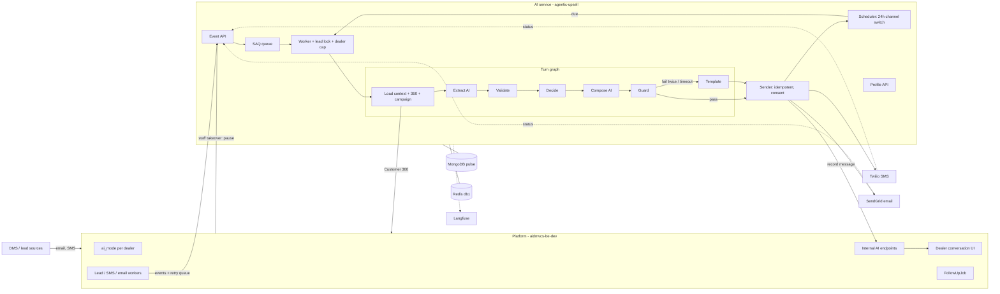
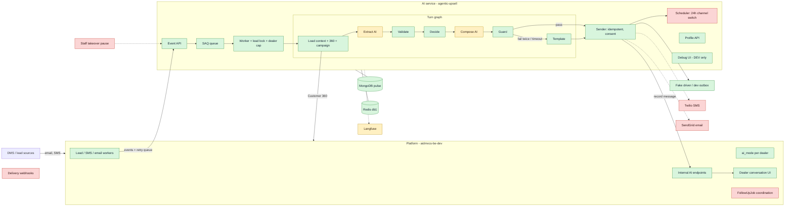

# AutoPulse AI layer: implementation report, Stages 1–9

Date: 2026-09-25. The plan is in `docs/plans/MASTER_PLAN_1.md` and the design in `docs/architecture/architecture.md`.

Paths are short: `AI:` means `agentic-upsell/src/upsell_agent/` and `PL:` means `aidmvcs-be-dev/`. Nothing is committed yet.

## Verification (as of this report)

| Check | Result |
|---|---|
| AI unit tests + DeepEval extraction evals | 262 passed, 2 skipped (the Redis checkpointer tests need Redis Stack) |
| Live scenarios in Docker, Stages 1–9 | 18 / 18 passed |
| Platform ↔ AI end-to-end check (`make ai-e2e`) | 13 / 13 passed (new lead to AI reply in about 1.3 s) |
| Customer 360: AI port vs the platform's real endpoint (`make compare-360`) | 11 / 11 customers match |
| Platform unit + integration tests (`make platform-test`) | 25 + 8 passed |
| Debug UI typecheck and build | OK |
| Ruff on all new Python code | Clean |

---

## Stage 0 — Decisions
- SendGrid for AI email, with a reply-to that routes back through the platform's Mailgun inbound.
- SMS goes out from the dealer's own Twilio number.
- The platform sends an event ID with every event.
- `ENVIRONMENT=DEV` in `agentic-upsell/.env` turns on the Debug UI and the dev endpoints.

## Stage 1 — Foundations
- `AI:config.py` — added settings: environment/is_dev, model names, timeouts, per-dealer cap, and driver choices.
- `AI:clock.py` — a clock the dev tools can move forward, so time-based tests don't have to wait.
- `AI:channels/base.py`, `AI:channels/__init__.py` — the interface every SMS/email driver follows.
- `AI:channels/fake.py` — a fake driver that stores messages in a dev outbox instead of sending them.
- `AI:integrations/platform_client.py` — the client for calling the platform (stub for tests, live over HTTP).
- `AI:integrations/mongodb.py` — added collection names and indexes for all AI collections.
- `AI:worker/queue.py`, `AI:worker/jobs.py`, `AI:worker/main.py`, `AI:worker/__init__.py` — the SAQ background worker and its jobs (SAQ instead of arq because arq clashes with redis 6+).
- `AI:agent/qualification.py` — lead types reduced to sales / trade-in / service / general.
- `AI:agent/state.py` — turn state rebuilt for the new pipeline (old upsell fields removed).
- `AI:memory/long_term.py` — stopped saving the removed upsell fields.
- `AI:api/routes.py` — marked the old upsell routes as not registered (out of scope).
- `AI:memory/short_term.py`, `AI:tools/*.py`, `AI:guardrails/policy.py` — comments only: they now point to the new doc sections.
- `agentic-upsell/pyproject.toml`, `uv.lock` — added saq, sse-starlette and pyyaml, plus mongomock-motor and fakeredis for tests.
- `agentic-upsell/Dockerfile`, `.dockerignore` — the image now includes the scenarios, and the worker runs from the same image.
- `agentic-upsell/.env.example` — documents every new setting.
- `compose.yml` — added ai-api and ai-worker services, a `dev` profile with the source bind-mounted and auto-reload, and the model and first-reply settings.
- `Makefile` — added ai-up, ai-build, ai-restart, ai-seed, ai-scenarios and the other dev targets.
- `AI:devtools/seed.py`, `AI:devtools/__init__.py` — seed data: dealers, customers, leads and a campaign.
- `tests/unit/conftest.py`, `test_foundations.py` — test fixtures (in-memory Mongo and Redis) and foundation tests.
- `tests/unit/test_api_health.py`, `test_dealer_scoped_mongo.py`, `test_qualification_*.py`, `test_short_term_ttl.py` — updated for the new app factory, the new state and the new doc references.

## Stage 2 — Events in
- `AI:events/models.py` — the shapes of the lead-created, inbound-message, paused and resumed events.
- `AI:events/intake.py` — checks for duplicates by event ID and queues one job per event.
- `AI:events/handlers.py` — what each job does: runs a turn, pauses the lead or resumes it.
- `AI:api/events.py` — the `POST /v1/events/*` endpoints; they return 202 straight away.
- `AI:api/auth.py` — shared-secret check, which now reads settings from the running app.
- `AI:main.py` — app factory that registers the event, lead and dev routers (dev only when DEV).
- `tests/unit/test_events_api.py`, `test_event_handlers.py` — duplicate, pause/resume and auth tests.

## Stage 3 — Pipeline skeleton, trace and Debug UI
- `AI:agent/graph.py` — the LangGraph turn graph (placeholder steps at this stage).
- `AI:agent/pipeline.py` — the list of steps and edges the Debug UI draws.
- `AI:agent/turn.py` — runs one turn: graph, then send, then schedule, then the turn log.
- `AI:observability/trace.py` — records each step's input, reasoning and output, and streams it live.
- `AI:api/dev.py` — DEV-only endpoints: simulate, trace stream, conversation, slots, clock and scenarios.
- `AI:devtools/simulate.py` — creates fake leads and inbound messages the way the platform would.
- `AI:devtools/scenarios.py` + `agentic-upsell/scenarios/s1_*`, `s2_*`, `s3_*` — scripted end-to-end scenarios.
- `agentic-upsell/debug-ui/*` — React app showing the animated pipeline, a step inspector, the simulator, the timeline, and the slots, scheduler and scenarios tabs.
- `tests/unit/test_dev_routes.py` — confirms the dev routes are hidden unless DEV.

## Stage 4 — Instant first reply and real sending
- `AI:agent/templates.py` — first-reply templates for each lead type (SMS kept to 320 characters).
- `AI:agent/nodes/template_reply.py` — the template step, also used as the fallback.
- `AI:channels/base.py` — added a send error that says whether a retry makes sense.
- `AI:channels/fake.py` — can simulate temporary and permanent failures.
- `AI:channels/consent.py` — STOP/START words, opt-out checks, recipient lookup and phone numbers converted to E.164.
- `AI:channels/sender.py` — sends once per turn and channel (idempotency key), with retries, consent and shadow mode, and records every send on the platform.
- `AI:worker/locks.py` — a Redis lock per lead and a limit of turns running at once per dealer.
- `AI:worker/jobs.py` — jobs that are busy get re-queued instead of failing.
- `AI:events/intake.py`, `AI:events/handlers.py` — pass the time the event arrived; handle STOP/START.
- `AI:agent/turn.py` — Send is real; Schedule only reports what it would do; lead state records the first-reply time.
- `AI:integrations/mongodb.py` — added the `ai_consent` collection and the platform collection names.
- `AI:config.py` — added lock, busy-retry, send-retry and first-reply settings.
- `AI:api/dev.py`, Debug UI — show the delivery status on each chat bubble.
- `scenarios/s4_*` — instant reply, email lead, duplicate event and STOP.
- `tests/unit/test_templates.py`, `test_sender.py`, `test_locks.py`, `test_jobs.py` — new tests.

## Stage 5 — Platform side (aidmvcs-be-dev)
- `PL:app/lib/ai/aiMode.js` — `ai_mode` for each dealer (off / shadow / live), cached for 60 seconds.
- `PL:app/lib/ai/aiEvents.js` — posts events to the AI with a 2 s timeout and a 5-attempt retry queue; it never throws.
- `PL:app/lib/ai/aiDispatch.js` — builds and sends the lead-created and inbound-message events.
- `PL:app/lib/ai/aiInbound.js` — in live mode, saves inbound SMS and email into the conversation and notifies the AI.
- `PL:app/lib/ai/aiMessageRecord.js` — checks AI messages and turns them into conversation (`Email`) records.
- `PL:app/models/User.js` — added the `ai_mode` field.
- `PL:app/models/Email.js` — added AI fields (generated, fallback, turn ID, idempotency key, delivery status) and a unique index.
- `PL:scripts/ensure-email-indexes.js` — also creates the new AI index.
- `PL:app/api/internal/ai/messages/route.js` — the AI records a sent message here (shared secret, idempotent).
- `PL:app/api/internal/ai/messages/status/route.js` — the AI updates delivery status here.
- `PL:app/api/admin/ai-mode/route.js` — admin endpoint to set a dealer's AI mode.
- `PL:app/worker/leadworker.js` — in live mode, skips n8n, saves the lead's message, notifies the AI and skips the old follow-ups.
- `PL:app/worker/processSms.js` — in live mode, sends inbound SMS to the AI; in shadow mode, only notifies it.
- `PL:app/worker/emailWorker.js` — same for email; ADF lead emails notify the AI.
- `PL:app/worker/worker.js` — runs the AI event retry worker.
- `PL:app/api/system/route.js` — adds the email record ID and lead ID to the job data.
- `PL:test-ai-layer.js`, `PL:test-ai-layer-integration.js` — 25 unit and 8 real-Mongo tests.
- `PL:scripts/ai-dev-full.js`, `PL:scripts/ai-e2e-check.js` — run the platform against the dev stack, and the 13-check end-to-end test.
- `PL:next-env.d.ts` — changed by Next.js itself when the dev server ran.
- `AI:integrations/platform_client.py` — the live client records messages and updates statuses on the platform.
- `Makefile` — added platform-install, platform-test, dev-full, ai-e2e and test-all.

## Stage 6 — Customer 360
- `PL:app/api/customers/[id]/360/route.js` — the 360 response now includes trade-ins.
- `AI:integrations/customer360.py` — a Python copy of the platform's 360 assembly, for the stub client.
- `AI:integrations/platform_client.py` — the stub builds a real 360 from Mongo; the live client unwraps the response and treats 400/404 as "no customer".
- `AI:integrations/mongodb.py` — added the vehicle, deal, repair order, appointment and trade-in collections (vehicles use `dealerId`).
- `AI:devtools/simulate.py` — writes history in the same shape the DMS does, plus platform dealers and phone formats.
- `AI:devtools/seed.py` — rewritten to seed owned, serviced, traded and merged-customer histories.
- `AI:devtools/compare_360.py` — compares the stub 360 with the platform's live 360, customer by customer.
- `scenarios/s6_customer360_parity.yaml`, `tests/unit/test_customer360.py` — parity scenario and tests.

## Stage 7 — Slot engine
- `AI:slots/schema.py` — every slot: its label, type, group, how long it stays valid, and how to ask for it.
- `AI:slots/validators.py` — cleans and checks values (numbers, years, mileage, choices, yes/no).
- `AI:slots/requirements.py` — which slots each lead type needs (all/any, and trade-in slots only when there is a trade); lead source mapped to lead type.
- `AI:slots/store.py` — saves facts with history (a new value replaces the old one), confirm/reject, and refuses values the bot guessed.
- `AI:slots/profile.py` — builds the profile: each slot is filled, needs confirming, stale or missing.
- `AI:slots/prefill.py` — fills slots from Customer 360 (vehicles, service, trade-ins).
- `AI:slots/policy.py` — the Decide rules: stop, hand off, confirm, ask, or qualified.
- `AI:api/leads.py` — `GET /v1/leads/{id}/profile` for the platform UI.
- `AI:agent/nodes/load_context.py` — loads the lead, customer, 360, profile and recent messages.
- `AI:agent/nodes/decide.py` — runs the Decide rules and traces why each rule fired or not.
- `AI:api/dev.py`, `AI:main.py` — the Slots tab shows the real profile; the leads router is registered.
- `scenarios/s7_*`, `tests/unit/test_slots.py` — pre-fill, sales qualification and confirming a hedged value; 57 tests.

## Stage 8 — AI steps
- `AI:agent/llm.py` — Pydantic AI agents for extract and compose, with structured outputs, usage limits and cost per call.
- `AI:agent/offline_model.py` — a deterministic stand-in model, so dev and tests need no API key (dev hints #retry, #fallback, #reject and #slow).
- `AI:agent/context.py` — per-turn context with an AI-call budget of 4.
- `AI:agent/nodes/extract.py` — the AI pulls slot values, questions and sentiment from the customer's message.
- `AI:agent/nodes/validate.py` — 4 checks: allowed slot, the quote is really in the text, the value is valid, the confidence is enough.
- `AI:agent/nodes/compose.py` — the AI writes the SMS and email versions of the reply.
- `AI:guardrails/draft_guard.py` — blocks invented numbers, approvals, stock claims and bad formats.
- `AI:agent/nodes/guard.py` — runs the guard and allows one rewrite before falling back to the template.
- `AI:agent/nodes/template_reply.py` — fallback template with the reason it was used.
- `AI:agent/graph.py` — the real graph: load → extract → validate → decide → compose → guard → (rewrite | fallback). Placeholder steps and `stubs.py` removed.
- `AI:agent/state.py` — added profile, recent messages, fallback reason and the hand-off flag.
- `AI:agent/turn.py` — 8 s limit for a first reply and 20 s otherwise, with the template if time runs out; lead status set to qualified or handoff; tokens and cost logged.
- `AI:observability/tracing.py` — optional Langfuse v4 trace per turn (off without keys).
- `AI:worker/main.py` — gives the turn its platform client, settings and tracing.
- `AI:events/handlers.py`, `AI:worker/jobs.py` — inbound messages are recorded before the lock, so one turn answers all unanswered messages.
- `AI:config.py` — first reply is written by the AI by default; offline models are the default.
- Debug UI (`types.ts`, `SlotsPanel.tsx`, `App.tsx`, `PipelineGraph.tsx`) — real slots panel and paced live animation.
- `scenarios/s8_*` — AI first reply, and a slow model that falls back to the template in time.
- `tests/unit/test_turn_pipeline.py`, `test_guard_and_models.py`, `evals/test_extraction.py`, `evals/datasets/extraction_cases.jsonl` — pipeline tests and the DeepEval slot F1 evals.

## Stage 9 — Campaign replies
- `AI:agent/campaigns.py` — finds the campaign a reply belongs to: the dealer's latest campaign send within 14 days that is newer than the last AI message.
- `AI:agent/nodes/load_context.py`, `AI:agent/nodes/compose.py` — load the campaign and write the reply in its context.
- `AI:agent/offline_model.py` — the offline reply mentions the campaign.
- `AI:devtools/scenarios.py`, `scenarios/s9_campaign_reply.yaml` — new "send_campaign" step and a campaign-reply scenario.

## Clean-up in this session
- `scenarios/s7_confirm_hedged_value.yaml` — fixed invalid YAML in the description.
- `tests/integration/test_short_term_redis_idle_expiry.py` — skips when Redis has no RediSearch module (the dev image is plain redis:7).
- `AI:slots/requirements.py`, `AI:slots/validators.py`, `tests/unit/test_slots.py` — lint fixes.
- `AI:docs/architecture/architecture.md` — build status updated to Stage 9; `ai_consent` and platform collections added.

---

## Required architecture (target)

## Current architecture (what is built)

Green is built and verified. Amber is built but running on a stand-in in dev. Red is not built yet.

| Part | Status | Notes |
|---|---|---|
| Events, queue, worker, locks, dealer cap | Built (1, 2, 4) | |
| Turn graph with trace and Debug UI | Built (3, 8) | |
| Sender (idempotent, retries, consent, STOP/START, shadow) | Built (4) | Sends through the fake driver in dev |
| Platform integration (ai_mode, events, recording, conversation view) | Built (5) | |
| Customer 360 | Built (6) | Stub and live match |
| Slot engine and profile API | Built (7) | |
| Extract / Compose AI | Built (8), amber | Runs on the offline model until a real `OPENAI_API_KEY` and model names are set |
| Langfuse | Built (8), amber | Off until Langfuse keys are set |
| Campaign replies | Built (9) | |
| 24h channel-switch scheduler | Not built (10) | The Schedule step only reports what it would create |
| No double messaging with FollowUpJob, staff takeover pause | Not built (11) | The pause/resume endpoints exist; the platform doesn't call them yet |
| Real Twilio / SendGrid drivers and delivery webhooks | Not built (12) | |
| Shadow rollout per dealer | Not built (13) | The ai_mode switch exists |

## Known caveats
- The offline model is rule-based, not AI. Set `AI_MODEL_EXTRACT` / `AI_MODEL_COMPOSE` and a real `OPENAI_API_KEY` to use real models (the current key is a placeholder and returns 401).
- Docker Hub is unreachable from this machine, so the images were not rebuilt. The dev profile bind-mounts the source instead.
- Existing platform bug, not fixed: the catch block in `PL:app/api/system/route.js` references `data`, which is not defined there (ReferenceError).
- Nothing is committed.
