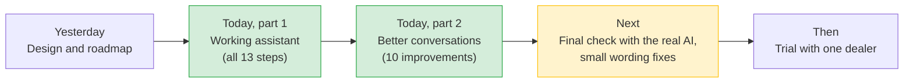
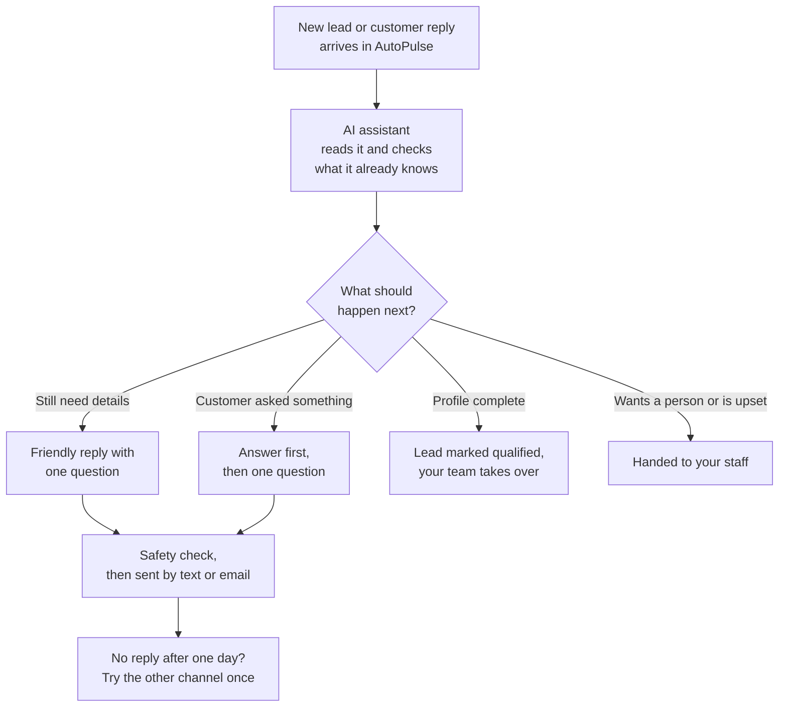
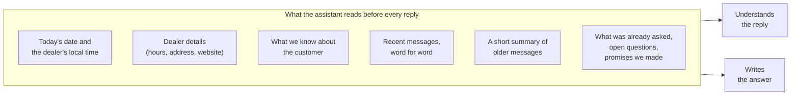
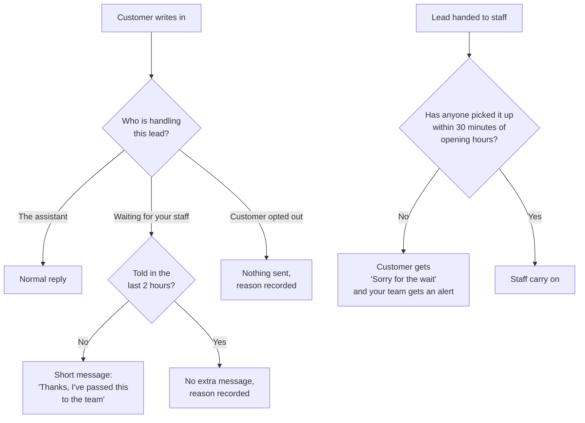
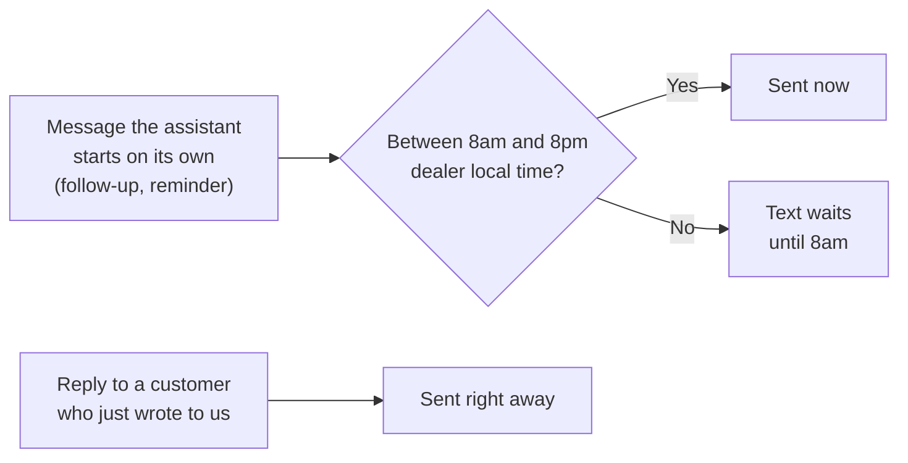
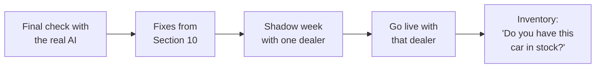

# AutoPulse AI Assistant: Progress Report

**Date:** 25 September 2026
**For:** AutoPulse leadership and dealer partners

---

## 1. Summary

Today the AI assistant went from a design on paper to a working system, and then became noticeably better at holding a real conversation.

- **The assistant is built.** All 13 steps of yesterday's roadmap are in place: instant first replies, getting to know the customer, campaign replies, the one-day switch to the other channel, and staff takeover.
- **We tested it by hand and fixed what felt wrong.** The first version was safe but stiff. It sometimes repeated a question, ignored what the customer asked, didn't know what "tomorrow" meant, and occasionally didn't reply at all. A second round of work fixed all of these.
- **The assistant now remembers the whole conversation.** It knows what it already asked, what the customer asked, and what it promised, even in a long email thread.
- **No customer is left without an answer.** Even when a lead is waiting for your staff, the customer hears back.
- **Contact hours follow US rules.** Messages the assistant starts on its own are only sent by text between 8am and 8pm in the dealer's local time.
- **One thing is blocking the final check.** Our tests with the real AI could not run because the AI account key we were given is being refused. We need a working key (see [Section 9](#9-what-we-need-from-you)).

---

## 2. Where we are

*Green = done today. Yellow = next.*

---

## 3. Part 1: the working assistant

Everything described in yesterday's report now works from start to finish in our test setup, connected to a copy of your AutoPulse platform. Nothing touches your live system or real customers.

| What you get | What it means for you |
|---|---|
| **Instant first reply** | A new lead gets an answer in about one to two seconds. |
| **Customer profile** | The assistant fills in what the customer wants, their budget, timing and trade-in, and never asks for something you already know. |
| **Campaign replies** | When a customer answers one of your campaigns, the assistant knows which campaign it was. |
| **Other channel after a day** | If a customer goes quiet, the same message is tried once by email instead of text, or the other way round. |
| **Staff stay in charge** | The moment one of your staff replies to a customer, the assistant steps back on that lead. |
| **A visual test screen** | Our testers can watch each message move through the assistant step by step and see why it said what it said. |

---

## 4. Part 2: what testing showed, and what we fixed

We used the assistant ourselves as if we were customers. These were the problems we found and how each one is now handled.

| What we saw | What the assistant does now |
|---|---|
| **It felt like filling in a form.** It asked "what model?", the customer asked "what do you know about me?", and it asked "what model?" again. | It answers the customer's question first, from what it really knows, and then asks **one** new question. It never asks the same thing twice in a row, and it moves on if a customer keeps avoiding a question. |
| **It didn't know what "tomorrow" meant.** | It knows today's date and the dealer's local time. "Tomorrow", "this Friday" or "next week" become a real date. When a date could mean two things, it checks: "Just to check, is that Friday, October 2?" |
| **Replies were unclear.** It used dealership wording, and "what do you mean?" went unanswered. | Replies use everyday words and are written at a level most people read easily. If a customer asks "what do you mean?", it explains the question more simply and asks it again. |
| **Sometimes there was no reply at all.** | Every customer message now gets a reply, a short "we've passed this to the team" message, or a clear reason on record (for example, the customer opted out). See [Section 6](#6-never-leaving-a-customer-waiting). |
| **The test buttons were confusing.** | The test buttons only appear in practice mode, each with a short explanation. The test screen also shows which mode is running. |

It can now also answer simple questions about the dealership, such as opening hours, address and website, using the details the dealer entered when they registered. If a detail is missing, it says the team will confirm. It never gives out staff phone numbers.

---

## 5. How the assistant keeps track of a conversation

Before, the assistant looked mostly at the latest message. Now it reads the same full picture every time before it replies.

- **Short replies make sense.** If the assistant asked "new or used?" and the customer says "used", it knows what "used" answers.
- **Long threads keep their beginning.** Older messages are folded into a short summary, so a detail mentioned early on ("it's for my daughter") is not forgotten.
- **Promises are remembered.** If the assistant said "the team will confirm the price", that is recorded so it isn't forgotten or contradicted.

---

## 6. Never leaving a customer waiting

- A customer waiting for your team hears from us, but at most once every two hours, so they are never flooded.
- If nobody on your team picks up a handed-over lead within 30 minutes of opening hours, the customer gets one apology and your team is alerted.
- A customer who is simply annoyed ("you keep asking the same thing!") gets an apology and fewer questions, not a handover. A customer who is clearly upset or asks for a person is handed to your team.

---

## 7. Staying within US contact rules

- Texts the assistant starts on its own go out only between **8am and 8pm** in the dealer's local time. That is inside the federal limit (8am to 9pm) and also fits the stricter state rules.
- Replies to a customer who has just written to us go out straight away, because the customer started the conversation.
- Email has no time-of-day limit.
- Each dealer's time zone comes from their registration details. If none is set, we use US Eastern time.

We recommend your legal team confirms these hours before the first dealer goes live.

---

## 8. How we checked it

| Check | Result |
|---|---|
| Automated tests of the assistant's rules and replies | 641 passed |
| Attempts to trick the assistant into saying something it shouldn't (for example, hidden instructions in a message) | 12 of 12 blocked |
| Full practice conversations, from new lead to qualified | 36 of 36 passed |
| AutoPulse platform and assistant working together | 35 of 35 passed |
| AutoPulse platform tests | 61 of 61 passed |
| A busy period: 300 replies in one minute | Passed. No slow-downs and no other dealer affected |
| **Test run with the real AI** | **Not yet run.** The AI account key is being refused (see below) |

We also wrote a step-by-step test guide so anyone on your team can have the same conversations with the assistant and judge the replies for themselves.

---

## 9. What we need from you

1. **A working AI account key.** *(urgent)* The key we have is refused by the AI provider because the account it belongs to is no longer accessible. Until we have a new one, we can only test in practice mode. The good news is that the assistant handled this safely: every customer still got a pre-approved reply, and nothing unsafe was sent.
2. **Legal sign-off on contact hours.** Please confirm that 8am to 8pm in the dealer's local time is acceptable for texts the assistant starts on its own.
3. **Dealer details.** The assistant answers questions about opening hours, address and website from each dealer's registration details. Dealers who haven't filled these in will see "the team will confirm" instead. It helps if the first trial dealer's details are complete.
4. **The first trial dealer.** Still open from yesterday.

---

## 10. What we fix next

In our latest round of testing we noticed a few more things. None of them are safety problems, but they make the conversation feel less natural. Some came up in practice mode, which uses fixed wording instead of the real AI, so we will check each one again with the real AI and fix whatever remains.

| What we noticed | What we will change |
|---|---|
| **Too much in one message, in words customers may not use.** For a service lead it asked what service was needed and "the year, make and model" all at once. | Ask about one or two things at a time, in everyday words, for example "Which car is it? Just the year and model is fine." |
| **The lead's own message was overlooked.** A customer wrote "I'm interested in a new Toyota RAV4", but the lead had been filed as a service request, so the assistant asked about servicing. | Read what the customer actually wrote before anything else, and when it doesn't match how the lead was filed, follow the customer and let your team know. |
| **It asked for the budget again after the customer gave one.** The customer said "a monthly payment of around $5", which looked unrealistic, so the assistant asked the whole question again. | When an answer looks odd, check it with the customer ("Did you mean $500 a month?") instead of asking again from the start. |
| **Every message started the same way.** "Thanks! So we can help..." at the start of each reply. | Vary how replies open, and respond to what the customer just said before asking anything. |

---

## 11. Coming after that

- **Shadow week and trial dealer:** unchanged from yesterday's plan. The assistant writes replies for one dealer without sending them, we compare them with what goes out today, and then we go live with that dealer.
- **Inventory:** we have written the plan for answering "do you have this car?" from the dealer's real stock. Until then, stock and price questions are passed to your team with "the team will check for you".
