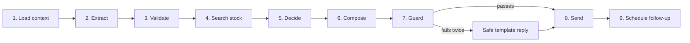
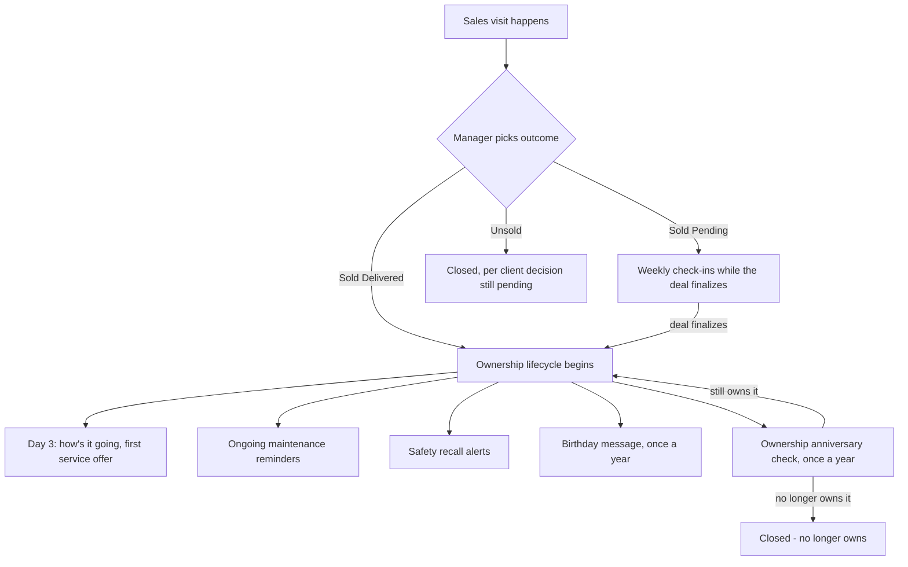
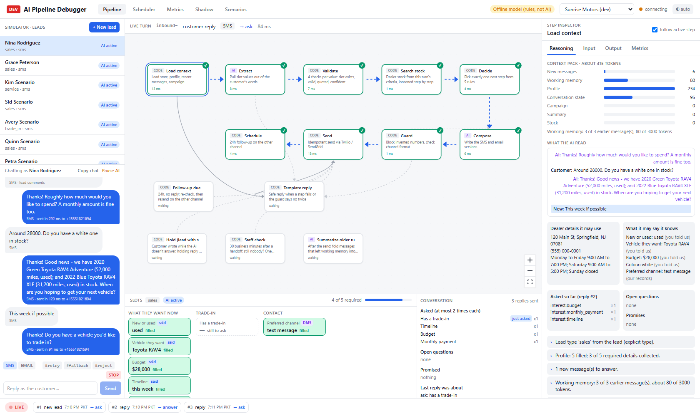
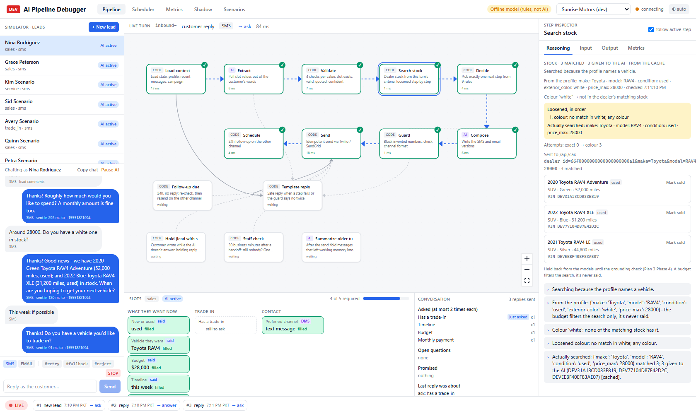
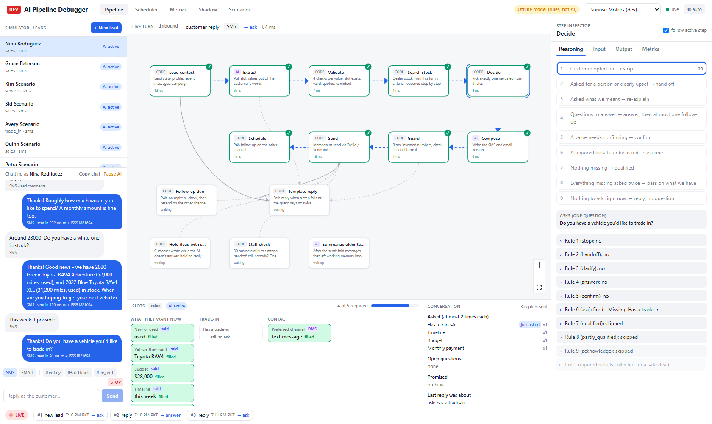
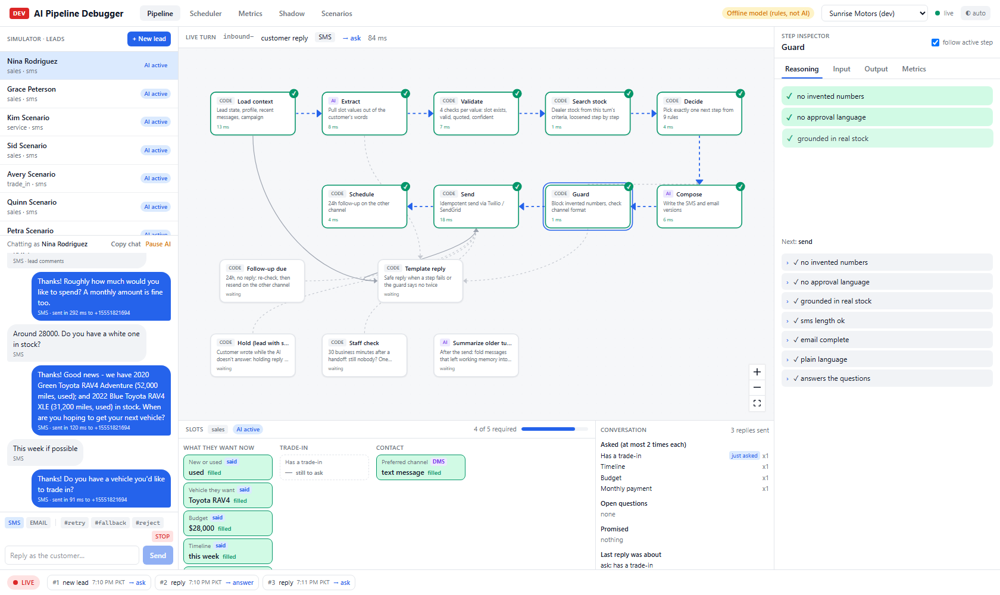

# AutoPulse AI Conversation Layer: Status Report

**Date:** 29 September 2026

This report explains, in plain language, how the AI conversation system works today, what has been built so far, and what is planned next. It is written for a business audience, not a technical one. Screenshots from our internal Debug Tool are included to show the system actually working.

---

## Part 1: How the conversation layer works today

### 1.1 What starts a conversation

The AI can start talking to a customer in two ways:

1. **Inbound** - a new lead comes in (from a web form, phone call log, trade-in request, or service request), or an existing customer replies to a text or email.
2. **Outbound** - the AI itself sends a message first. This happens in a few situations: a scheduled follow-up (for example, switching from text to email after 24 hours of silence), a "checking in with staff" message if nobody has taken over a handed-off lead, or a campaign reply when a customer responds to a marketing blast.

So the answer is **both**. The AI reacts to what customers send in, and it also reaches out on its own on a schedule, but it never messages a customer without a reason tied to something that happened (a new lead, a reply, a timer, or a campaign).

### 1.2 What happens step by step, every time the AI answers

Every single reply goes through the same nine-step pipeline, in the same order, every time. Nothing is skipped and nothing is improvised outside these steps.

1. **Load context.** The system gathers everything it knows about this customer: their profile, past messages, what the dealership has told us about opening hours and address, any active marketing campaign, and (new) what stock the dealership actually has.
2. **Extract.** The AI reads the customer's new message and pulls out any useful facts: what they want, their budget, whether they have a trade-in, their timeline, and so on. It only ever pulls facts from the customer's own words, never invents them.
3. **Validate.** Every fact pulled out in step 2 is checked: does it belong to a real question, is it actually quoted from what the customer said, is it a sensible value, and is the AI confident enough in it. Anything that fails this check is thrown out rather than trusted.
4. **Search stock.** If the customer is asking about a vehicle, the system searches the dealership's real, live inventory (more on this below).
5. **Decide.** This step picks exactly one thing to do next, using nine fixed rules in strict order (explained in section 1.4).
6. **Compose.** The AI writes the actual reply, in both an SMS version and an email version, following the plan Decide picked.
7. **Guard.** Before anything is sent, the reply is checked for safety: no invented numbers, no promises the dealership never approved, no vehicle claims that aren't backed by real stock, and correct formatting for a text message versus an email. If it fails, the AI gets one chance to fix it. If it still fails, the system falls back to a safe, pre-written template instead of a risky AI-written reply.
8. **Send.** The message actually goes out, by text or email, with checks to make sure it's never sent twice.
9. **Schedule.** The system decides if and when a follow-up should happen if the customer doesn't reply.

The whole thing, from a customer's message arriving to a reply going out, normally completes within a few seconds.

### 1.3 What "convergence points" mean

A convergence point is a moment where several different paths in the system come back together into the same next step. In our pipeline, there are two important ones:

- **Guard is a convergence point.** Whether the AI wrote a perfectly good reply, needed one correction, or completely failed the safety check and fell back to a template, every one of those paths ends up at the same place: the Guard step, which is the single checkpoint everything must pass through before anything reaches a customer. This means there is exactly one place where safety is enforced, not many places that could each have gaps.
- **Send is a convergence point.** Whether a reply came from a live AI conversation, a scheduled follow-up, a staff check-in, or a safe fallback template, it all funnels through the same Send step, which guarantees a message is never sent twice and always respects consent (for example, if a customer has texted STOP).

In plain terms: no matter how a reply got written, it always passes through the same two safety and delivery gates before it reaches a customer.

### 1.4 How the system decides what to say (the strategy)

The AI does not simply "chat freely." Every turn, it picks exactly one of nine actions, checked in this strict order:

1. **Stop** - the customer opted out (texted STOP). Say nothing further.
2. **Hand off** - the customer asked for a real person, or seems clearly upset. Pass to staff.
3. **Clarify** - the customer asked what a question meant. Explain it simply, then ask again.
4. **Answer** - the customer asked a real question. Answer it, and ask at most one follow-up question.
5. **Confirm** - a value needs double-checking (for example, an unclear date like "next Friday"). Confirm it.
6. **Ask** - there's a required detail still missing. Ask for the one detail that has been asked about least so far.
7. **Qualified** - everything needed has been collected. Let the customer know they're all set.
8. **Partly qualified** - a detail has been asked twice with no answer. Stop asking, and hand what we have to the sales team.
9. **Acknowledge** - nothing else applies. Just reply politely, no question.

The golden rule behind all of this: **answer first, then ask, and never repeat yourself.** The system remembers exactly what it has already asked and how many times, so a customer is never asked the same question three times in a row, and every question they ask gets a real answer before we ask for anything back.

### 1.5 How slots get filled (the "shopping list" the AI is collecting)

Every conversation has a "shopping list" of details the AI needs, depending on the type of lead (sales, trade-in, service, or general inquiry). For example, a sales lead needs: new or used, what vehicle, budget, timeline, and trade-in status.

Details get filled in three ways:

- **From what the customer already told us.** If a lead form already says "trading in a 2019 Honda Civic," that's filled in immediately, no need to ask again.
- **From the customer's own words during the conversation**, matched to the exact question that was asked. A short reply like "yes" or "about 60k miles" is understood in context.
- **From the dealership's own records**, where available (for example, if we already know a returning customer's past vehicle).

The system never guesses. If a value is unclear (a hedge like "maybe 2019 or 2020"), it's saved as "needs confirming," not treated as fact, and the AI double-checks with the customer before relying on it.

Each detail is only asked about a maximum of two times. After that, it's "parked" and the AI moves on, coming back to it only after three other replies have passed. This is what stops the AI from feeling repetitive or robotic.

### 1.6 Real vehicle stock, not made-up answers

As of the most recent work, the AI can look at the dealership's actual, live vehicle inventory when a customer asks "do you have a red RAV4?" It searches using whatever the customer has told us (make, model, colour, new or used, budget), and if there's no exact match, it automatically tries a series of reasonable substitutions in order: a different colour, a different trim level, a nearby model year, a similar body style, and finally new versus used. Every step it tries is recorded, so we always know exactly why it suggested what it suggested.

Every vehicle mentioned to a customer is double-checked against real inventory data right before the message is sent and again if a follow-up gets triggered later. If a vehicle sells in the meantime, the AI will not send a message naming it; it swaps to a version of the message that doesn't mention a specific car. The AI is never allowed to invent a vehicle, a price, or a "yes it's in stock" claim that isn't backed by real data.

### 1.7 Appointment duration

**There is no appointment-booking feature built yet.** The AI today collects interest, qualifies leads, and answers questions, but it does not book test drives or service appointments, and it does not have any concept of an appointment's length. This is planned for a later phase (see Part 3 below), not something currently working. We want to be fully transparent about this rather than imply it already exists.

### 1.8 Scheduler behaviour (what happens if nobody replies)

- **24-hour channel switch.** If the AI sends a text and the customer doesn't reply within 24 hours, the system automatically tries again by email instead, without ever sending a duplicate reminder through the same channel.
- **Staff check-in timer.** If a lead gets handed off to a human (customer asked for a person, or something went wrong twice), the system waits 30 working minutes. If nobody from the dealership has stepped in by then, the customer gets one polite "sorry for the wait" message and the dealership gets an internal alert. This only happens once per handoff, so the customer is never pestered.
- **Quiet hours.** Any text message the AI starts on its own only goes out between 8:00 AM and 8:00 PM in the customer's local dealership time zone, to stay within US texting regulations. Replies to something the customer just said, and all emails, go out immediately regardless of time.
- **Never silent.** Every single customer message gets either a reply or a clearly logged reason why not (for example: they opted out, or the lead is paused). Nothing is ever silently ignored.

---

## Part 2: What has been built so far

The project has been delivered in three major stages so far.

### Stage 1: The foundation (Plan 1)

This built the entire skeleton of the system:
- Receiving leads and messages from the dealership's platform.
- The nine-step reply pipeline described above.
- Real text and email sending through Twilio and SendGrid, with retry logic and safety checks.
- Connecting to the dealership's own customer history (a "360 view" of everything known about a customer).
- The slot system (the "shopping list" of details described in section 1.5).
- The AI's actual writing and safety-checking steps.
- The 24-hour follow-up timer.
- Making sure the AI and the dealership's existing staff workflow never send duplicate or conflicting messages.
- Load testing (300 conversations at once) to prove it holds up under real dealership volume.
- A safe rollout process: a "shadow mode" where the AI drafts replies without sending them, so we can review its work before it goes live for a dealership, plus a "go/no go" health check.

Everything in Stage 1 was tested and verified, except for a live send through real Twilio/SendGrid accounts and a full week-long real-dealer trial, which need a live production deployment to test.

### Stage 2: Natural conversation (Plan 2)

This stage made the AI sound like a real, attentive person rather than a form-filling bot:
- The AI now reads the whole conversation, not just the latest message, so it has real context.
- **Nothing is ever left unanswered.** Every customer message gets a reply or a logged reason why not.
- **Long conversations are summarized** so the AI never "forgets" something said many messages ago.
- **Understanding improved**: short replies like "yes" or "60k miles" are correctly matched to the right question, and the AI can tell the difference between a customer who is simply annoyed at being asked the same thing versus one who is genuinely upset and needs a person.
- **The answer-first, ask-later strategy** described in section 1.4 was built here, including never asking the same thing three times in a row.
- **Real answers to real questions**: dealership hours, address, and phone number are pulled from the dealership's own records, not invented.
5. **Plain English replies**: every reply is written at an easy reading level, with no internal jargon or technical field names ever leaking into a message to a customer.
6. **Understanding dates**: "tomorrow," "next Friday," "in two weeks" are all correctly turned into real calendar dates, and if a date is ambiguous the AI double-checks it with the customer rather than guessing.
7. Debug tool improvements so any reply can be fully explained after the fact.
8. A full battery of automated conversation tests, though the very last item (running those tests against the real OpenAI models, rather than our offline testing model) was blocked at the time by an expired API key.

### Stage 3: Real inventory grounding (Plan 3, Part A)

This is the most recent major stage, finished this week:

1. **Reading real stock.** The AI can now search the dealership's actual, live vehicle inventory (see section 1.6).
2. **Smart search criteria.** The AI understands "used," "red," "SUV," "bigger," and budget limits, and searches accordingly.
3. **Answering stock questions honestly.** If a customer asks "do you have X," the AI gives a real, grounded answer using actual inventory, or honestly says nothing matches (never a flat "no" with no next step).
4. **The grounding safety check.** Every vehicle detail the AI mentions (VIN, trim, make) is checked against real data before sending; nothing invented gets through.
5. **Freshness checks.** Right before a message is sent, and again before a follow-up goes out, the system re-checks that any vehicle mentioned is still available. If it has sold, the message is swapped to a version that doesn't mention that vehicle by name.
6. **Debug tool and testing improvements**, including a "mark as sold" button for testing, and an expanded set of 48 test vehicles covering all body types and colours.
7. **Expanded automated checks** covering the new inventory features, plus dealership health metrics tracking how often the safety check catches a problem.

**One known limitation, being fully transparent about it:** the dealership's current inventory feed has no "sold" flag; a vehicle only disappears from the feed once it's completely gone. This means a vehicle marked "sold pending" internally but not yet removed from the feed could theoretically still be found by a search. The code is already built to safely handle a real "sold" signal the moment the dealership's system provides one (planned in Part 3 below); until then, our system's safety net (the double-check right before sending) is what protects against ever mentioning a car that's actually gone.

**Real-model timing.** When we ran the system against the real OpenAI models (rather than our offline testing model) for the first time this week, we measured that a real AI reply takes about 8-10 seconds to write, end to end. Our own internal target had been a stricter 8 seconds, which caused replies to be needlessly discarded. We checked the client's actual documented requirement (from the workflow blueprint) and found it specifies a first reply within **60 seconds**, not 8. We've since adjusted our internal timing budget to 20 seconds, giving very comfortable headroom under the true 60-second requirement while still keeping things fast.

---

## Part 3: What's planned next

Two new detailed workflow specifications arrived from the client this week, covering what happens after a sales visit results in a sale. Here is the plan for that work, in plain terms.

### The big picture

Today, once a sales visit happens, a manager picks one of three outcomes: **Sold Pending**, **Sold Delivered**, or **Unsold**. Right now, the system only records which one was picked; nothing automated happens afterward. The new specs describe exactly what should happen in each case.

### A few open questions for the client first

Before we can build the new statuses, we need three small decisions from the client, because their new documents don't perfectly line up with what we built earlier:

1. **How many "closed" statuses should exist?** Our existing plan has a status for leads that time out after 90 days with no response. The new document says there should only ever be two closed statuses. We recommend folding the 90-day timeout into one of those two, but want the client to confirm.
2. **What happens on "Unsold"?** The new documents don't mention this outcome at all. We have a sensible recommendation (treat it as closed, the same as a lost deal), but want it confirmed rather than assumed.
3. **The dealership's own system doesn't have these statuses yet.** Statuses like "Sold Pending" and "Sold Delivered" don't currently exist in the dealership platform's database. This needs a decision from the platform side on how best to add them.

### The planned phases

Once those three questions are answered, the work breaks down into:

- **Wiring up the outcome.** Make sure picking Sold Pending, Sold Delivered, or Unsold actually starts the right sequence of messages and stops any other automatic messages running for that customer.
- **The Sold Pending workflow.** While a deal is still finalizing (paperwork, financing, etc.), the customer gets a weekly check-in for the first month, then a check-in every two weeks indefinitely, until the deal either finalizes or falls through. These messages are warm and supportive, never pushy, and never guess at things like financing status or delivery dates.
- **The ownership lifecycle.** Once a vehicle is delivered, a new relationship begins: a status system that tracks whether the customer is an active or inactive owner, and whether each vehicle they've owned is still with them or not.
- **Day-3 check-in.** Three days after delivery, a friendly "how's it going" message, with an offer to book the first recommended service visit.
- **Maintenance reminders.** Automatic service reminders based on the vehicle's maintenance schedule. This needs a data source we don't currently have (a maintenance schedule database), so a decision is needed on where that information comes from.
- **Safety recall alerts.** A check against the government's public vehicle recall database, so customers are notified if their specific vehicle has an open safety recall. This is a brand-new type of outside connection for our system, but it's a free, publicly available government service, so it's very doable.
- **Birthday and anniversary messages.** One birthday message a year (only if we have a verified birthday on file), and one "do you still have this vehicle?" check per year, per vehicle owned, for the first 10 years of ownership. A "no" answer closes that vehicle out and gently asks what they drive now, without pushing a trade-in pitch.
- **Keeping statuses fresh.** Behind-the-scenes plumbing to make sure a customer's active/inactive status is always accurate and never stale.

**Explicitly not being built yet:** any kind of automatic trade-in or repurchase pitch. The client's own documents say this is reserved for a future phase, and we're respecting that boundary; we'll collect the relevant information (like what vehicle they drive now) but won't act on it.

---

## Part 4: The Debug Tool, in action

We use an internal Debug Tool to test and verify every part of the conversation system before anything reaches a real customer. It is not something customers ever see; it's purely for our own development and quality assurance. Below are real screenshots from a live test conversation, with a fictional customer "Nina Rodriguez" shopping for a Toyota RAV4.

### Screenshot 1: The full pipeline in action

This is the main screen. On the left is the simulated text conversation with the customer. In the middle is the nine-step pipeline diagram described in Part 1, with green checkmarks showing every step that ran for this reply, and how many milliseconds each one took. On the right is the detailed "Load context" step, showing everything the AI was given to work with for this reply: the customer's profile, what's already been filled in (budget $28,000, timeline "this week," interested in a used Toyota RAV4), and the dealership's own details (address, hours, phone number).

### Screenshot 2: Searching real inventory

This shows the "Search stock" step in detail. The customer asked for a white RAV4. The dealership doesn't have one in white, so the system automatically loosened the search step by step (as described in section 1.6) and found matches by dropping the colour requirement. It shows the exact three vehicles found, their real VINs, mileage, and colour, and confirms only 3 are given to the AI to mention (to keep replies short and manageable). This proves the AI is working from real, current stock, not guessing.

### Screenshot 3: The decision-making strategy

This shows the "Decide" step, where the system runs through its nine fixed rules in order (see section 1.4) to pick exactly one next action. In this example, rules 1 through 5 didn't apply, and rule 6 ("ask a required detail") fired, choosing to ask whether the customer has a trade-in, since that's the one detail still missing and it hasn't been asked about yet. This is the transparency that lets us prove the AI never randomly decides what to say.

### Screenshot 4: The safety check before sending

This is the "Guard" step, the safety gate every reply must pass before it's allowed to reach a customer. All checks passed here: no made-up numbers, no unauthorized promises, every vehicle mentioned is grounded in real stock, correct text-message length, a complete email version, plain language, and every customer question answered. If any of these had failed, the reply would have been rejected and either rewritten once or replaced with a safe, pre-approved template.

### Screenshot 5: Understanding the conversation

This is a closer look at the "Load context" step's reasoning panel. It shows exactly what the AI read before writing its reply: the customer's last two messages, what's already been asked (and how many times, so nothing is repeated), what open questions remain, and what has already been promised to the customer. This is how we guarantee the AI never asks the same question twice in a row and never forgets something it already told a customer.

---

## Summary

The AI conversation system today can reliably: receive a lead, reply within seconds, hold a natural back-and-forth conversation without repeating itself, look up real vehicle stock and answer honestly about it, and follow up automatically if a customer goes quiet, all while staying within safety rules that block invented facts or promises. Appointment booking does not exist yet. The next major piece of work is the post-sale relationship: keeping in touch with a customer through delivery, service reminders, safety recalls, and yearly check-ins for years after the sale, pending a few small confirmations from the client on exactly how those statuses should work.
